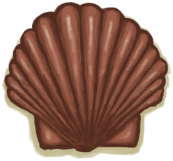

# “铜制小物件”  

[

 [铜项链](CopperNecklace.md)](CopperNecklace.md)

[

 [铜罐](CopperJar.md)](CopperJar.md)

[

 [废铜](CopperDecoration_Failed.md)](CopperDecoration_Failed.md)

[

 [铸铜鱼雕](CopperDecoration_Fish.md)](CopperDecoration_Fish.md)

[

 [铜制贝壳](CopperDecoration_Seashell.md)](CopperDecoration_Seashell.md)

[

 [铜制乌龟](CopperDecoration_Turtle.md)](CopperDecoration_Turtle.md)

[

 [铜制餐具](EatingUtensilsCopper.md)](EatingUtensilsCopper.md)

[

 [铜刀](KnifeCopper.md)](KnifeCopper.md)

[

 [钝刀](KnifeCopperBlunt.md)](KnifeCopperBlunt.md)

[

 [矛头](SpearHead.md)](SpearHead.md)

[

 [钝矛头](SpearHeadBlunt.md)](SpearHeadBlunt.md)

  
  
