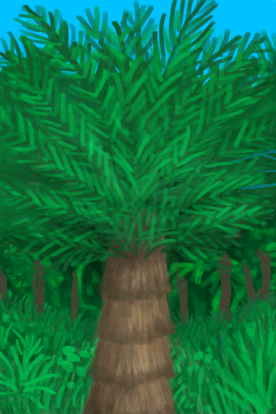
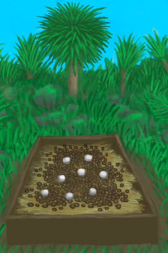
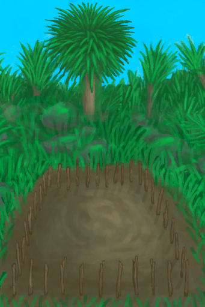

# “农作物” 
<table class="table table-bordered" data-toggle="table" ><thead><tr ><th  style="text-align:left;vertical-align:top;"  >名称</th><th  style="text-align:left;vertical-align:top;"  >种子</th><th  style="text-align:left;vertical-align:top;"  >收获</th><th  style="text-align:left;vertical-align:top;"  >基础生长速度</th><th  style="text-align:left;vertical-align:top;"  >[“潮湿环境”](tag_EnvHumid.md)</th><th  style="text-align:left;vertical-align:top;"  >[“干燥环境”](tag_EnvDry.md)</th><th  style="text-align:left;vertical-align:top;"  >[“肥沃环境”](tag_EnvFertile.md)</th><th  style="text-align:left;vertical-align:top;"  >暗光</th></tr></thead><tr ><td  style="text-align:left;vertical-align:top;"  >[

[杏仁树田](CropPlotAlmondTree.md)](CropPlotAlmondTree.md)</td><td  style="text-align:left;vertical-align:top;"  >[

[热带杏仁](TropicalAlmonds.md)](TropicalAlmonds.md)</td><td  style="text-align:left;vertical-align:top;"  >  [

[小杏仁树](TropicalAlmondTreeYoung.md)](TropicalAlmondTreeYoung.md)(+1) </td><td  style="text-align:left;vertical-align:top;"  >+0.5 (1344TP)</td><td  style="text-align:left;vertical-align:top;"  >🔴-0.25</td><td  style="text-align:left;vertical-align:top;"  >🟢+0.25</td><td  style="text-align:left;vertical-align:top;"  >🟢+0.25</td><td  style="text-align:left;vertical-align:top;"  ></td></tr><tr ><td  style="text-align:left;vertical-align:top;"  >[

[芦荟田](CropPlotAloeVera.md)](CropPlotAloeVera.md)</td><td  style="text-align:left;vertical-align:top;"  >[

[芦荟叶](AloeVeraLeaf.md)](AloeVeraLeaf.md)</td><td  style="text-align:left;vertical-align:top;"  >  [

[芦荟](AloeVera.md)](AloeVera.md)(+4) </td><td  style="text-align:left;vertical-align:top;"  >+1 (672TP)</td><td  style="text-align:left;vertical-align:top;"  >🔴-0.25</td><td  style="text-align:left;vertical-align:top;"  >🟢+0.25</td><td  style="text-align:left;vertical-align:top;"  >🟢+0.25</td><td  style="text-align:left;vertical-align:top;"  ></td></tr><tr ><td  style="text-align:left;vertical-align:top;"  >[

[香蕉树田](CropPlotBananaTree.md)](CropPlotBananaTree.md)</td><td  style="text-align:left;vertical-align:top;"  >[

[香蕉](Banana.md)](Banana.md)</td><td  style="text-align:left;vertical-align:top;"  >  [

[香蕉树](BananaTree.md)](BananaTree.md)(+2) </td><td  style="text-align:left;vertical-align:top;"  >+0.5 (1344TP)</td><td  style="text-align:left;vertical-align:top;"  >🟢+0.25</td><td  style="text-align:left;vertical-align:top;"  >🔴-0.25</td><td  style="text-align:left;vertical-align:top;"  >🟢+0.25</td><td  style="text-align:left;vertical-align:top;"  ></td></tr><tr ><td  style="text-align:left;vertical-align:top;"  >[

[辣椒田](CropPlotChilies.md)](CropPlotChilies.md)</td><td  style="text-align:left;vertical-align:top;"  >[

[辣椒](Chilies.md)](Chilies.md)</td><td  style="text-align:left;vertical-align:top;"  >  [

[辣椒丛](ChiliPlant.md)](ChiliPlant.md)(+6) </td><td  style="text-align:left;vertical-align:top;"  >+1 (672TP)</td><td  style="text-align:left;vertical-align:top;"  >🔴-0.25</td><td  style="text-align:left;vertical-align:top;"  >🟢+0.25</td><td  style="text-align:left;vertical-align:top;"  >🟢+0.25</td><td  style="text-align:left;vertical-align:top;"  ></td></tr><tr ><td  style="text-align:left;vertical-align:top;"  >[

[月季田](CropPlotChinaRose.md)](CropPlotChinaRose.md)</td><td  style="text-align:left;vertical-align:top;"  >[

[月季](ChinaRoseFlowers.md)](ChinaRoseFlowers.md)</td><td  style="text-align:left;vertical-align:top;"  >  [

[月季丛](ChinaRosePlant.md)](ChinaRosePlant.md)(+6) </td><td  style="text-align:left;vertical-align:top;"  >+1 (672TP)</td><td  style="text-align:left;vertical-align:top;"  >🟢+0.25</td><td  style="text-align:left;vertical-align:top;"  >🔴-0.25</td><td  style="text-align:left;vertical-align:top;"  >🟢+0.25</td><td  style="text-align:left;vertical-align:top;"  ></td></tr><tr ><td  style="text-align:left;vertical-align:top;"  >[

[金鸡纳树田](CropPlotCinchonaTree.md)](CropPlotCinchonaTree.md)</td><td  style="text-align:left;vertical-align:top;"  >[

[金鸡纳树皮](BarkCinchona.md)](BarkCinchona.md)</td><td  style="text-align:left;vertical-align:top;"  >  [

[金鸡纳树](CinchonaTree.md)](CinchonaTree.md)(+2) </td><td  style="text-align:left;vertical-align:top;"  >+0.5 (1344TP)</td><td  style="text-align:left;vertical-align:top;"  >🔴-0.25</td><td  style="text-align:left;vertical-align:top;"  >🟢+0.25</td><td  style="text-align:left;vertical-align:top;"  >🟢+0.25</td><td  style="text-align:left;vertical-align:top;"  ></td></tr><tr ><td  style="text-align:left;vertical-align:top;"  >[

[咖啡田](CropPlotCoffee.md)](CropPlotCoffee.md)</td><td  style="text-align:left;vertical-align:top;"  >[

[咖啡豆](CoffeeBeans.md)](CoffeeBeans.md)</td><td  style="text-align:left;vertical-align:top;"  >  [

[咖啡丛](CoffeePlant.md)](CoffeePlant.md)(+5) </td><td  style="text-align:left;vertical-align:top;"  >+1 (672TP)</td><td  style="text-align:left;vertical-align:top;"  >🔴-0.25</td><td  style="text-align:left;vertical-align:top;"  >🟢+0.25</td><td  style="text-align:left;vertical-align:top;"  >🟢+0.25</td><td  style="text-align:left;vertical-align:top;"  ></td></tr><tr ><td  style="text-align:left;vertical-align:top;"  >[

[姜田](CropPlotGinger.md)](CropPlotGinger.md)</td><td  style="text-align:left;vertical-align:top;"  >[

[姜](Ginger.md)](Ginger.md)</td><td  style="text-align:left;vertical-align:top;"  >  [

[姜株](GingerPlant.md)](GingerPlant.md)(+8) </td><td  style="text-align:left;vertical-align:top;"  >+1 (672TP)</td><td  style="text-align:left;vertical-align:top;"  >🟢+0.5</td><td  style="text-align:left;vertical-align:top;"  >🔴-0.25</td><td  style="text-align:left;vertical-align:top;"  >🟢+0.25</td><td  style="text-align:left;vertical-align:top;"  ></td></tr><tr ><td  style="text-align:left;vertical-align:top;"  >[

[茉莉花田](CropPlotJasmine.md)](CropPlotJasmine.md)</td><td  style="text-align:left;vertical-align:top;"  >[

[茉莉花](JasmineFlowers.md)](JasmineFlowers.md)</td><td  style="text-align:left;vertical-align:top;"  >  [

[茉莉花](JasminePlant.md)](JasminePlant.md)(+8) </td><td  style="text-align:left;vertical-align:top;"  >+1 (672TP)</td><td  style="text-align:left;vertical-align:top;"  >🟢+0.25</td><td  style="text-align:left;vertical-align:top;"  >🔴-0.25</td><td  style="text-align:left;vertical-align:top;"  >🟢+0.25</td><td  style="text-align:left;vertical-align:top;"  ></td></tr><tr ><td  style="text-align:left;vertical-align:top;"  >[

[卡瓦胡椒田](CropPlotKava.md)](CropPlotKava.md)</td><td  style="text-align:left;vertical-align:top;"  >[

[卡瓦根](KavaRoot.md)](KavaRoot.md)</td><td  style="text-align:left;vertical-align:top;"  >  [

[卡瓦胡椒株](KavaPlant.md)](KavaPlant.md)(+8) </td><td  style="text-align:left;vertical-align:top;"  >+1 (672TP)</td><td  style="text-align:left;vertical-align:top;"  >🟢+0.25</td><td  style="text-align:left;vertical-align:top;"  >🔴-0.25</td><td  style="text-align:left;vertical-align:top;"  >🟢+0.25</td><td  style="text-align:left;vertical-align:top;"  ></td></tr><tr ><td  style="text-align:left;vertical-align:top;"  >[

[柠檬草田](CropPlotLemonGrass.md)](CropPlotLemonGrass.md)</td><td  style="text-align:left;vertical-align:top;"  >[

[柠檬草](LemongrassStalks.md)](LemongrassStalks.md)</td><td  style="text-align:left;vertical-align:top;"  >  [

[柠檬草](Lemongrass.md)](Lemongrass.md)(+12) </td><td  style="text-align:left;vertical-align:top;"  >+1 (672TP)</td><td  style="text-align:left;vertical-align:top;"  >🔴-0.25</td><td  style="text-align:left;vertical-align:top;"  >🟢+0.25</td><td  style="text-align:left;vertical-align:top;"  >🟢+0.25</td><td  style="text-align:left;vertical-align:top;"  ></td></tr><tr ><td  style="text-align:left;vertical-align:top;"  >[

[芒果树田](CropPlotMangoTree.md)](CropPlotMangoTree.md)</td><td  style="text-align:left;vertical-align:top;"  >[

[芒果](Mango.md)](Mango.md)</td><td  style="text-align:left;vertical-align:top;"  >  [

[小芒果树](MangoTreeYoung.md)](MangoTreeYoung.md)(+1) </td><td  style="text-align:left;vertical-align:top;"  >+0.5 (1344TP)</td><td  style="text-align:left;vertical-align:top;"  >🔴-0.25</td><td  style="text-align:left;vertical-align:top;"  >🟢+0.25</td><td  style="text-align:left;vertical-align:top;"  >🟢+0.25</td><td  style="text-align:left;vertical-align:top;"  ></td></tr><tr ><td  style="text-align:left;vertical-align:top;"  >[

[水椰树田](CropPlotNipaPalm.md)](CropPlotNipaPalm.md)</td><td  style="text-align:left;vertical-align:top;"  >[

[水椰籽](NipaSeeds.md)](NipaSeeds.md)</td><td  style="text-align:left;vertical-align:top;"  >  [

[水椰](NipaPalm.md)](NipaPalm.md)(+3) </td><td  style="text-align:left;vertical-align:top;"  >+0.5 (1344TP)</td><td  style="text-align:left;vertical-align:top;"  >🟢+0.25</td><td  style="text-align:left;vertical-align:top;"  >🔴-0.25</td><td  style="text-align:left;vertical-align:top;"  >🟢+0.25</td><td  style="text-align:left;vertical-align:top;"  ></td></tr><tr ><td  style="text-align:left;vertical-align:top;"  >[

[棕榈丛田](CropPlotPalmBush.md)](CropPlotPalmBush.md)</td><td  style="text-align:left;vertical-align:top;"  >[

[棕榈丛种子](PalmBushSeeds.md)](PalmBushSeeds.md)</td><td  style="text-align:left;vertical-align:top;"  >  [

[棕榈丛](PalmBush.md)](PalmBush.md)(+4) </td><td  style="text-align:left;vertical-align:top;"  >+0.5 (1344TP)</td><td  style="text-align:left;vertical-align:top;"  >🔴-0.25</td><td  style="text-align:left;vertical-align:top;"  >🟢+0.25</td><td  style="text-align:left;vertical-align:top;"  >🟢+0.25</td><td  style="text-align:left;vertical-align:top;"  ></td></tr><tr ><td  style="text-align:left;vertical-align:top;"  >[

[椰子树田](CropPlotPalmTree.md)](CropPlotPalmTree.md)</td><td  style="text-align:left;vertical-align:top;"  >[

[椰子](Coconut.md)](Coconut.md)[

[青椰子](CoconutHusked.md)](CoconutHusked.md)</td><td  style="text-align:left;vertical-align:top;"  >  [

[幼年椰子树](PalmTreeYoung.md)](PalmTreeYoung.md)(+1) </td><td  style="text-align:left;vertical-align:top;"  >+0.5 (1344TP)</td><td  style="text-align:left;vertical-align:top;"  >🔴-0.25</td><td  style="text-align:left;vertical-align:top;"  >🟢+0.25</td><td  style="text-align:left;vertical-align:top;"  >🟢+0.25</td><td  style="text-align:left;vertical-align:top;"  ></td></tr><tr ><td  style="text-align:left;vertical-align:top;"  >[

[稻田](CropPlotRice.md)](CropPlotRice.md)</td><td  style="text-align:left;vertical-align:top;"  >[

[稻米](RiceGrains.md)](RiceGrains.md)</td><td  style="text-align:left;vertical-align:top;"  >  [

[水稻](RicePlant.md)](RicePlant.md)(+4) </td><td  style="text-align:left;vertical-align:top;"  >+1 (672TP)</td><td  style="text-align:left;vertical-align:top;"  >🔴-0.25</td><td  style="text-align:left;vertical-align:top;"  >🟢+0.25</td><td  style="text-align:left;vertical-align:top;"  >🟢+0.25</td><td  style="text-align:left;vertical-align:top;"  ></td></tr><tr ><td  style="text-align:left;vertical-align:top;"  >[

[西米树田](CropPlotSagoPalm.md)](CropPlotSagoPalm.md)</td><td  style="text-align:left;vertical-align:top;"  >[

[西米树种](SagoSeeds.md)](SagoSeeds.md)</td><td  style="text-align:left;vertical-align:top;"  >  [

[西米树](SagoPalm.md)](SagoPalm.md)(+2) </td><td  style="text-align:left;vertical-align:top;"  >+0.5 (1344TP)</td><td  style="text-align:left;vertical-align:top;"  >🟢+0.25</td><td  style="text-align:left;vertical-align:top;"  >🔴-0.25</td><td  style="text-align:left;vertical-align:top;"  >🟢+0.25</td><td  style="text-align:left;vertical-align:top;"  ></td></tr><tr ><td  style="text-align:left;vertical-align:top;"  >[

[蛇草田](CropPlotSnakeGrass.md)](CropPlotSnakeGrass.md)</td><td  style="text-align:left;vertical-align:top;"  >[

[蛇草](SnakeGrass.md)](SnakeGrass.md)</td><td  style="text-align:left;vertical-align:top;"  >  [

[蛇草丛](SnakegrassPatch.md)](SnakegrassPatch.md)(+3) </td><td  style="text-align:left;vertical-align:top;"  >+1 (672TP)</td><td  style="text-align:left;vertical-align:top;"  >🟢+0.25</td><td  style="text-align:left;vertical-align:top;"  >🔴-0.25</td><td  style="text-align:left;vertical-align:top;"  >🟢+0.25</td><td  style="text-align:left;vertical-align:top;"  ></td></tr><tr ><td  style="text-align:left;vertical-align:top;"  >[

[蜘蛛兰田](CropPlotSpiderLily.md)](CropPlotSpiderLily.md)</td><td  style="text-align:left;vertical-align:top;"  >[

[蜘蛛兰叶](SpiderLilyLeaves.md)](SpiderLilyLeaves.md)</td><td  style="text-align:left;vertical-align:top;"  >  [

[蜘蛛兰](SpiderLily.md)](SpiderLily.md)(+6) </td><td  style="text-align:left;vertical-align:top;"  >+1 (672TP)</td><td  style="text-align:left;vertical-align:top;"  >🟢+0.25</td><td  style="text-align:left;vertical-align:top;"  >🔴-0.25</td><td  style="text-align:left;vertical-align:top;"  >🟢+0.25</td><td  style="text-align:left;vertical-align:top;"  ></td></tr><tr ><td  style="text-align:left;vertical-align:top;"  >[

[大叶仙茅田](CropPlotWeevilLily.md)](CropPlotWeevilLily.md)</td><td  style="text-align:left;vertical-align:top;"  >[

[大叶仙茅叶片](WeevilLilyLeaves.md)](WeevilLilyLeaves.md)</td><td  style="text-align:left;vertical-align:top;"  >  [

[大叶仙茅](WeevilLily.md)](WeevilLily.md)(+5) </td><td  style="text-align:left;vertical-align:top;"  >+1 (672TP)</td><td  style="text-align:left;vertical-align:top;"  >🟢+0.25</td><td  style="text-align:left;vertical-align:top;"  >🔴-0.25</td><td  style="text-align:left;vertical-align:top;"  >🟢+0.25</td><td  style="text-align:left;vertical-align:top;"  ></td></tr><tr ><td  style="text-align:left;vertical-align:top;"  >[

[野枣田](CropPlotWildJujube.md)](CropPlotWildJujube.md)</td><td  style="text-align:left;vertical-align:top;"  >[

[野枣](JujubeFruits.md)](JujubeFruits.md)</td><td  style="text-align:left;vertical-align:top;"  >  [

[野枣丛](WildJujube.md)](WildJujube.md)(+3) </td><td  style="text-align:left;vertical-align:top;"  >+1 (672TP)</td><td  style="text-align:left;vertical-align:top;"  >🔴-0.5</td><td  style="text-align:left;vertical-align:top;"  >🟢+0.5</td><td  style="text-align:left;vertical-align:top;"  >🟢+0.25</td><td  style="text-align:left;vertical-align:top;"  ></td></tr><tr ><td  style="text-align:left;vertical-align:top;"  >[

[参薯田](CropPlotYam.md)](CropPlotYam.md)</td><td  style="text-align:left;vertical-align:top;"  >[

[参薯](Yam.md)](Yam.md)</td><td  style="text-align:left;vertical-align:top;"  >  [

[野参薯](YamPlant.md)](YamPlant.md)(+4) </td><td  style="text-align:left;vertical-align:top;"  >+1 (672TP)</td><td  style="text-align:left;vertical-align:top;"  >🟢+0.25</td><td  style="text-align:left;vertical-align:top;"  >🔴-0.25</td><td  style="text-align:left;vertical-align:top;"  >🟢+0.25</td><td  style="text-align:left;vertical-align:top;"  ></td></tr><tr ><td  style="text-align:left;vertical-align:top;"  >[

[杂菌菌床](MushroomBedAssorted.md)](MushroomBedAssorted.md)</td><td  style="text-align:left;vertical-align:top;"  >[

[杂菌](AssortedMushrooms.md)](AssortedMushrooms.md)</td><td  style="text-align:left;vertical-align:top;"  >  [

[杂菌](AssortedMushroomsPlant.md)](AssortedMushroomsPlant.md)(+12～+20)   [

[木板](Plank.md)](Plank.md)(+4) </td><td  style="text-align:left;vertical-align:top;"  >+1 (672TP)</td><td  style="text-align:left;vertical-align:top;"  >🟢+0.25</td><td  style="text-align:left;vertical-align:top;"  >🔴-0.5</td><td  style="text-align:left;vertical-align:top;"  ></td><td  style="text-align:left;vertical-align:top;"  >🟢+0.25</td></tr><tr ><td  style="text-align:left;vertical-align:top;"  >[

[迷幻菇菌床](MushroomBedMagic.md)](MushroomBedMagic.md)</td><td  style="text-align:left;vertical-align:top;"  >[

[迷幻菇](MagicMushrooms.md)](MagicMushrooms.md)</td><td  style="text-align:left;vertical-align:top;"  >  [

[迷幻菇](MagicMushroomsPlant.md)](MagicMushroomsPlant.md)(+4)   [

[木板](Plank.md)](Plank.md)(+4) </td><td  style="text-align:left;vertical-align:top;"  >+1 (672TP)</td><td  style="text-align:left;vertical-align:top;"  >🟢+0.25</td><td  style="text-align:left;vertical-align:top;"  >🔴-0.5</td><td  style="text-align:left;vertical-align:top;"  ></td><td  style="text-align:left;vertical-align:top;"  >🟢+0.25</td></tr><tr ><td  style="text-align:left;vertical-align:top;"  >[

[马勃菌菌床](MushroomBedPuffballs.md)](MushroomBedPuffballs.md)</td><td  style="text-align:left;vertical-align:top;"  >[

[马勃菌](Puffballs.md)](Puffballs.md)</td><td  style="text-align:left;vertical-align:top;"  >  [

[马勃菌](PuffballsPlant.md)](PuffballsPlant.md)(+8)   [

[木板](Plank.md)](Plank.md)(+4) </td><td  style="text-align:left;vertical-align:top;"  >+1 (672TP)</td><td  style="text-align:left;vertical-align:top;"  >🟢+0.25</td><td  style="text-align:left;vertical-align:top;"  >🔴-0.5</td><td  style="text-align:left;vertical-align:top;"  ></td><td  style="text-align:left;vertical-align:top;"  >🟢+0.25</td></tr><tr ><td  style="text-align:left;vertical-align:top;"  >[

[未栽种的农田(空)](CropPlotEmpty.md)](CropPlotEmpty.md)</td><td  style="text-align:left;vertical-align:top;"  >-</td><td  style="text-align:left;vertical-align:top;"  ></td><td  style="text-align:left;vertical-align:top;"  >-</td><td  style="text-align:left;vertical-align:top;"  ></td><td  style="text-align:left;vertical-align:top;"  ></td><td  style="text-align:left;vertical-align:top;"  ></td><td  style="text-align:left;vertical-align:top;"  ></td></tr><tr ><td  style="text-align:left;vertical-align:top;"  >[

[毁坏的田地](CropPlotRuined.md)](CropPlotRuined.md)</td><td  style="text-align:left;vertical-align:top;"  >-</td><td  style="text-align:left;vertical-align:top;"  ></td><td  style="text-align:left;vertical-align:top;"  >-</td><td  style="text-align:left;vertical-align:top;"  >🔴-0.25</td><td  style="text-align:left;vertical-align:top;"  >🟢+0.25</td><td  style="text-align:left;vertical-align:top;"  >🟢+0.25</td><td  style="text-align:left;vertical-align:top;"  ></td></tr><tr ><td  style="text-align:left;vertical-align:top;"  >[

[未种植的菌床(空)](MushroomBedEmpty.md)](MushroomBedEmpty.md)</td><td  style="text-align:left;vertical-align:top;"  >-</td><td  style="text-align:left;vertical-align:top;"  ></td><td  style="text-align:left;vertical-align:top;"  >-</td><td  style="text-align:left;vertical-align:top;"  ></td><td  style="text-align:left;vertical-align:top;"  ></td><td  style="text-align:left;vertical-align:top;"  ></td><td  style="text-align:left;vertical-align:top;"  ></td></tr></tbody></table>  
  
