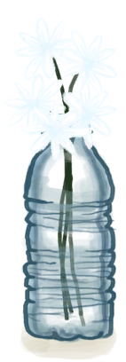
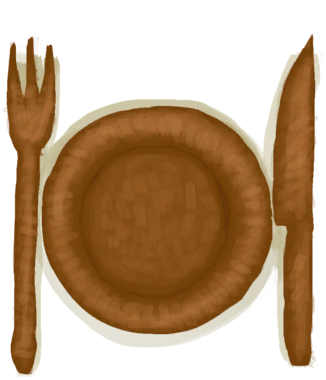

# “装饰品”  

<a href="Calcite.md" style="color:black">方解石晶体</a>

<a href="ClayJarJasmine.md" style="color:black">茉莉花</a>

<a href="CopperBottle.md" style="color:black">铜瓶</a>

<a href="CopperJar.md" style="color:black">铜罐</a>

<a href="PlasticBottleJasmine.md" style="color:black">茉莉花</a>

<a href="CopperDecoration_Fish.md" style="color:black">铸铜鱼雕</a>

<a href="CopperDecoration_Seashell.md" style="color:black">铜制贝壳</a>

<a href="CopperDecoration_Turtle.md" style="color:black">铜制乌龟</a>

<a href="Coral.md" style="color:black">珊瑚</a>

<a href="EatingUtensilsCopper.md" style="color:black">铜制餐具</a>

<a href="EatingUtensilsWooden.md" style="color:black">木质餐具</a>

<a href="FluteBone.md" style="color:black">骨笛</a>

<a href="FluteWooden.md" style="color:black">木笛</a>

<a href="GiantConch.md" style="color:black">大海螺</a>

<a href="WoodCarving_Goat.md" style="color:black">山羊木雕</a>

<a href="WoodCarving_Man.md" style="color:black">小人木雕（男）</a>

<a href="WoodCarving_Monster.md" style="color:black">神灵木雕</a>

<a href="WoodCarving_Seagull.md" style="color:black">海鸥木雕</a>

<a href="WoodCarving_Woman.md" style="color:black">小人木雕（女）</a>

  
  

