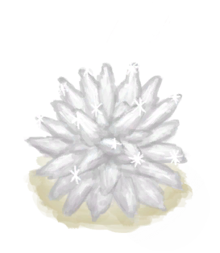

# “装饰品”  

[

 [方解石晶体](Calcite.md)](Calcite.md)

[

 [茉莉花](ClayJarJasmine.md)](ClayJarJasmine.md)

[

 [铜瓶](CopperBottle.md)](CopperBottle.md)

[

 [铜罐](CopperJar.md)](CopperJar.md)

[

 [茉莉花](PlasticBottleJasmine.md)](PlasticBottleJasmine.md)

[

 [铸铜鱼雕](CopperDecoration_Fish.md)](CopperDecoration_Fish.md)

[

 [铜制贝壳](CopperDecoration_Seashell.md)](CopperDecoration_Seashell.md)

[

 [铜制乌龟](CopperDecoration_Turtle.md)](CopperDecoration_Turtle.md)

[

 [珊瑚](Coral.md)](Coral.md)

[

 [铜制餐具](EatingUtensilsCopper.md)](EatingUtensilsCopper.md)

[

 [木质餐具](EatingUtensilsWooden.md)](EatingUtensilsWooden.md)

[

 [大海螺](GiantConch.md)](GiantConch.md)

[

 [山羊木雕](WoodCarving_Goat.md)](WoodCarving_Goat.md)

[

 [小人木雕（男）](WoodCarving_Man.md)](WoodCarving_Man.md)

[

 [神灵木雕](WoodCarving_Monster.md)](WoodCarving_Monster.md)

[

 [海鸥木雕](WoodCarving_Seagull.md)](WoodCarving_Seagull.md)

[

 [小人木雕（女）](WoodCarving_Woman.md)](WoodCarving_Woman.md)

  
  
