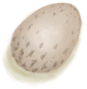
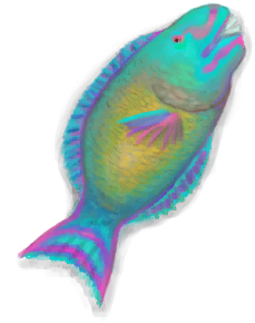
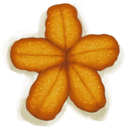
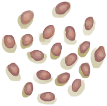

# “饲料”  

<a href="AssortedMushrooms.md" style="color:black">杂菌</a>

<a href="Banana.md" style="color:black">香蕉</a>

<a href="BananaHand.md" style="color:black">一串香蕉</a>

<a href="BananaStem.md" style="color:black">香蕉树芯</a>

<a href="Bat.md" style="color:black">蝙蝠尸体</a>

<a href="BatCooked.md" style="color:black">烤蝙蝠</a>

<a href="BeeHoneycomb.md" style="color:black">巢脾</a>

<a href="Bees.md" style="color:black">蜜蜂</a>

<a href="BirdMeat.md" style="color:black">鸟肉</a>

<a href="BirdMeatCooked.md" style="color:black">烤鸟肉</a>

<a href="BirdMeatSmoked.md" style="color:black">烟熏鸟肉</a>

<a href="BoarMeat.md" style="color:black">野猪肉</a>

<a href="BoarMeatCooked.md" style="color:black">烤野猪肉</a>

<a href="BoarMeatDried.md" style="color:black">野猪肉干</a>

<a href="BoarMeatSalted.md" style="color:black">腌野猪肉</a>

<a href="BoarMeatSaltedDrying.md" style="color:black">腌制中的野猪肉</a>

<a href="BoarMeatSmoked.md" style="color:black">烟熏野猪肉</a>

<a href="Bonefish.md" style="color:black">北梭鱼</a>

<a href="BonefishCooked.md" style="color:black">烤北梭鱼</a>

<a href="BonefishMeat.md" style="color:black">北梭鱼肉</a>

<a href="BonefishSmoked.md" style="color:black">烟熏北梭鱼</a>

<a href="Bugs.md" style="color:black">虫子</a>

<a href="Butter.md" style="color:black">黄油</a>

<a href="CandiedGinger.md" style="color:black">姜糖</a>

<a href="Cheese.md" style="color:black">山羊奶酪</a>

<a href="ChickenSandwich.md" style="color:black">鸡肉三明治</a>

<a href="Chilies.md" style="color:black">辣椒</a>

<a href="ChiliesDried.md" style="color:black">干辣椒</a>

<a href="ChinaRoseFlowers.md" style="color:black">月季</a>

<a href="Chocolate.md" style="color:black">巧克力</a>

<a href="CobraDead.md" style="color:black">眼镜蛇尸体</a>

<a href="CoconutMeat.md" style="color:black">椰肉</a>

<a href="CoconutMeatCooked.md" style="color:black">烤椰肉</a>

<a href="CoffeeBerries.md" style="color:black">咖啡果</a>

<a href="CoffeeBerryPulp.md" style="color:black">咖啡果浆</a>

<a href="ConchMeat.md" style="color:black">海螺肉</a>

<a href="ConchMeatCooked.md" style="color:black">烤海螺肉</a>

<a href="ConchMeatSoft.md" style="color:black">松软的海螺肉</a>

<a href="ConchMeatSoftCooked.md" style="color:black">松软的烤海螺肉</a>

<a href="Crab.md" style="color:black">螃蟹</a>

<a href="CrabCooked.md" style="color:black">烤螃蟹</a>

<a href="Egg.md" style="color:black">蛋</a>

<a href="EggBoiled.md" style="color:black">水煮蛋</a>

<a href="EggCooked.md" style="color:black">烤蛋</a>

<a href="EggPartridgeFertilized.md" style="color:black">受精蛋</a>

<a href="Fat.md" style="color:black">脂肪</a>

<a href="FeedBird.md" style="color:black">鸟食</a>

<a href="FishDried.md" style="color:black">鱼干</a>

<a href="FishSalted.md" style="color:black">咸鱼</a>

<a href="FishSaltedDrying.md" style="color:black">腌制中的咸鱼</a>

<a href="FishScraps.md" style="color:black">鱼杂</a>

<a href="FishScrapsCooked.md" style="color:black">烤鱼杂</a>

<a href="FishSlices.md" style="color:black">鱼片</a>

<a href="FishSlicesCooked.md" style="color:black">烤鱼片</a>

<a href="FishTaco.md" style="color:black">鱼肉塔可</a>

<a href="FoodRation.md" style="color:black">压缩干粮</a>

<a href="FriedBanana.md" style="color:black">炸香蕉</a>

<a href="Ginger.md" style="color:black">姜</a>

<a href="GingerDried.md" style="color:black">干姜</a>

<a href="GingerGround.md" style="color:black">姜末</a>

<a href="GoatMeat.md" style="color:black">羊肉</a>

<a href="GoatMeatCooked.md" style="color:black">烤羊肉</a>

<a href="GoatMeatDried.md" style="color:black">羊肉干</a>

<a href="GoatMeatSalted.md" style="color:black">腌羊肉</a>

<a href="GoatMeatSaltedDrying.md" style="color:black">腌制中的羊肉</a>

<a href="GoatMeatSmoked.md" style="color:black">烟熏羊肉</a>

<a href="Goatfish.md" style="color:black">绯鲤</a>

<a href="GoatfishCooked.md" style="color:black">烤绯鲤</a>

<a href="GoatfishSmoked.md" style="color:black">烟熏绯鲤</a>

<a href="Grouper.md" style="color:black">石斑鱼</a>

<a href="GrouperMeat.md" style="color:black">石斑鱼肉</a>

<a href="GrouperMeatCooked.md" style="color:black">烤石斑鱼</a>

<a href="GrouperMeatSmoked.md" style="color:black">烟熏石斑鱼</a>

<a href="Herring.md" style="color:black">鲱鱼</a>

<a href="HerringCooked.md" style="color:black">烤鲱鱼</a>

<a href="HerringSmoked.md" style="color:black">烟熏鲱鱼</a>

<a href="HoneyCandy.md" style="color:black">蜜糖</a>

<a href="JasmineFlowers.md" style="color:black">茉莉花</a>

<a href="JasmineFlowersGround.md" style="color:black">捣碎的茉莉花</a>

<a href="JujubeFruits.md" style="color:black">野枣</a>

<a href="KavaRoot.md" style="color:black">卡瓦根</a>

<a href="KavaRootDried.md" style="color:black">干燥的卡瓦根</a>

<a href="KavaRootGround.md" style="color:black">捣碎的卡瓦根</a>

<a href="KingThreadfin.md" style="color:black">大马鲅鱼</a>

<a href="LemonGrassGround.md" style="color:black">捣碎的柠檬草</a>

<a href="LemongrassStalks.md" style="color:black">柠檬草</a>

<a href="Lizard.md" style="color:black">蜥蜴</a>

<a href="LizardCooked.md" style="color:black">烤蜥蜴</a>

<a href="MacaqueMeat.md" style="color:black">猕猴肉</a>

<a href="MacaqueMeatCooked.md" style="color:black">烤猕猴肉</a>

<a href="MacaqueMeatDried.md" style="color:black">猕猴肉干</a>

<a href="MacaqueMeatSalted.md" style="color:black">腌猕猴肉</a>

<a href="MacaqueMeatSaltedDrying.md" style="color:black">腌制中的猕猴肉</a>

<a href="MacaqueMeatSmoked.md" style="color:black">烟熏猕猴肉</a>

<a href="MagicMushrooms.md" style="color:black">迷幻菇</a>

<a href="Mango.md" style="color:black">芒果</a>

<a href="MeatSaltedDried.md" style="color:black">腌肉</a>

<a href="MeatSaltedDrying.md" style="color:black">腌制中的肉</a>

<a href="MonitorMeat.md" style="color:black">巨蜥肉</a>

<a href="MonitorMeatCooked.md" style="color:black">烤巨蜥肉</a>

<a href="MonitorMeatDried.md" style="color:black">巨蜥肉干</a>

<a href="MonitorMeatSalted.md" style="color:black">腌巨蜥肉</a>

<a href="MonitorMeatSaltedDrying.md" style="color:black">腌制中的巨蜥肉</a>

<a href="MonitorMeatSmoked.md" style="color:black">烟熏巨蜥肉</a>

<a href="Mouse.md" style="color:black">老鼠尸体</a>

<a href="MouseCooked.md" style="color:black">烤老鼠</a>

<a href="MouseSkinned.md" style="color:black">剥皮的老鼠</a>

<a href="Mudskipper.md" style="color:black">弹涂鱼</a>

<a href="MudskipperCooked.md" style="color:black">烤弹涂鱼</a>

<a href="NipaSeeds.md" style="color:black">水椰籽</a>

<a href="OysterMeat.md" style="color:black">牡蛎肉</a>

<a href="OysterMeatBaked.md" style="color:black">黄油焗牡蛎</a>

<a href="OysterMeatCooked.md" style="color:black">烤牡蛎肉</a>

<a href="ParrotFish.md" style="color:black">鹦哥鱼</a>

<a href="ParrotFishCooked.md" style="color:black">烤鹦哥鱼</a>

<a href="ParrotFishSmoked.md" style="color:black">烟熏鹦哥鱼</a>

<a href="PartridgeChick.md" style="color:black">小灰山鹑</a>

<a href="PartridgeChickDead.md" style="color:black">小灰山鹑尸体</a>

<a href="PartridgeDead.md" style="color:black">灰山鹑尸体</a>

<a href="Prawns.md" style="color:black">虾</a>

<a href="PrawnsCooked.md" style="color:black">烤虾</a>

<a href="ProteinBar.md" style="color:black">蛋白棒</a>

<a href="Puffballs.md" style="color:black">马勃菌</a>

<a href="Rennet.md" style="color:black">凝乳酶</a>

<a href="RiceCooked.md" style="color:black">米饭</a>

<a href="RiceGrains.md" style="color:black">稻米</a>

<a href="RiceStalks.md" style="color:black">稻秆</a>

<a href="RottenRemains.md" style="color:black">腐烂物</a>

<a href="SagoFlatbread.md" style="color:black">西米饼</a>

<a href="SagoFlatbreadHoney.md" style="color:black">蜂蜜西米饼</a>

<a href="SagoFlatbreadJam.md" style="color:black">果酱西米饼</a>

<a href="SagoFlour.md" style="color:black">西米粉</a>

<a href="SagoPulp.md" style="color:black">西米浆</a>

<a href="SagoSawdust.md" style="color:black">西米树芯</a>

<a href="SagoSlime.md" style="color:black">西米糕</a>

<a href="SeaKraitDead.md" style="color:black">海蛇尸体</a>

<a href="SeagullDead.md" style="color:black">海鸥尸体</a>

<a href="SeahoundCooked.md" style="color:black">烤海怪肉</a>

<a href="Seahoundmeat.md" style="color:black">海怪肉</a>

<a href="Seaweed.md" style="color:black">海藻</a>

<a href="SharkCooked.md" style="color:black">烤鲨鱼肉</a>

<a href="SharkMeat.md" style="color:black">鲨鱼肉</a>

<a href="SharkSmoked.md" style="color:black">烟熏鲨鱼肉</a>

<a href="SnakeCooked.md" style="color:black">烤蛇肉</a>

<a href="SnakeSkinned.md" style="color:black">剥皮的蛇</a>

<a href="Sugar.md" style="color:black">糖</a>

<a href="Sushi.md" style="color:black">寿司</a>

<a href="ThreadfinCooked.md" style="color:black">烤马鲅鱼</a>

<a href="ThreadfinMeat.md" style="color:black">马鲅鱼肉</a>

<a href="ThreadfinSmoked.md" style="color:black">烟熏马鲅鱼</a>

<a href="TropicalAlmondKernels.md" style="color:black">热带杏仁核</a>

<a href="TropicalAlmondsRoasted.md" style="color:black">烤热带杏仁</a>

<a href="UrchinMeat.md" style="color:black">海胆肉</a>

<a href="UrchinMeatCooked.md" style="color:black">烤海胆</a>

<a href="Yam.md" style="color:black">参薯</a>

<a href="YamBoiled.md" style="color:black">煮熟的参薯</a>

<a href="YamCut.md" style="color:black">参薯片</a>

<a href="YamJam.md" style="color:black">参薯酱</a>

<a href="PalmBushSeeds.md" style="color:black">棕榈丛种子</a>

<a href="SagoSeeds.md" style="color:black">西米树种</a>

<a href="SnakegrassSeeds.md" style="color:black">蛇草种子</a>

  
  

