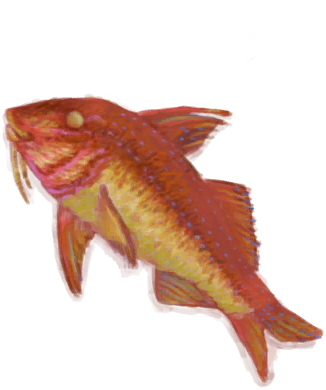
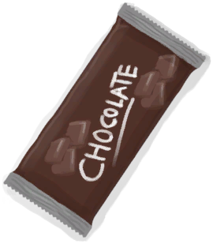

# “饲料”  

[

 [杂菌](AssortedMushrooms.md)](AssortedMushrooms.md)

[

 [香蕉](Banana.md)](Banana.md)

[

 [一串香蕉](BananaHand.md)](BananaHand.md)

[

 [香蕉树芯](BananaStem.md)](BananaStem.md)

[

 [蝙蝠尸体](Bat.md)](Bat.md)

[

 [烤蝙蝠](BatCooked.md)](BatCooked.md)

[

 [巢脾](BeeHoneycomb.md)](BeeHoneycomb.md)

[

 [蜜蜂](Bees.md)](Bees.md)

[

 [鸟肉](BirdMeat.md)](BirdMeat.md)

[

 [烤鸟肉](BirdMeatCooked.md)](BirdMeatCooked.md)

[

 [烟熏鸟肉](BirdMeatSmoked.md)](BirdMeatSmoked.md)

[

 [野猪肉](BoarMeat.md)](BoarMeat.md)

[

 [烤野猪肉](BoarMeatCooked.md)](BoarMeatCooked.md)

[

 [野猪肉干](BoarMeatDried.md)](BoarMeatDried.md)

[

 [腌野猪肉](BoarMeatSalted.md)](BoarMeatSalted.md)

[

 [腌制中的野猪肉](BoarMeatSaltedDrying.md)](BoarMeatSaltedDrying.md)

[

 [烟熏野猪肉](BoarMeatSmoked.md)](BoarMeatSmoked.md)

[

 [北梭鱼](Bonefish.md)](Bonefish.md)

[

 [烤北梭鱼](BonefishCooked.md)](BonefishCooked.md)

[

 [北梭鱼肉](BonefishMeat.md)](BonefishMeat.md)

[

 [烟熏北梭鱼](BonefishSmoked.md)](BonefishSmoked.md)

[

 [虫子](Bugs.md)](Bugs.md)

[

 [黄油](Butter.md)](Butter.md)

[

 [辣椒](Chilies.md)](Chilies.md)

[

 [干辣椒](ChiliesDried.md)](ChiliesDried.md)

[

 [月季](ChinaRoseFlowers.md)](ChinaRoseFlowers.md)

[

 [眼镜蛇尸体](CobraDead.md)](CobraDead.md)

[

 [椰肉](CoconutMeat.md)](CoconutMeat.md)

[

 [烤椰肉](CoconutMeatCooked.md)](CoconutMeatCooked.md)

[

 [咖啡果](CoffeeBerries.md)](CoffeeBerries.md)

[

 [咖啡果浆](CoffeeBerryPulp.md)](CoffeeBerryPulp.md)

[

 [海螺肉](ConchMeat.md)](ConchMeat.md)

[

 [烤海螺肉](ConchMeatCooked.md)](ConchMeatCooked.md)

[

 [松软的海螺肉](ConchMeatSoft.md)](ConchMeatSoft.md)

[

 [松软的烤海螺肉](ConchMeatSoftCooked.md)](ConchMeatSoftCooked.md)

[

 [螃蟹](Crab.md)](Crab.md)

[

 [烤螃蟹](CrabCooked.md)](CrabCooked.md)

[

 [蛋](Egg.md)](Egg.md)

[

 [水煮蛋](EggBoiled.md)](EggBoiled.md)

[

 [烤蛋](EggCooked.md)](EggCooked.md)

[

 [受精蛋](EggPartridgeFertilized.md)](EggPartridgeFertilized.md)

[

 [脂肪](Fat.md)](Fat.md)

[

 [鸟食](FeedBird.md)](FeedBird.md)

[

 [鱼干](FishDried.md)](FishDried.md)

[

 [咸鱼](FishSalted.md)](FishSalted.md)

[

 [腌制中的咸鱼肉](FishSaltedDrying.md)](FishSaltedDrying.md)

[

 [鱼杂](FishScraps.md)](FishScraps.md)

[

 [烤鱼杂](FishScrapsCooked.md)](FishScrapsCooked.md)

[

 [鱼片](FishSlices.md)](FishSlices.md)

[

 [烤鱼片](FishSlicesCooked.md)](FishSlicesCooked.md)

[

 [压缩干粮](FoodRation.md)](FoodRation.md)

[

 [食丸](GastricPellet.md)](GastricPellet.md)

[

 [姜](Ginger.md)](Ginger.md)

[

 [干姜](GingerDried.md)](GingerDried.md)

[

 [姜末](GingerGround.md)](GingerGround.md)

[

 [羊肉](GoatMeat.md)](GoatMeat.md)

[

 [烤羊肉](GoatMeatCooked.md)](GoatMeatCooked.md)

[

 [羊肉干](GoatMeatDried.md)](GoatMeatDried.md)

[

 [腌羊肉](GoatMeatSalted.md)](GoatMeatSalted.md)

[

 [腌制中的羊肉](GoatMeatSaltedDrying.md)](GoatMeatSaltedDrying.md)

[

 [烟熏羊肉](GoatMeatSmoked.md)](GoatMeatSmoked.md)

[

 [绯鲤](Goatfish.md)](Goatfish.md)

[

 [烤绯鲤](GoatfishCooked.md)](GoatfishCooked.md)

[

 [烟熏绯鲤](GoatfishSmoked.md)](GoatfishSmoked.md)

[石斑鱼](Grouper.md)

[

 [石斑鱼肉](GrouperMeat.md)](GrouperMeat.md)

[

 [烤石斑鱼](GrouperMeatCooked.md)](GrouperMeatCooked.md)

[

 [烟熏石斑鱼](GrouperMeatSmoked.md)](GrouperMeatSmoked.md)

[

 [鲱鱼](Herring.md)](Herring.md)

[

 [烤鲱鱼](HerringCooked.md)](HerringCooked.md)

[

 [烟熏鲱鱼](HerringSmoked.md)](HerringSmoked.md)

[

 [茉莉花](JasmineFlowers.md)](JasmineFlowers.md)

[

 [捣碎的茉莉花](JasmineFlowersGround.md)](JasmineFlowersGround.md)

[

 [野枣](JujubeFruits.md)](JujubeFruits.md)

[

 [卡瓦根](KavaRoot.md)](KavaRoot.md)

[

 [干燥的卡瓦根](KavaRootDried.md)](KavaRootDried.md)

[

 [捣碎的卡瓦根](KavaRootGround.md)](KavaRootGround.md)

[

 [大马鲅鱼](KingThreadfin.md)](KingThreadfin.md)

[

 [捣碎的柠檬草](LemonGrassGround.md)](LemonGrassGround.md)

[

 [柠檬草](LemongrassStalks.md)](LemongrassStalks.md)

[

 [蜥蜴](Lizard.md)](Lizard.md)

[

 [烤蜥蜴](LizardCooked.md)](LizardCooked.md)

[

 [猕猴肉](MacaqueMeat.md)](MacaqueMeat.md)

[

 [烤猕猴肉](MacaqueMeatCooked.md)](MacaqueMeatCooked.md)

[

 [猕猴肉干](MacaqueMeatDried.md)](MacaqueMeatDried.md)

[

 [腌猕猴肉](MacaqueMeatSalted.md)](MacaqueMeatSalted.md)

[

 [腌制中的猕猴肉](MacaqueMeatSaltedDrying.md)](MacaqueMeatSaltedDrying.md)

[

 [烟熏猕猴肉](MacaqueMeatSmoked.md)](MacaqueMeatSmoked.md)

[

 [迷幻菇](MagicMushrooms.md)](MagicMushrooms.md)

[

 [芒果](Mango.md)](Mango.md)

[

 [姜糖](CandiedGinger.md)](CandiedGinger.md)

[

 [山羊奶酪](Cheese.md)](Cheese.md)

[

 [鸡肉三明治](ChickenSandwich.md)](ChickenSandwich.md)

[

 [巧克力](Chocolate.md)](Chocolate.md)

[

 [鱼肉塔可](FishTaco.md)](FishTaco.md)

[

 [炸香蕉](FriedBanana.md)](FriedBanana.md)

[

 [蜜糖](HoneyCandy.md)](HoneyCandy.md)

[

 [蛋白棒](ProteinBar.md)](ProteinBar.md)

[

 [西米糕](SagoSlime.md)](SagoSlime.md)

[

 [参薯酱](YamJam.md)](YamJam.md)

[

 [巨蜥肉](MonitorMeat.md)](MonitorMeat.md)

[

 [烤巨蜥肉](MonitorMeatCooked.md)](MonitorMeatCooked.md)

[

 [巨蜥肉干](MonitorMeatDried.md)](MonitorMeatDried.md)

[

 [腌巨蜥肉](MonitorMeatSalted.md)](MonitorMeatSalted.md)

[

 [腌制中的巨蜥肉](MonitorMeatSaltedDrying.md)](MonitorMeatSaltedDrying.md)

[

 [烟熏巨蜥肉](MonitorMeatSmoked.md)](MonitorMeatSmoked.md)

[

 [老鼠尸体](Mouse.md)](Mouse.md)

[

 [烤老鼠](MouseCooked.md)](MouseCooked.md)

[

 [剥皮的老鼠](MouseSkinned.md)](MouseSkinned.md)

[

 [弹涂鱼](Mudskipper.md)](Mudskipper.md)

[

 [烤弹涂鱼](MudskipperCooked.md)](MudskipperCooked.md)

[

 [水椰籽](NipaSeeds.md)](NipaSeeds.md)

[

 [牡蛎肉](OysterMeat.md)](OysterMeat.md)

[

 [黄油焗牡蛎](OysterMeatBaked.md)](OysterMeatBaked.md)

[

 [烤牡蛎肉](OysterMeatCooked.md)](OysterMeatCooked.md)

[

 [鹦哥鱼](ParrotFish.md)](ParrotFish.md)

[

 [烤鹦哥鱼](ParrotFishCooked.md)](ParrotFishCooked.md)

[

 [烟熏鹦哥鱼](ParrotFishSmoked.md)](ParrotFishSmoked.md)

[

 [小灰山鹑](PartridgeChick.md)](PartridgeChick.md)

[

 [小灰山鹑尸体](PartridgeChickDead.md)](PartridgeChickDead.md)

[

 [灰山鹑尸体](PartridgeDead.md)](PartridgeDead.md)

[

 [虾](Prawns.md)](Prawns.md)

[

 [烤虾](PrawnsCooked.md)](PrawnsCooked.md)

[

 [马勃菌](Puffballs.md)](Puffballs.md)

[

 [凝乳酶](Rennet.md)](Rennet.md)

[

 [米饭](RiceCooked.md)](RiceCooked.md)

[

 [稻米](RiceGrains.md)](RiceGrains.md)

[

 [稻秆](RiceStalks.md)](RiceStalks.md)

[

 [腐烂物](RottenRemains.md)](RottenRemains.md)

[

 [西米饼](SagoFlatbread.md)](SagoFlatbread.md)

[

 [蜂蜜西米饼](SagoFlatbreadHoney.md)](SagoFlatbreadHoney.md)

[

 [果酱西米饼](SagoFlatbreadJam.md)](SagoFlatbreadJam.md)

[

 [西米粉](SagoFlour.md)](SagoFlour.md)

[

 [西米浆](SagoPulp.md)](SagoPulp.md)

[

 [西米树芯](SagoSawdust.md)](SagoSawdust.md)

[

 [海蛇尸体](SeaKraitDead.md)](SeaKraitDead.md)

[

 [海鸥尸体](SeagullDead.md)](SeagullDead.md)

[

 [烤海怪肉](SeahoundCooked.md)](SeahoundCooked.md)

[

 [海怪肉](Seahoundmeat.md)](Seahoundmeat.md)

[

 [海藻](Seaweed.md)](Seaweed.md)

[

 [烤鲨鱼肉](SharkCooked.md)](SharkCooked.md)

[

 [鲨鱼肉](SharkMeat.md)](SharkMeat.md)

[

 [烟熏鲨鱼肉](SharkSmoked.md)](SharkSmoked.md)

[

 [烤蛇肉](SnakeCooked.md)](SnakeCooked.md)

[

 [剥皮的蛇](SnakeSkinned.md)](SnakeSkinned.md)

[

 [糖](Sugar.md)](Sugar.md)

[

 [寿司](Sushi.md)](Sushi.md)

[

 [烤马鲅鱼](ThreadfinCooked.md)](ThreadfinCooked.md)

[

 [马鲅鱼肉](ThreadfinMeat.md)](ThreadfinMeat.md)

[

 [烟熏马鲅鱼](ThreadfinSmoked.md)](ThreadfinSmoked.md)

[

 [热带杏仁核](TropicalAlmondKernels.md)](TropicalAlmondKernels.md)

[

 [烤热带杏仁](TropicalAlmondsRoasted.md)](TropicalAlmondsRoasted.md)

[

 [海胆肉](UrchinMeat.md)](UrchinMeat.md)

[

 [烤海胆](UrchinMeatCooked.md)](UrchinMeatCooked.md)

[

 [参薯](Yam.md)](Yam.md)

[

 [煮熟的参薯](YamBoiled.md)](YamBoiled.md)

[

 [参薯片](YamCut.md)](YamCut.md)

[

 [棕榈丛种子](PalmBushSeeds.md)](PalmBushSeeds.md)

[

 [西米树种](SagoSeeds.md)](SagoSeeds.md)

  
  
