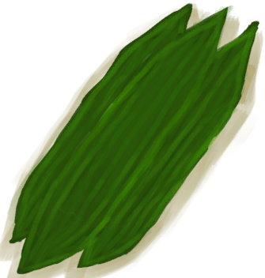

# “喂食（草食动物）”  

[

 [杂菌](AssortedMushrooms.md)](AssortedMushrooms.md)

[

 [香蕉](Banana.md)](Banana.md)

[

 [辣椒](Chilies.md)](Chilies.md)

[

 [干辣椒](ChiliesDried.md)](ChiliesDried.md)

[

 [月季](ChinaRoseFlowers.md)](ChinaRoseFlowers.md)

[

 [椰肉](CoconutMeat.md)](CoconutMeat.md)

[

 [烤椰肉](CoconutMeatCooked.md)](CoconutMeatCooked.md)

[

 [咖啡果](CoffeeBerries.md)](CoffeeBerries.md)

[

 [咖啡果浆](CoffeeBerryPulp.md)](CoffeeBerryPulp.md)

[

 [山羊饲料](FeedGoat.md)](FeedGoat.md)

[

 [姜](Ginger.md)](Ginger.md)

[

 [干姜](GingerDried.md)](GingerDried.md)

[

 [茉莉花](JasmineFlowers.md)](JasmineFlowers.md)

[

 [野枣](JujubeFruits.md)](JujubeFruits.md)

[

 [卡瓦根](KavaRoot.md)](KavaRoot.md)

[

 [捣碎的柠檬草](LemonGrassGround.md)](LemonGrassGround.md)

[

 [柠檬草](LemongrassStalks.md)](LemongrassStalks.md)

[

 [迷幻菇](MagicMushrooms.md)](MagicMushrooms.md)

[

 [芒果](Mango.md)](Mango.md)

[

 [姜糖](CandiedGinger.md)](CandiedGinger.md)

[

 [水椰籽](NipaSeeds.md)](NipaSeeds.md)

[

 [马勃菌](Puffballs.md)](Puffballs.md)

[

 [稻秆](RiceStalks.md)](RiceStalks.md)

[

 [西米饼](SagoFlatbread.md)](SagoFlatbread.md)

[

 [蜂蜜西米饼](SagoFlatbreadHoney.md)](SagoFlatbreadHoney.md)

[

 [果酱西米饼](SagoFlatbreadJam.md)](SagoFlatbreadJam.md)

[

 [海藻](Seaweed.md)](Seaweed.md)

[

 [蜘蛛兰叶](SpiderLilyLeaves.md)](SpiderLilyLeaves.md)

[

 [干燥的蜘蛛兰叶](SpiderLilyLeavesDried.md)](SpiderLilyLeavesDried.md)

[

 [热带杏仁核](TropicalAlmondKernels.md)](TropicalAlmondKernels.md)

[

 [烤热带杏仁](TropicalAlmondsRoasted.md)](TropicalAlmondsRoasted.md)

[

 [大叶仙茅叶片](WeevilLilyLeaves.md)](WeevilLilyLeaves.md)

[

 [参薯](Yam.md)](Yam.md)

[

 [煮熟的参薯](YamBoiled.md)](YamBoiled.md)

[

 [参薯片](YamCut.md)](YamCut.md)

[

 [稻杆](RiceStraw.md)](RiceStraw.md)

  
  
