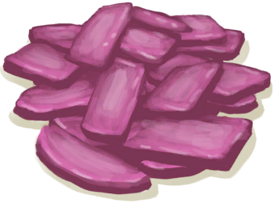

# “喂食（草食动物）”  

<a href="AssortedMushrooms.md" style="color:black">杂菌</a>

<a href="Banana.md" style="color:black">香蕉</a>

<a href="CandiedGinger.md" style="color:black">姜糖</a>

<a href="Chilies.md" style="color:black">辣椒</a>

<a href="ChiliesDried.md" style="color:black">干辣椒</a>

<a href="ChinaRoseFlowers.md" style="color:black">月季</a>

<a href="CoconutMeat.md" style="color:black">椰肉</a>

<a href="CoconutMeatCooked.md" style="color:black">烤椰肉</a>

<a href="CoffeeBerries.md" style="color:black">咖啡果</a>

<a href="CoffeeBerryPulp.md" style="color:black">咖啡果浆</a>

<a href="FeedGoat.md" style="color:black">山羊饲料</a>

<a href="Ginger.md" style="color:black">姜</a>

<a href="GingerDried.md" style="color:black">干姜</a>

<a href="JasmineFlowers.md" style="color:black">茉莉花</a>

<a href="JujubeFruits.md" style="color:black">野枣</a>

<a href="KavaRoot.md" style="color:black">卡瓦根</a>

<a href="LemonGrassGround.md" style="color:black">捣碎的柠檬草</a>

<a href="LemongrassStalks.md" style="color:black">柠檬草</a>

<a href="MagicMushrooms.md" style="color:black">迷幻菇</a>

<a href="Mango.md" style="color:black">芒果</a>

<a href="NipaSeeds.md" style="color:black">水椰籽</a>

<a href="Puffballs.md" style="color:black">马勃菌</a>

<a href="RiceStalks.md" style="color:black">稻秆</a>

<a href="SagoFlatbread.md" style="color:black">西米饼</a>

<a href="SagoFlatbreadHoney.md" style="color:black">蜂蜜西米饼</a>

<a href="SagoFlatbreadJam.md" style="color:black">果酱西米饼</a>

<a href="Seaweed.md" style="color:black">海藻</a>

<a href="SpiderLilyLeaves.md" style="color:black">蜘蛛兰叶</a>

<a href="SpiderLilyLeavesDried.md" style="color:black">干燥的蜘蛛兰叶</a>

<a href="TropicalAlmondKernels.md" style="color:black">热带杏仁核</a>

<a href="TropicalAlmondsRoasted.md" style="color:black">烤热带杏仁</a>

<a href="WeevilLilyLeaves.md" style="color:black">大叶仙茅叶片</a>

<a href="Yam.md" style="color:black">参薯</a>

<a href="YamBoiled.md" style="color:black">煮熟的参薯</a>

<a href="YamCut.md" style="color:black">参薯片</a>

<a href="RiceStraw.md" style="color:black">稻杆</a>

  
  

