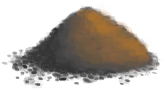

# “低效肥料”  

<a href="Bonemeal.md" style="color:black">骨粉</a>

<a href="Feathermeal.md" style="color:black">羽毛粉</a>

<a href="FishScraps.md" style="color:black">鱼杂</a>

<a href="FishScrapsCooked.md" style="color:black">烤鱼杂</a>

<a href="RottenRemains.md" style="color:black">腐烂物</a>

<a href="Guano.md" style="color:black">海鸟粪</a>

<a href="Manure.md" style="color:black">粪便</a>

  
  

