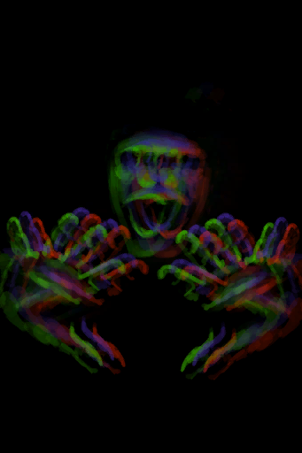

# “战斗事件”  

<a href="Combat_EventBoar_1_Explore.md" style="color:black">你看到了一头野猪！</a>

<a href="Combat_EventCobra_1_Explore.md" style="color:black">我发现了一条眼镜蛇！</a>

<a href="Combat_EventCobra_2_Track.md" style="color:black">追踪眼镜蛇</a>

<a href="Combat_EventCobra_3_TrackFail.md" style="color:black">失败了</a>

<a href="Combat_EventCobra_3_TrackSuccess.md" style="color:black">成功了</a>

<a href="Combat_EventDrone_1_Explore.md" style="color:black">我看到了一台无人机！</a>

<a href="Combat_EventDrone_2_Track.md" style="color:black">追踪无人机</a>

<a href="Combat_EventDrone_3_TrackFail.md" style="color:black">失败</a>

<a href="Combat_EventDrone_3_TrackSuccess.md" style="color:black">成功</a>

<a href="Combat_EventGoat_1_Explore.md" style="color:black">你看到一头山羊！</a>

<a href="Combat_EventGoat_2_Track.md" style="color:black">追踪山羊</a>

<a href="Combat_EventGoat_3_TrackFail.md" style="color:black">失败了</a>

<a href="Combat_EventGoat_3_TrackSuccess.md" style="color:black">成功了</a>

<a href="Combat_EventMacaqueDen.md" style="color:black">猕猴窝</a>

<a href="Combat_EventMacaque_1_Explore.md" style="color:black">你看到一只猕猴！</a>

<a href="Combat_EventMonitor_1_Explore.md" style="color:black">你看到了一头巨蜥！</a>

<a href="Combat_EventPartridge_1.md" style="color:black">你看到一只灰山鹑！</a>

<a href="Combat_EventPartridge_2_Track.md" style="color:black">追踪灰山鹑</a>

<a href="Combat_EventPartridge_3_TrackFail.md" style="color:black">失败</a>

<a href="Combat_EventPartridge_3_TrackSuccess.md" style="color:black">成功</a>

<a href="Combat_EventSeaHound_1_Raid.md" style="color:black">我看到了一头海怪！</a>

<a href="Combat_EventSeagull_1_Explore.md" style="color:black">你看到一只海鸥！</a>

<a href="Combat_EventShark_1_Explore.md" style="color:black">我看到了一条鲨鱼！</a>

<a href="Combat_EventBoar_1_Raid.md" style="color:black">一头野猪！</a>

<a href="Combat_EventDrone_1_Raid.md" style="color:black">攻击无人机！</a>

<a href="Combat_EventEnemy_1.md" style="color:black">宿敌来了！</a>

<a href="Combat_EventHunter_1.md" style="color:black">猎手来了！</a>

<a href="Combat_EventMacaque_1_Raid.md" style="color:black">一只猕猴！</a>

<a href="Combat_EventMonitor_1_Raid.md" style="color:black">一头巨蜥！</a>

<a href="Event_BoarFight.md" style="color:black">一头野猪！</a>

<a href="Event_BoarFightRaidOld.md" style="color:black">一头野猪！</a>

<a href="Event_BoarTrailLost.md" style="color:black">我跟丢了踪迹……</a>

<a href="Event_BoarTrailOld.md" style="color:black">老旧的踪迹</a>

<a href="Event_BoarTrailRecent.md" style="color:black">近期的踪迹</a>

<a href="Event_CobraFight.md" style="color:black">喷毒眼镜蛇！</a>

<a href="Event_EnemyFight.md" style="color:black">宿敌来了！</a>

<a href="Event_EnemyPresence.md" style="color:black">我感觉到某种“存在”……</a>

<a href="Event_MacaqueDenFight.md" style="color:black">猕猴们攻击了你！</a>

<a href="Event_MacaqueFight.md" style="color:black">一只猕猴！</a>

<a href="Event_MacaqueFightRaid.md" style="color:black">一只猕猴！</a>

<a href="Event_MacaqueRaidOld.md" style="color:black">一只猕猴！</a>

<a href="Event_MacaqueUndeadFight.md" style="color:black">一只猕猴！</a>

<a href="Event_MonitorFight.md" style="color:black">一头巨蜥！</a>

<a href="Event_SeahoundFight.md" style="color:black">一头海怪！</a>

<a href="Event_SharkFight.md" style="color:black">一条鲨鱼！</a>

<a href="Track_EventGoat.md" style="color:black">一头野猪！</a>

<a href="Track_EventGoatFail.md" style="color:black">一头野猪！</a>

<a href="Track_EventGoatSucess.md" style="color:black">一头野猪！</a>

<a href="VedransEvent_Boar.md" style="color:black">一头野猪！</a>

<a href="VedransLazerEvent_Boar.md" style="color:black">一头野猪！</a>

  
  

