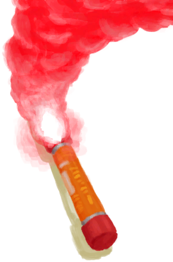

# “火源”  

<a href="BeeSmokerOn.md" style="color:black">熏蜂器</a>

<a href="CandleCitronellaOn.md" style="color:black">香茅蜡烛</a>

<a href="CandleJasmineOn.md" style="color:black">茉莉蜡烛</a>

<a href="CandleOn.md" style="color:black">蜡烛</a>

<a href="DynamiteOn.md" style="color:black">炸药</a>

<a href="FlareHandOn.md" style="color:black">燃烧的信号弹</a>

<a href="TorchOn.md" style="color:black">火把</a>

  
  

