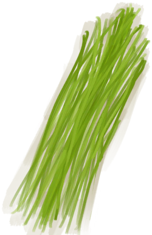
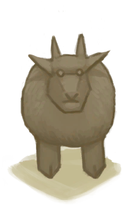

# “燃料”  

[铜箭矢](ArrowCopper.md)

[

 [箭杆](ArrowShaft.md)](ArrowShaft.md)

[

 [简易箭矢](ArrowSimple.md)](ArrowSimple.md)

[

 [椰子皮](CoconutHusk.md)](CoconutHusk.md)

[

 [骨钩](HookBone.md)](HookBone.md)

[

 [稻杆](RiceStraw.md)](RiceStraw.md)

[

 [小树枝](Sticks.md)](Sticks.md)

[

 [失败品](WoodCarving_Failed.md)](WoodCarving_Failed.md)

[

 [山羊木雕](WoodCarving_Goat.md)](WoodCarving_Goat.md)

[

 [小人木雕（男）](WoodCarving_Man.md)](WoodCarving_Man.md)

[

 [神灵木雕](WoodCarving_Monster.md)](WoodCarving_Monster.md)

[

 [海鸥木雕](WoodCarving_Seagull.md)](WoodCarving_Seagull.md)

[

 [未完成的木雕](WoodCarving_Unfinished.md)](WoodCarving_Unfinished.md)

[

 [小人木雕（女）](WoodCarving_Woman.md)](WoodCarving_Woman.md)

  
  

