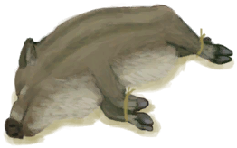
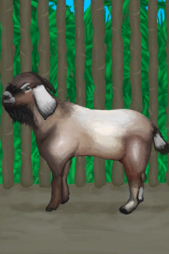
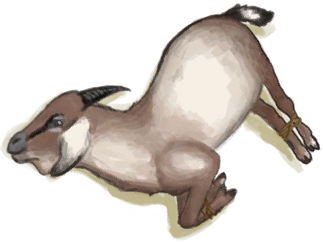
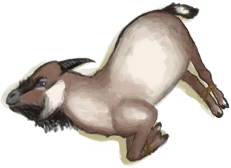

# “山羊”  

<a href="BoarTiedPiglet.md" style="color:black">小猪</a>

<a href="GoatEnclosureFemale.md" style="color:black">母山羊</a>

<a href="GoatEnclosureLactating.md" style="color:black">泌乳期山羊</a>

<a href="GoatEnclosureMale.md" style="color:black">公山羊</a>

<a href="GoatTiedFemale.md" style="color:black">母山羊</a>

<a href="GoatTiedFemaleLactating.md" style="color:black">泌乳期山羊</a>

<a href="GoatTiedMale.md" style="color:black">公山羊</a>

  
  

