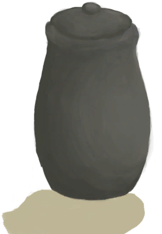
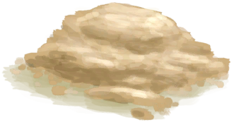
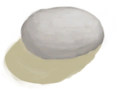
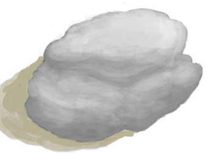
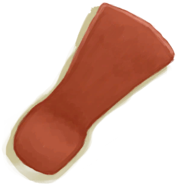
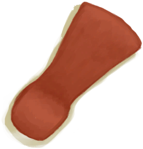
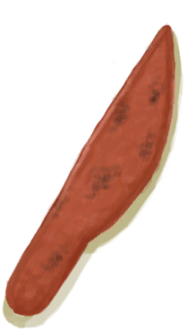
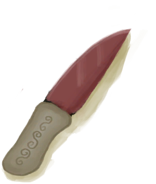

# “沉重的”  

<a href="DirtPile.md" style="color:black">干土堆</a>

<a href="ClayFirePit.md" style="color:black">粘土火盆</a>

<a href="ClayFirePitExtinguished.md" style="color:black">粘土火盆</a>

<a href="HalfLog.md" style="color:black">半根原木</a>

<a href="Log.md" style="color:black">原木</a>

<a href="MudPile.md" style="color:black">泥堆</a>

<a href="Clay.md" style="color:black">粘土</a>

<a href="ClayPotCoolerUnfired.md" style="color:black">未烧制的保鲜罐</a>

<a href="ClayVase.md" style="color:black">陶罐</a>

<a href="ClayVaseUnfired.md" style="color:black">未烧制的陶罐</a>

<a href="CookingPot.md" style="color:black">烹饪锅</a>

<a href="CookingPotUnfired.md" style="color:black">未烧制的烹饪锅</a>

<a href="GlazedVase.md" style="color:black">釉面陶罐</a>

<a href="GlazedVaseUnfired.md" style="color:black">未烧制的釉面陶罐</a>

<a href="Jerrycan.md" style="color:black">油桶</a>

<a href="JerrycanFuel.md" style="color:black">装有燃料的油桶</a>

<a href="Flint.md" style="color:black">燧石</a>

<a href="FlintSlab.md" style="color:black">燧石板</a>

<a href="Chest.md" style="color:black">储物箱</a>

<a href="ChestFarmer.md" style="color:black">储物箱</a>

<a href="ChestPlaced.md" style="color:black">储物箱</a>

<a href="ClayPotCoolerOff.md" style="color:black">保鲜罐</a>

<a href="ClayPotCoolerOn.md" style="color:black">保鲜罐</a>

<a href="ClayPotCoolerUndeployed.md" style="color:black">保鲜罐</a>

<a href="SupplyChestRaft.md" style="color:black">补给箱</a>

<a href="Trunk.md" style="color:black">收纳箱</a>

<a href="TrunkPerk.md" style="color:black">超级生存箱 2000</a>

<a href="TrunkPerkPlaced.md" style="color:black">超级生存箱 2000</a>

<a href="TrunkPlaced.md" style="color:black">收纳箱</a>

<a href="MetalScrap.md" style="color:black">金属废料</a>

<a href="MoldAxe.md" style="color:black">斧头模具</a>

<a href="MoldCopperDecoration.md" style="color:black">装饰品模具</a>

<a href="MoldKnife.md" style="color:black">刀模具</a>

<a href="MoldShovel.md" style="color:black">铲头模具</a>

<a href="MoldSpear.md" style="color:black">矛头模具</a>

<a href="Mortar.md" style="color:black">砂浆</a>

<a href="MortarBurnt.md" style="color:black">煅烧后的砂浆</a>

<a href="MortarDry.md" style="color:black">干燥的砂浆</a>

<a href="MudBrick.md" style="color:black">泥砖</a>

<a href="Obsidian.md" style="color:black">黑曜石</a>

<a href="Stone.md" style="color:black">石头</a>

<a href="StoneBurnt.md" style="color:black">煅烧后的石头</a>

<a href="StoneHeavy.md" style="color:black">大石块</a>

<a href="StoneHeavyBrimstone.md" style="color:black">硫磺石</a>

<a href="StoneHeavyBurnt.md" style="color:black">煅烧后的大石块</a>

<a href="AxeFlint.md" style="color:black">燧石斧</a>

<a href="AxeHead.md" style="color:black">斧子头</a>

<a href="AxeHeadBlunt.md" style="color:black">钝斧子头</a>

<a href="AxeScrap.md" style="color:black">废金属斧</a>

<a href="AxeSurvival.md" style="color:black">求生斧</a>

<a href="AxeSurvivalBlunt.md" style="color:black">钝的求生斧</a>

<a href="CeremonialDagger.md" style="color:black">仪式匕首</a>

<a href="KnifeCopper.md" style="color:black">铜刀</a>

<a href="KnifeCopperBlunt.md" style="color:black">钝刀</a>

<a href="KnifeFlint.md" style="color:black">燧石刀</a>

<a href="KnifeGrandpa.md" style="color:black">祖父的刀</a>

<a href="KnifeGrandpaBlunt.md" style="color:black">祖父的钝刀</a>

<a href="KnifeMilitary.md" style="color:black">军刀</a>

<a href="KnifeMilitaryBlunt.md" style="color:black">钝刀</a>

<a href="KnifeObsidian.md" style="color:black">黑曜石刀</a>

<a href="KnifeScrap.md" style="color:black">废金属刀</a>

<a href="ShovelCopper.md" style="color:black">铜铲</a>

<a href="ShovelHead.md" style="color:black">铲子头</a>

<a href="ShovelScrap.md" style="color:black">废金属铲</a>

<a href="ShovelWooden.md" style="color:black">木铲</a>

<a href="StoneAxe.md" style="color:black">石斧</a>

<a href="StoneSharpened.md" style="color:black">石刀</a>

  
  

