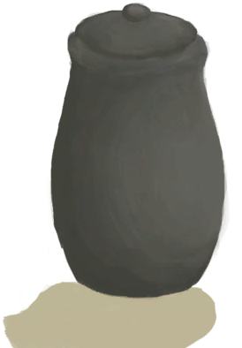
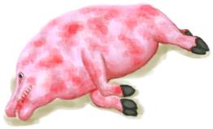
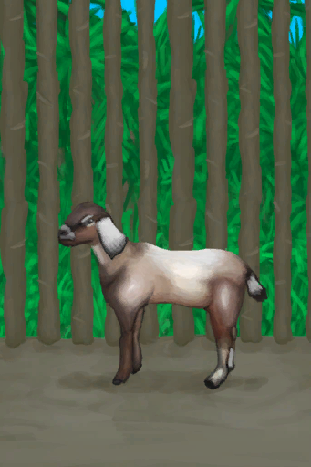

# “大的”  

[

 [诱捕笼](CageTrap.md)](CageTrap.md)

[

 [诱捕笼](CageTrapPlaced.md)](CageTrapPlaced.md)

[

 [瓦斯炉](GasCookerOn.md)](GasCookerOn.md)

[

 [半根原木](HalfLog.md)](HalfLog.md)

[

 [原木](Log.md)](Log.md)

[

 [简易的弓](BowRustic.md)](BowRustic.md)

[

 [上弦的简易弓](BowRustic_Copper.md)](BowRustic_Copper.md)

[

 [上弦的简易弓](BowRustic_Simple.md)](BowRustic_Simple.md)

[

 [未烧制的粘土火盆](ClayFirePitUnfired.md)](ClayFirePitUnfired.md)

[

 [陶罐](ClayVase.md)](ClayVase.md)

[

 [未烧制的陶罐](ClayVaseUnfired.md)](ClayVaseUnfired.md)

[

 [釉面陶罐](GlazedVase.md)](GlazedVase.md)

[

 [未烧制的釉面陶罐](GlazedVaseUnfired.md)](GlazedVaseUnfired.md)

[

 [油桶](Jerrycan.md)](Jerrycan.md)

[

 [装有燃料的油桶](JerrycanFuel.md)](JerrycanFuel.md)

[

 [鼓](Drum.md)](Drum.md)

[

 [中陷阱的猕猴](CageTrapMacaque.md)](CageTrapMacaque.md)

[

 [野猪尸体](BoarCarcass.md)](BoarCarcass.md)

[

 [小猪尸体](BoarCarcassPiglet.md)](BoarCarcassPiglet.md)

[

 [母猪](BoarEnclosureFemale.md)](BoarEnclosureFemale.md)

[

 [公猪](BoarEnclosureMale.md)](BoarEnclosureMale.md)

[

 [小猪](BoarEnclosurePiglet.md)](BoarEnclosurePiglet.md)

[

 [剥皮的野猪](BoarSkinned.md)](BoarSkinned.md)

[

 [剥皮的猪](BoarSkinnedPiglet.md)](BoarSkinnedPiglet.md)

[

 [母猪](BoarTiedFemale.md)](BoarTiedFemale.md)

[

 [公猪](BoarTiedMale.md)](BoarTiedMale.md)

[

 [小猪](BoarTiedPiglet.md)](BoarTiedPiglet.md)

[

 [忠犬朋友](DogFriend.md)](DogFriend.md)

[

 [山羊尸体](GoatCarcassFemale.md)](GoatCarcassFemale.md)

[

 [小羊尸体](GoatCarcassKid.md)](GoatCarcassKid.md)

[

 [山羊尸体](GoatCarcassMale.md)](GoatCarcassMale.md)

[

 [母山羊](GoatEnclosureFemale.md)](GoatEnclosureFemale.md)

[

 [小羊](GoatEnclosureKid.md)](GoatEnclosureKid.md)

[

 [哺乳期山羊](GoatEnclosureLactating.md)](GoatEnclosureLactating.md)

[

 [公山羊](GoatEnclosureMale.md)](GoatEnclosureMale.md)

[

 [剥皮的山羊](GoatSkinned.md)](GoatSkinned.md)

[

 [剥皮的小羊](GoatSkinnedKid.md)](GoatSkinnedKid.md)

[

 [母山羊](GoatTiedFemale.md)](GoatTiedFemale.md)

[

 [哺乳期山羊](GoatTiedFemaleLactating.md)](GoatTiedFemaleLactating.md)

[

 [小羊](GoatTiedKid.md)](GoatTiedKid.md)

[

 [公山羊](GoatTiedMale.md)](GoatTiedMale.md)

[

 [雌灰山鹑](PartridgeFemaleEnclosure.md)](PartridgeFemaleEnclosure.md)

[

 [雄灰山鹑](PartridgeMaleEnclosure.md)](PartridgeMaleEnclosure.md)

[

 [海怪尸体](SeahoundCarcass.md)](SeahoundCarcass.md)

[

 [鲨鱼尸体](SharkCarcass.md)](SharkCarcass.md)

[

 [储物箱](Chest.md)](Chest.md)

[

 [储物箱](ChestFarmer.md)](ChestFarmer.md)

[

 [保鲜罐](ClayPotCoolerOff.md)](ClayPotCoolerOff.md)

[

 [保鲜罐](ClayPotCoolerUndeployed.md)](ClayPotCoolerUndeployed.md)

[

 [补给箱](SupplyChestRaft.md)](SupplyChestRaft.md)

[

 [小拉车](Travois.md)](Travois.md)

[

 [收纳箱](Trunk.md)](Trunk.md)

[

 [超级生存箱 2000](TrunkPerk.md)](TrunkPerk.md)

[

 [超级生存箱 2000](TrunkPerkPlaced.md)](TrunkPerkPlaced.md)

[

 [收纳箱](TrunkPlaced.md)](TrunkPlaced.md)

[

 [蜥蜴皮手鼓](LizardDrum.md)](LizardDrum.md)

[

 [巨蜥尸体](MonitorCarcass.md)](MonitorCarcass.md)

[

 [剥皮的巨蜥](MonitorSkinned.md)](MonitorSkinned.md)

[

 [沙堡](SandCastle.md)](SandCastle.md)

[

 [长木棍](StickLong.md)](StickLong.md)

[

 [扫帚](Broom.md)](Broom.md)

[

 [钓鱼竿](FishingRod.md)](FishingRod.md)

[

 [钓鱼竿（已添加诱饵）](FishingRodBait.md)](FishingRodBait.md)

[

 [鱼镖](HarpoonBone.md)](HarpoonBone.md)

[

 [盾牌](Shield.md)](Shield.md)

[

 [铜长矛](SpearCopper.md)](SpearCopper.md)

[

 [鱼叉](SpearFishing.md)](SpearFishing.md)

[

 [燧石长矛](SpearFlint.md)](SpearFlint.md)

[

 [黑曜石长矛](SpearObsidian.md)](SpearObsidian.md)

[

 [简易长矛](SpearRustic.md)](SpearRustic.md)

[

 [废金属长矛](SpearScrap.md)](SpearScrap.md)

[

 [蒸馏器](AlembicUndeployed.md)](AlembicUndeployed.md)

  
  
