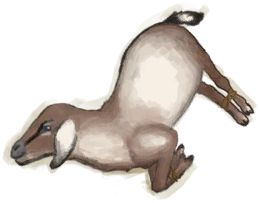

# “大型动物”  
<table class="table table-bordered table7297" data-toggle="table"  ><thead style=""><tr ><th  style=""  >名称</th><th  style=""  data-sortable="true"  >可使用次数</th></tr></thead><tr ><td  style=""  >[

[母猪](BoarEnclosureFemale.md)](BoarEnclosureFemale.md)</td><td  style=""  >288</td></tr><tr ><td  style=""  >[

[公猪](BoarEnclosureMale.md)](BoarEnclosureMale.md)</td><td  style=""  >288</td></tr><tr ><td  style=""  >[

[小猪](BoarEnclosurePiglet.md)](BoarEnclosurePiglet.md)</td><td  style=""  >288</td></tr><tr ><td  style=""  >[

[母猪](BoarTiedFemale.md)](BoarTiedFemale.md)</td><td  style=""  >288</td></tr><tr ><td  style=""  >[

[公猪](BoarTiedMale.md)](BoarTiedMale.md)</td><td  style=""  >288</td></tr><tr ><td  style=""  >[

[小猪](BoarTiedPiglet.md)](BoarTiedPiglet.md)</td><td  style=""  >192</td></tr><tr ><td  style=""  >[

[忠犬朋友](DogFriend.md)](DogFriend.md)</td><td  style=""  >288</td></tr><tr ><td  style=""  >[

[母山羊](GoatEnclosureFemale.md)](GoatEnclosureFemale.md)</td><td  style=""  >288</td></tr><tr ><td  style=""  >[

[小羊](GoatEnclosureKid.md)](GoatEnclosureKid.md)</td><td  style=""  >288</td></tr><tr ><td  style=""  >[

[哺乳期山羊](GoatEnclosureLactating.md)](GoatEnclosureLactating.md)</td><td  style=""  >288</td></tr><tr ><td  style=""  >[

[公山羊](GoatEnclosureMale.md)](GoatEnclosureMale.md)</td><td  style=""  >288</td></tr><tr ><td  style=""  >[

[母山羊](GoatTiedFemale.md)](GoatTiedFemale.md)</td><td  style=""  >288</td></tr><tr ><td  style=""  >[

[哺乳期山羊](GoatTiedFemaleLactating.md)](GoatTiedFemaleLactating.md)</td><td  style=""  >288</td></tr><tr ><td  style=""  >[

[小羊](GoatTiedKid.md)](GoatTiedKid.md)</td><td  style=""  >192</td></tr><tr ><td  style=""  >[

[公山羊](GoatTiedMale.md)](GoatTiedMale.md)</td><td  style=""  >288</td></tr></tbody></table>  
  

