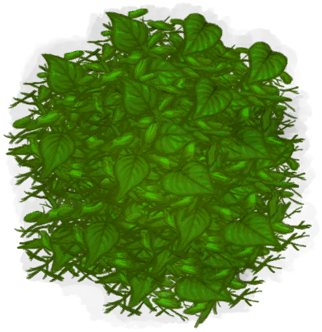

# “树叶”  

[

 [枯叶](LeavesDry.md)](LeavesDry.md)

[

 [树叶](LeavesFresh.md)](LeavesFresh.md)

[

 [鸟巢](Nest.md)](Nest.md)

[

 [棕榈叶](PalmFronds.md)](PalmFronds.md)

[

 [稻杆](RiceStraw.md)](RiceStraw.md)

[

 [蛇草](SnakeGrass.md)](SnakeGrass.md)

  
  
