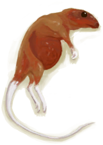

# “肉”  

[

 [蝙蝠尸体](Bat.md)](Bat.md)

[

 [烤蝙蝠](BatCooked.md)](BatCooked.md)

[

 [鸟肉](BirdMeat.md)](BirdMeat.md)

[

 [烤鸟肉](BirdMeatCooked.md)](BirdMeatCooked.md)

[

 [烟熏鸟肉](BirdMeatSmoked.md)](BirdMeatSmoked.md)

[

 [野猪肉](BoarMeat.md)](BoarMeat.md)

[

 [烤野猪肉](BoarMeatCooked.md)](BoarMeatCooked.md)

[

 [野猪肉干](BoarMeatDried.md)](BoarMeatDried.md)

[

 [腌野猪肉](BoarMeatSalted.md)](BoarMeatSalted.md)

[

 [腌制中的野猪肉](BoarMeatSaltedDrying.md)](BoarMeatSaltedDrying.md)

[

 [烟熏野猪肉](BoarMeatSmoked.md)](BoarMeatSmoked.md)

[

 [北梭鱼](Bonefish.md)](Bonefish.md)

[

 [烤北梭鱼](BonefishCooked.md)](BonefishCooked.md)

[

 [北梭鱼肉](BonefishMeat.md)](BonefishMeat.md)

[

 [黄油](Butter.md)](Butter.md)

[

 [海螺肉](ConchMeat.md)](ConchMeat.md)

[

 [烤海螺肉](ConchMeatCooked.md)](ConchMeatCooked.md)

[

 [松软的海螺肉](ConchMeatSoft.md)](ConchMeatSoft.md)

[

 [松软的烤海螺肉](ConchMeatSoftCooked.md)](ConchMeatSoftCooked.md)

[

 [蛋](Egg.md)](Egg.md)

[

 [水煮蛋](EggBoiled.md)](EggBoiled.md)

[

 [烤蛋](EggCooked.md)](EggCooked.md)

[

 [受精蛋](EggPartridgeFertilized.md)](EggPartridgeFertilized.md)

[

 [脂肪](Fat.md)](Fat.md)

[

 [鱼干](FishDried.md)](FishDried.md)

[

 [咸鱼](FishSalted.md)](FishSalted.md)

[

 [腌制中的咸鱼肉](FishSaltedDrying.md)](FishSaltedDrying.md)

[

 [鱼杂](FishScraps.md)](FishScraps.md)

[

 [烤鱼杂](FishScrapsCooked.md)](FishScrapsCooked.md)

[

 [羊肉](GoatMeat.md)](GoatMeat.md)

[

 [烤羊肉](GoatMeatCooked.md)](GoatMeatCooked.md)

[

 [羊肉干](GoatMeatDried.md)](GoatMeatDried.md)

[

 [腌羊肉](GoatMeatSalted.md)](GoatMeatSalted.md)

[

 [腌制中的羊肉](GoatMeatSaltedDrying.md)](GoatMeatSaltedDrying.md)

[

 [烟熏羊肉](GoatMeatSmoked.md)](GoatMeatSmoked.md)

[

 [绯鲤](Goatfish.md)](Goatfish.md)

[

 [烤绯鲤](GoatfishCooked.md)](GoatfishCooked.md)

[

 [烟熏绯鲤](GoatfishSmoked.md)](GoatfishSmoked.md)

[

 [鲱鱼](Herring.md)](Herring.md)

[

 [烤鲱鱼](HerringCooked.md)](HerringCooked.md)

[

 [烟熏鲱鱼](HerringSmoked.md)](HerringSmoked.md)

[

 [大马鲅鱼](KingThreadfin.md)](KingThreadfin.md)

[

 [蜥蜴](Lizard.md)](Lizard.md)

[

 [烤蜥蜴](LizardCooked.md)](LizardCooked.md)

[

 [猕猴尸体](MacaqueCarcass.md)](MacaqueCarcass.md)

[

 [猕猴肉](MacaqueMeat.md)](MacaqueMeat.md)

[

 [烤猕猴肉](MacaqueMeatCooked.md)](MacaqueMeatCooked.md)

[

 [猕猴肉干](MacaqueMeatDried.md)](MacaqueMeatDried.md)

[

 [腌猕猴肉](MacaqueMeatSalted.md)](MacaqueMeatSalted.md)

[

 [腌制中的猕猴肉](MacaqueMeatSaltedDrying.md)](MacaqueMeatSaltedDrying.md)

[

 [烟熏猕猴肉](MacaqueMeatSmoked.md)](MacaqueMeatSmoked.md)

[

 [参薯酱](YamJam.md)](YamJam.md)

[

 [巨蜥肉](MonitorMeat.md)](MonitorMeat.md)

[

 [烤巨蜥肉](MonitorMeatCooked.md)](MonitorMeatCooked.md)

[

 [巨蜥肉干](MonitorMeatDried.md)](MonitorMeatDried.md)

[

 [腌巨蜥肉](MonitorMeatSalted.md)](MonitorMeatSalted.md)

[

 [腌制中的巨蜥肉](MonitorMeatSaltedDrying.md)](MonitorMeatSaltedDrying.md)

[

 [烟熏巨蜥肉](MonitorMeatSmoked.md)](MonitorMeatSmoked.md)

[

 [老鼠尸体](Mouse.md)](Mouse.md)

[

 [烤老鼠](MouseCooked.md)](MouseCooked.md)

[

 [剥皮的老鼠](MouseSkinned.md)](MouseSkinned.md)

[

 [弹涂鱼](Mudskipper.md)](Mudskipper.md)

[

 [烤弹涂鱼](MudskipperCooked.md)](MudskipperCooked.md)

[

 [牡蛎肉](OysterMeat.md)](OysterMeat.md)

[

 [黄油焗牡蛎](OysterMeatBaked.md)](OysterMeatBaked.md)

[

 [烤牡蛎肉](OysterMeatCooked.md)](OysterMeatCooked.md)

[

 [鹦哥鱼](ParrotFish.md)](ParrotFish.md)

[

 [烤鹦哥鱼](ParrotFishCooked.md)](ParrotFishCooked.md)

[

 [烟熏鹦哥鱼](ParrotFishSmoked.md)](ParrotFishSmoked.md)

[

 [小灰山鹑](PartridgeChick.md)](PartridgeChick.md)

[

 [小灰山鹑尸体](PartridgeChickDead.md)](PartridgeChickDead.md)

[

 [灰山鹑尸体](PartridgeDead.md)](PartridgeDead.md)

[

 [雌灰山鹑](PartridgeFemaleEnclosure.md)](PartridgeFemaleEnclosure.md)

[

 [雌灰山鹑](PartridgeFemaleLive.md)](PartridgeFemaleLive.md)

[

 [雄灰山鹑](PartridgeMaleEnclosure.md)](PartridgeMaleEnclosure.md)

[

 [雄灰山鹑](PartridgeMaleLive.md)](PartridgeMaleLive.md)

[

 [虾](Prawns.md)](Prawns.md)

[

 [烤虾](PrawnsCooked.md)](PrawnsCooked.md)

[

 [凝乳酶](Rennet.md)](Rennet.md)

[

 [海鸥尸体](SeagullDead.md)](SeagullDead.md)

[

 [海怪尸体](SeahoundCarcass.md)](SeahoundCarcass.md)

[

 [烤海怪肉](SeahoundCooked.md)](SeahoundCooked.md)

[

 [海怪肉](Seahoundmeat.md)](Seahoundmeat.md)

[

 [鲨鱼尸体](SharkCarcass.md)](SharkCarcass.md)

[

 [烤鲨鱼肉](SharkCooked.md)](SharkCooked.md)

[

 [烤马鲅鱼](ThreadfinCooked.md)](ThreadfinCooked.md)

[

 [马鲅鱼肉](ThreadfinMeat.md)](ThreadfinMeat.md)

[

 [烟熏马鲅鱼](ThreadfinSmoked.md)](ThreadfinSmoked.md)

[

 [海胆肉](UrchinMeat.md)](UrchinMeat.md)

[

 [烤海胆](UrchinMeatCooked.md)](UrchinMeatCooked.md)

  
  

