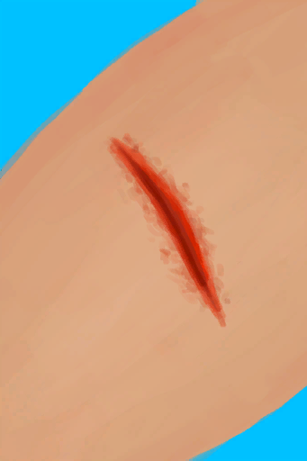

# “开放性伤口”  

<a href="W_Abrasion.md" style="color:black">擦伤</a>

<a href="W_ArmLacerationL.md" style="color:black">左臂撕裂伤</a>

<a href="W_ArmLacerationR.md" style="color:black">右臂撕裂伤</a>

<a href="W_DogBite.md" style="color:black">狗咬伤</a>

<a href="W_LegLacerationL.md" style="color:black">左腿撕裂伤</a>

<a href="W_LegLacerationR.md" style="color:black">右腿撕裂伤</a>

<a href="W_MacaqueBite.md" style="color:black">猕猴咬伤</a>

<a href="W_MinorLaceration.md" style="color:black">轻微撕裂伤</a>

<a href="W_MonitorBite.md" style="color:black">巨蜥咬伤</a>

<a href="W_SharkBite.md" style="color:black">鲨鱼咬伤</a>

  
  

