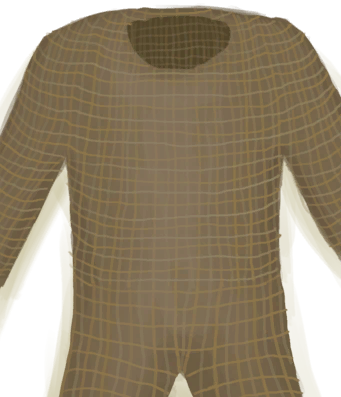
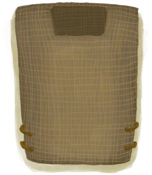

# “躯干（外层）”  

<a href="BeeSuit.md" style="color:black">防蜂服</a>

<a href="FiberArmor.md" style="color:black">纤维甲</a>

<a href="FiberCuirass.md" style="color:black">纤维胸甲</a>

<a href="HawaiianShirt.md" style="color:black">夏威夷衬衫</a>

<a href="HoodieRetromation.md" style="color:black">卫衣</a>

<a href="JacketClothDisabled.md" style="color:black">布夹克</a>

<a href="LeatherJacketDisabled.md" style="color:black">皮夹克</a>

<a href="LeatherVest.md" style="color:black">皮背心</a>

<a href="Raincoat.md" style="color:black">雨衣</a>

<a href="ShirtCloth.md" style="color:black">衬衫</a>

<a href="StrawCape.md" style="color:black">蓑衣</a>

<a href="T-Shirt.md" style="color:black">T恤</a>

  
  

