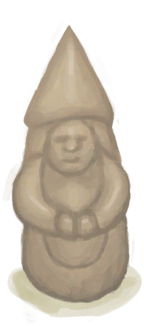

# “美丽的/好看的”  

<a href="Calcite.md" style="color:black">方解石晶体</a>

<a href="CopperNecklace.md" style="color:black">铜项链</a>

<a href="FlowerNecklace.md" style="color:black">鲜花项链</a>

<a href="PearlNecklace.md" style="color:black">珍珠项链</a>

<a href="SeagullCharm.md" style="color:black">海鸥护符</a>

<a href="SeashellNecklace.md" style="color:black">贝壳项链</a>

<a href="Conch.md" style="color:black">海螺</a>

<a href="ClayBowl.md" style="color:black">陶碗</a>

<a href="ClayJar.md" style="color:black">小陶罐</a>

<a href="CopperJar.md" style="color:black">铜罐</a>

<a href="CopperDecoration_Failed.md" style="color:black">废铜</a>

<a href="CopperDecoration_Fish.md" style="color:black">铸铜鱼雕</a>

<a href="CopperDecoration_Seashell.md" style="color:black">铜制贝壳</a>

<a href="CopperDecoration_Turtle.md" style="color:black">铜制乌龟</a>

<a href="Coral.md" style="color:black">珊瑚</a>

<a href="EatingUtensilsCopper.md" style="color:black">铜制餐具</a>

<a href="Flint.md" style="color:black">燧石</a>

<a href="MetalScrap.md" style="color:black">金属废料</a>

<a href="Obsidian.md" style="color:black">黑曜石</a>

<a href="Pearl.md" style="color:black">珍珠</a>

<a href="SeashellsPretty.md" style="color:black">漂亮贝壳</a>

<a href="CeremonialDagger.md" style="color:black">仪式匕首</a>

<a href="KnifeBone.md" style="color:black">骨刀</a>

<a href="KnifeCopper.md" style="color:black">铜刀</a>

<a href="KnifeCopperBlunt.md" style="color:black">钝刀</a>

<a href="KnifeFlint.md" style="color:black">燧石刀</a>

<a href="KnifeGrandpa.md" style="color:black">祖父的刀</a>

<a href="KnifeGrandpaBlunt.md" style="color:black">祖父的钝刀</a>

<a href="KnifeMilitary.md" style="color:black">军刀</a>

<a href="KnifeMilitaryBlunt.md" style="color:black">钝刀</a>

<a href="KnifeObsidian.md" style="color:black">黑曜石刀</a>

<a href="KnifeScrap.md" style="color:black">废金属刀</a>

<a href="SafetyKnife.md" style="color:black">安全刀</a>

<a href="SpearHead.md" style="color:black">矛头</a>

<a href="SpearHeadBlunt.md" style="color:black">钝矛头</a>

<a href="StoneSharpened.md" style="color:black">石刀</a>

<a href="TuskCarving_GnomeFemale.md" style="color:black">侏儒牙雕（女）</a>

<a href="TuskCarving_GnomeMale.md" style="color:black">侏儒牙雕（男）</a>

<a href="Weston.md" style="color:black">韦斯顿</a>

  
  

