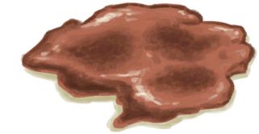
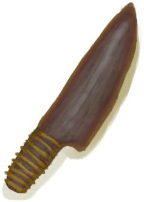

# “美丽的/好看的”  

[

 [方解石晶体](Calcite.md)](Calcite.md)

[

 [铜项链](CopperNecklace.md)](CopperNecklace.md)

[

 [鲜花项链](FlowerNecklace.md)](FlowerNecklace.md)

[

 [珍珠项链](PearlNecklace.md)](PearlNecklace.md)

[

 [海鸥护符](SeagullCharm.md)](SeagullCharm.md)

[

 [贝壳项链](SeashellNecklace.md)](SeashellNecklace.md)

[

 [海螺](Conch.md)](Conch.md)

[

 [陶碗](ClayBowl.md)](ClayBowl.md)

[

 [小陶罐](ClayJar.md)](ClayJar.md)

[

 [铜罐](CopperJar.md)](CopperJar.md)

[

 [废铜](CopperDecoration_Failed.md)](CopperDecoration_Failed.md)

[

 [铸铜鱼雕](CopperDecoration_Fish.md)](CopperDecoration_Fish.md)

[

 [铜制贝壳](CopperDecoration_Seashell.md)](CopperDecoration_Seashell.md)

[

 [铜制乌龟](CopperDecoration_Turtle.md)](CopperDecoration_Turtle.md)

[

 [珊瑚](Coral.md)](Coral.md)

[

 [铜制餐具](EatingUtensilsCopper.md)](EatingUtensilsCopper.md)

[

 [燧石](Flint.md)](Flint.md)

[

 [金属废料](MetalScrap.md)](MetalScrap.md)

[

 [黑曜石](Obsidian.md)](Obsidian.md)

[

 [珍珠](Pearl.md)](Pearl.md)

[

 [漂亮贝壳](SeashellsPretty.md)](SeashellsPretty.md)

[

 [仪式匕首](CeremonialDagger.md)](CeremonialDagger.md)

[

 [骨刀](KnifeBone.md)](KnifeBone.md)

[

 [铜刀](KnifeCopper.md)](KnifeCopper.md)

[

 [钝刀](KnifeCopperBlunt.md)](KnifeCopperBlunt.md)

[

 [燧石刀](KnifeFlint.md)](KnifeFlint.md)

[

 [祖父的刀](KnifeGrandpa.md)](KnifeGrandpa.md)

[

 [祖父的钝刀](KnifeGrandpaBlunt.md)](KnifeGrandpaBlunt.md)

[

 [军刀](KnifeMilitary.md)](KnifeMilitary.md)

[

 [钝刀](KnifeMilitaryBlunt.md)](KnifeMilitaryBlunt.md)

[

 [黑曜石刀](KnifeObsidian.md)](KnifeObsidian.md)

[

 [废金属刀](KnifeScrap.md)](KnifeScrap.md)

[

 [安全刀](SafetyKnife.md)](SafetyKnife.md)

[

 [矛头](SpearHead.md)](SpearHead.md)

[

 [钝矛头](SpearHeadBlunt.md)](SpearHeadBlunt.md)

[

 [石刀](StoneSharpened.md)](StoneSharpened.md)

[

 [侏儒牙雕（女）](TuskCarving_GnomeFemale.md)](TuskCarving_GnomeFemale.md)

[

 [侏儒牙雕（男）](TuskCarving_GnomeMale.md)](TuskCarving_GnomeMale.md)

[

 [韦斯顿](Weston.md)](Weston.md)

  
  
