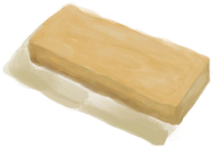

# “高加工”  

<a href="ChickenSandwich.md" style="color:black">鸡肉三明治</a>

<a href="Chocolate.md" style="color:black">巧克力</a>

<a href="FeedBird.md" style="color:black">鸟食</a>

<a href="FeedBoar.md" style="color:black">猪食</a>

<a href="FishTaco.md" style="color:black">鱼肉塔可</a>

<a href="FoodRation.md" style="color:black">压缩干粮</a>

<a href="ProteinBar.md" style="color:black">蛋白棒</a>

  
  

