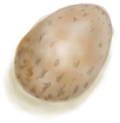

# “低蛋白”  

<a href="Bat.md" style="color:black">蝙蝠尸体</a>

<a href="BatCooked.md" style="color:black">烤蝙蝠</a>

<a href="Bugs.md" style="color:black">虫子</a>

<a href="ConchMeat.md" style="color:black">海螺肉</a>

<a href="ConchMeatCooked.md" style="color:black">烤海螺肉</a>

<a href="ConchMeatSoft.md" style="color:black">松软的海螺肉</a>

<a href="ConchMeatSoftCooked.md" style="color:black">松软的烤海螺肉</a>

<a href="Crab.md" style="color:black">螃蟹</a>

<a href="CrabCooked.md" style="color:black">烤螃蟹</a>

<a href="Egg.md" style="color:black">蛋</a>

<a href="EggBoiled.md" style="color:black">水煮蛋</a>

<a href="EggCooked.md" style="color:black">烤蛋</a>

<a href="EggPartridgeFertilized.md" style="color:black">受精蛋</a>

<a href="FishScraps.md" style="color:black">鱼杂</a>

<a href="FishScrapsCooked.md" style="color:black">烤鱼杂</a>

<a href="FishSlices.md" style="color:black">鱼片</a>

<a href="FishSlicesCooked.md" style="color:black">烤鱼片</a>

<a href="Lizard.md" style="color:black">蜥蜴</a>

<a href="LizardCooked.md" style="color:black">烤蜥蜴</a>

<a href="Mouse.md" style="color:black">老鼠尸体</a>

<a href="MouseCooked.md" style="color:black">烤老鼠</a>

<a href="MouseSkinned.md" style="color:black">剥皮的老鼠</a>

<a href="Mudskipper.md" style="color:black">弹涂鱼</a>

<a href="MudskipperCooked.md" style="color:black">烤弹涂鱼</a>

<a href="OysterMeat.md" style="color:black">牡蛎肉</a>

<a href="OysterMeatBaked.md" style="color:black">黄油焗牡蛎</a>

<a href="OysterMeatCooked.md" style="color:black">烤牡蛎肉</a>

<a href="PartridgeChick.md" style="color:black">小灰山鹑</a>

<a href="PartridgeChickDead.md" style="color:black">小灰山鹑尸体</a>

<a href="Prawns.md" style="color:black">虾</a>

<a href="PrawnsCooked.md" style="color:black">烤虾</a>

<a href="Rennet.md" style="color:black">凝乳酶</a>

<a href="UrchinMeat.md" style="color:black">海胆肉</a>

<a href="UrchinMeatCooked.md" style="color:black">烤海胆</a>

  
  

