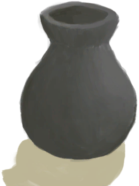

# “可泼溅的”  

[

 [陶碗](ClayBowl.md)](ClayBowl.md)

[

 [小陶罐](ClayJar.md)](ClayJar.md)

[

 [陶罐](ClayVase.md)](ClayVase.md)

[

 [未烧制的陶罐](ClayVaseUnfired.md)](ClayVaseUnfired.md)

[

 [椰子壳](CoconutShell.md)](CoconutShell.md)

[

 [烹饪锅](CookingPot.md)](CookingPot.md)

[

 [铜罐](CopperJar.md)](CopperJar.md)

[

 [釉面陶罐](GlazedVase.md)](GlazedVase.md)

[

 [未烧制的釉面陶罐](GlazedVaseUnfired.md)](GlazedVaseUnfired.md)

  
  

