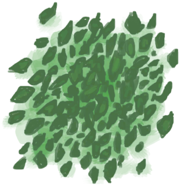
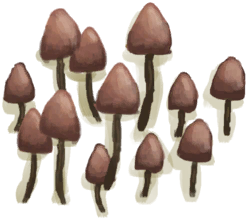

# “低糖分”  

<a href="AssortedMushrooms.md" style="color:black">杂菌</a>

<a href="BananaStem.md" style="color:black">香蕉树芯</a>

<a href="ChinaRoseFlowers.md" style="color:black">月季</a>

<a href="JasmineFlowers.md" style="color:black">茉莉花</a>

<a href="JasmineFlowersGround.md" style="color:black">捣碎的茉莉花</a>

<a href="LemonGrassGround.md" style="color:black">捣碎的柠檬草</a>

<a href="LemongrassStalks.md" style="color:black">柠檬草</a>

<a href="MagicMushrooms.md" style="color:black">迷幻菇</a>

<a href="SnakeGrass.md" style="color:black">蛇草</a>

<a href="SnakeGrassGround.md" style="color:black">捣碎的蛇草</a>

<a href="PalmBushSeeds.md" style="color:black">棕榈丛种子</a>

<a href="SagoSeeds.md" style="color:black">西米树种</a>

<a href="SnakegrassSeeds.md" style="color:black">蛇草种子</a>

  
  

