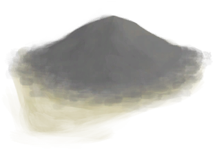
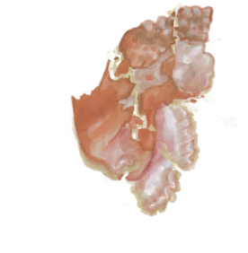
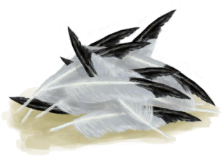
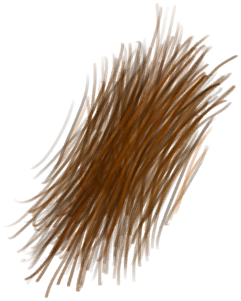
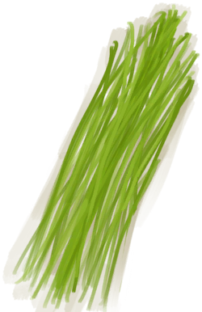
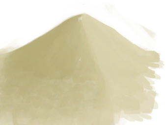

# “抗裂剂”  

<a href="Ash.md" style="color:black">灰烬</a>

<a href="ConchBroken.md" style="color:black">碎海螺壳</a>

<a href="Feathers.md" style="color:black">羽毛</a>

<a href="Fibers.md" style="color:black">纤维</a>

<a href="Quicklime.md" style="color:black">生石灰</a>

<a href="RiceStraw.md" style="color:black">稻杆</a>

<a href="Sand.md" style="color:black">沙子</a>

  
  

