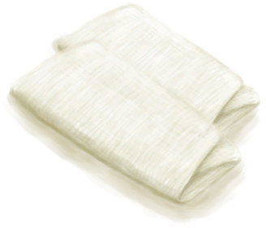

# “小的”  

[

 [草木灰敷料](AshDressing.md)](AshDressing.md)

[

 [铜针](CopperNeedle.md)](CopperNeedle.md)

[

 [针线](CopperNeedleThreaded.md)](CopperNeedleThreaded.md)

[

 [泻立停](AntiDiarrhoeaPills.md)](AntiDiarrhoeaPills.md)

[

 [抗生素](Antibiotics.md)](Antibiotics.md)

[

 [止痛药](Painkillers.md)](Painkillers.md)

[

 [晕船药](SeasicknessPills.md)](SeasicknessPills.md)

[

 [胜利药片](VictoryPillsTV.md)](VictoryPillsTV.md)

[

 [净水片](WaterPurificationTablets.md)](WaterPurificationTablets.md)

[

 [临时绷带](ImprovisedDressing.md)](ImprovisedDressing.md)

[

 [叶片绷带](LeafDressing.md)](LeafDressing.md)

[

 [伤口敷料](WoundDressing.md)](WoundDressing.md)

  
  
