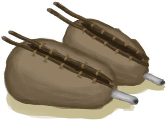

# “储水容器”  
<table class="table table-bordered table7357" data-toggle="table"  ><thead style=""><tr ><th  style=""  >名称</th><th  style=""  >储水量</th><th  style=""  >密封</th></tr></thead><tr ><td  style=""  >[

[油桶](Jerrycan.md)](Jerrycan.md)</td><td  style=""  >2400 (8份)</td><td  style=""  >✅</td></tr><tr ><td  style=""  >[

[陶罐](ClayVase.md)](ClayVase.md)</td><td  style=""  >1200 (4份)</td><td  style=""  >❌</td></tr><tr ><td  style=""  >[

[釉面陶罐](GlazedVase.md)](GlazedVase.md)</td><td  style=""  >900 (3份)</td><td  style=""  >✅</td></tr><tr ><td  style=""  >[

[水袋](Waterskin.md)](Waterskin.md)</td><td  style=""  >900 (3份)</td><td  style=""  >✅</td></tr><tr ><td  style=""  >[

[水壶](Canteen.md)](Canteen.md)</td><td  style=""  >600 (2份)</td><td  style=""  >✅</td></tr><tr ><td  style=""  >[

[烹饪锅](CookingPot.md)](CookingPot.md)</td><td  style=""  >600 (2份)</td><td  style=""  >✅</td></tr><tr ><td  style=""  >[

[铜瓶](CopperBottle.md)](CopperBottle.md)</td><td  style=""  >600 (2份)</td><td  style=""  >✅</td></tr><tr ><td  style=""  >[

[葫芦瓶](GourdBottle.md)](GourdBottle.md)</td><td  style=""  >600 (2份)</td><td  style=""  >✅</td></tr><tr ><td  style=""  >[

[带孔椰子](CoconutPerforated.md)](CoconutPerforated.md)</td><td  style=""  >300 (1份)</td><td  style=""  >✅</td></tr><tr ><td  style=""  >[

[陶碗](ClayBowl.md)](ClayBowl.md)</td><td  style=""  >300 (1份)</td><td  style=""  >❌</td></tr><tr ><td  style=""  >[

[椰子壳](CoconutShell.md)](CoconutShell.md)</td><td  style=""  >300 (1份)</td><td  style=""  >❌</td></tr><tr ><td  style=""  >[

[塑料瓶](PlasticBottle.md)](PlasticBottle.md)</td><td  style=""  >300 (1份)</td><td  style=""  >✅</td></tr><tr ><td  style=""  >[

[塑料瓶(满)](PlasticBottleFull.md)](PlasticBottleFull.md)</td><td  style=""  >300 (1份)</td><td  style=""  >✅</td></tr><tr ><td  style=""  >[

[茉莉花(塑料瓶)](PlasticBottleJasmine.md)](PlasticBottleJasmine.md)</td><td  style=""  >300 (1份)</td><td  style=""  >❌</td></tr><tr ><td  style=""  >[

[小陶罐](ClayJar.md)](ClayJar.md)</td><td  style=""  >150 (0.5份)</td><td  style=""  >✅</td></tr><tr ><td  style=""  >[

[茉莉花(陶罐)](ClayJarJasmine.md)](ClayJarJasmine.md)</td><td  style=""  >150 (0.5份)</td><td  style=""  >❌</td></tr><tr ><td  style=""  >[

[铜罐](CopperJar.md)](CopperJar.md)</td><td  style=""  >150 (0.5份)</td><td  style=""  >✅</td></tr><tr ><td  style=""  >[

[干土堆](DirtPile.md)](DirtPile.md)</td><td  style=""  ></td><td  style=""  ></td></tr><tr ><td  style=""  >[

[泥堆](MudPile.md)](MudPile.md)</td><td  style=""  ></td><td  style=""  ></td></tr><tr ><td  style=""  >[

[风箱](Bellows.md)](Bellows.md)</td><td  style=""  ></td><td  style=""  ></td></tr><tr ><td  style=""  >[

[椰壶](CoconutFlask.md)](CoconutFlask.md)</td><td  style=""  ></td><td  style=""  ></td></tr><tr ><td  style=""  >[

[神赐壶](CoconutFlaskAmbrosia.md)](CoconutFlaskAmbrosia.md)</td><td  style=""  ></td><td  style=""  ></td></tr><tr ><td  style=""  >[

[装有燃料的油桶](JerrycanFuel.md)](JerrycanFuel.md)</td><td  style=""  ></td><td  style=""  ></td></tr><tr ><td  style=""  >[

[细土](FineDirt.md)](FineDirt.md)</td><td  style=""  ></td><td  style=""  ></td></tr></tbody></table>  
  

