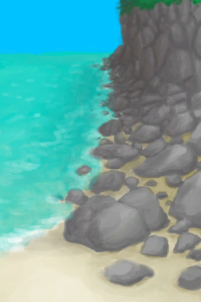

# “西”  

<a href="Env_Atoll.md" style="color:black">环礁</a>

<a href="Env_Bay.md" style="color:black">海湾</a>

<a href="Env_Beach.md" style="color:black">沙滩</a>

<a href="Env_BirdRock.md" style="color:black">鸟岩岛</a>

<a href="Env_Cove.md" style="color:black">沙滩</a>

<a href="Env_HighlandsEastern.md" style="color:black">东部高地</a>

<a href="Env_Outskirts.md" style="color:black">丛林边缘</a>

<a href="Env_Rocks.md" style="color:black">岩滩</a>

  
  

