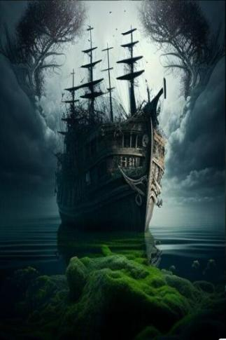

# 幽灵船  
  
<table class="table table-bordered" data-toggle="table"  data-show-header="false"><thead style="display:none"><tr ><th  style="width:50%;text-align:left;vertical-align:top;"  >title</th><th  style="width:50%;text-align:left;vertical-align:top;"  ></th></tr></thead><tr ><td  style="width:50%;text-align:left;vertical-align:top;"  >**标签：**	[“可能出现海鸥”](tag_Coastal.md), [“开阔环境”](tag_EnvOpen.md)  **初始：**	[船长(幽灵船)](tq_Nc_GhostShip_CaptainSkeleton.md), [骨堆(幽灵船)](tq_Nc_GhostShip_BonePile.md), [骨堆(幽灵船)](tq_Nc_GhostShip_BonePile.md), [骨堆(幽灵船)](tq_Nc_GhostShip_BonePile.md), [骷髅(幽灵船)](tq_Nc_GhostShip_BonePile_ProducedBoneMonster.md), [骷髅(幽灵船)](tq_Nc_GhostShip_BonePile_ProducedBoneMonster.md), [骷髅(幽灵船)](tq_Nc_GhostShip_BonePile_ProducedBoneMonster.md), [骷髅船(幽灵船)](tq_Exp_GhostShip.json.md)  ** 效果: ** [

[光亮](Light.md)](Light.md)<b>+10</b> [

[体感温度](TemperaturePerceived.md)](TemperaturePerceived.md) [

[内陆恐惧症](LandSickness.md)](LandSickness.md)加成<b>-8</b></td><td  style="width:50%;text-align:left;vertical-align:top;"  >

<a href="tq_Env_GhostShip.md" style="color:black">幽灵船</a>

</td></tr></tbody></table>  
  
## 获取来源  

啊！！

[怎么回事！(事件)](tq_Event_GhostShip_BoneNeck_Tp.md)

命运

[死亡](tq_Nc_GhostShip_BoneNeck.md)

Go

[前往浅滩](tq_Path_SkullNecklaceToGhostShip.md)

  
  

