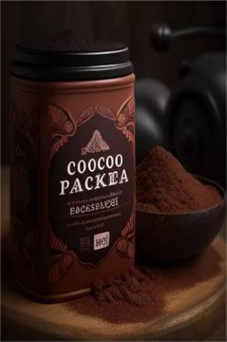

# 飓风(天启)  
> 紧握求生筏，密集雨点拍打在前。呆在求生筏上困意渐渐袭来，直至一个巨浪掀翻所有。  
  
<table class="table table-bordered" data-toggle="table"  data-show-header="false"><thead style="display:none"><tr ><th  style="width:50%;text-align:left;vertical-align:top;"  data-sortable="true"  >title</th><th  style="width:50%;text-align:left;vertical-align:top;"  ></th></tr></thead><tr ><td  style="width:50%;text-align:left;vertical-align:top;"  ></td><td  style="width:50%;text-align:left;vertical-align:top;"  >

<a href="tq_Event_Character_Lola_StartEpisode_Drowning_StepFour.md" style="color:black">飓风</a>

</td></tr></tbody></table>  
  
## 获取来源  

游往

[求生筏(飓风海域)](tq_Nc_DiasterBeason_Character_Lola_StartMaterials_LifeRaft_TypeFour.md)

游往

[求生筏(飓风海域)](tq_Nc_DiasterBeason_Character_Lola_StartMaterials_LifeRaft_TypeOne.md)

游往

[求生筏(飓风海域)](tq_Nc_DiasterBeason_Character_Lola_StartMaterials_LifeRaft_TypeThree.md)

游往

[求生筏(飓风海域)](tq_Nc_DiasterBeason_Character_Lola_StartMaterials_LifeRaft_TypeTwo.md)

  
  
## 动作  

<table><tr><td rowspan="2" style="width:200px;text-align:center;font-size:1.3em;font-weight:bold">

失去意识

1小时

</td><td></td></tr><tr><td><b>自身：</b>→消失</td></tr><tr><td colspan="2"><b>状态变化：</b>[

[清醒度](Wakefulness.md)](Wakefulness.md)<b>+96</b>, [Gs_Character_Lola_OpeningEpisode_Exhaustion](tq_Gs_Character_Lola_OpeningEpisode_Exhaustion.md)<b>-1</b></td></tr><tr><td colspan="2">

<table style="margin-bottom:3px;"><tr><td rowspan=2 style="text-align:center" width="80px">
基础权重

1
</td><td style="font-size:0.6em;line-height:0.6em;font-weight:bold">Lola_StartStory_StepZero</td></tr><tr><td>[

[海湾(环境)](Env_Bay.md)](Env_Bay.md)(<b>+1</b>), [

[晴朗](TropicalIsland_Clear.md)](TropicalIsland_Clear.md)(<b>+1</b>)</td></tr></table>

<table style="margin-bottom:3px;"><tr><td rowspan=2 style="text-align:center" width="80px">
基础权重

1
</td><td style="font-size:0.6em;line-height:0.6em;font-weight:bold">Lola_StartStory_StepOne</td></tr><tr><td>[

[鸟岩岛(环境)](Env_BirdRock.md)](Env_BirdRock.md)(<b>+1</b>), [

[晴朗](TropicalIsland_Clear.md)](TropicalIsland_Clear.md)(<b>+1</b>), [

[巴克咖啡](tq_Nc_DiasterBeason_Character_Lola_StartMaterials_ModernCoffee.md)](tq_Nc_DiasterBeason_Character_Lola_StartMaterials_ModernCoffee.md)(<b>+1</b>)[

[游泳(技能)](Skill_Swimming.md)](Skill_Swimming.md)<b>+5</b></td></tr></table>

<table style="margin-bottom:3px;"><tr><td rowspan=2 style="text-align:center" width="80px">
基础权重

1
</td><td style="font-size:0.6em;line-height:0.6em;font-weight:bold">Lola_StartStory_StepTwo</td></tr><tr><td>[

[隐秘港湾(环境)](Env_Cove.md)](Env_Cove.md)(<b>+1</b>), [

[晴朗](TropicalIsland_Clear.md)](TropicalIsland_Clear.md)(<b>+1</b>)</td></tr></table>

<table style="margin-bottom:3px;"><tr><td rowspan=2 style="text-align:center" width="80px">
基础权重

1
</td><td style="font-size:0.6em;line-height:0.6em;font-weight:bold">Lola_StartStory_StepThree</td></tr><tr><td>[

[沙滩(环境)](Env_Beach.md)](Env_Beach.md)(<b>+1</b>), [

[晴朗](TropicalIsland_Clear.md)](TropicalIsland_Clear.md)(<b>+1</b>)</td></tr></table>

<table style="margin-bottom:3px;"><tr><td rowspan=2 style="text-align:center" width="80px">
基础权重

1
</td><td style="font-size:0.6em;line-height:0.6em;font-weight:bold">Lola_StartStory_StepFour</td></tr><tr><td>[

[荒芜沙滩(环境)](Env_DesolateBeach.md)](Env_DesolateBeach.md)(<b>+1</b>), [

[晴朗](TropicalIsland_Clear.md)](TropicalIsland_Clear.md)(<b>+1</b>), [

[巴克咖啡](tq_Nc_DiasterBeason_Character_Lola_StartMaterials_ModernCoffee.md)](tq_Nc_DiasterBeason_Character_Lola_StartMaterials_ModernCoffee.md)(<b>+1</b>)</td></tr></table>

<table style="margin-bottom:3px;"><tr><td rowspan=2 style="text-align:center" width="80px">
基础权重

1
</td><td style="font-size:0.6em;line-height:0.6em;font-weight:bold">Lola_StartStory_StepFour</td></tr><tr><td>[

[岩滩(环境)](Env_Rocks.md)](Env_Rocks.md)(<b>+1</b>), [

[晴朗](TropicalIsland_Clear.md)](TropicalIsland_Clear.md)(<b>+1</b>)</td></tr></table>

<table style="margin-bottom:3px;"><tr><td rowspan=2 style="text-align:center" width="80px">
基础权重

1
</td><td style="font-size:0.6em;line-height:0.6em;font-weight:bold">Lola_StartStory_StepSix</td></tr><tr><td>[

[红树林(环境)](Env_Mangroves.md)](Env_Mangroves.md)(<b>+1</b>), [

[晴朗](TropicalIsland_Clear.md)](TropicalIsland_Clear.md)(<b>+1</b>)</td></tr></table>

<table style="margin-bottom:3px;"><tr><td rowspan=2 style="text-align:center" width="80px">
基础权重

0
</td><td style="font-size:0.6em;line-height:0.6em;font-weight:bold">Lola_StartStory_StepSeven_ToRuins_Ship</td></tr><tr><td>[

[基地(环境)](cod_Env_船仓.md)](cod_Env_船仓.md)(<b>+1</b>), [

[Storm](tq_Wather_StromRain.md)](tq_Wather_StromRain.md)(<b>+1</b>)</td></tr><tr><td colspan=2><li>[DisasterBeason_ToShipCounter](cod_Gs_Ruins_DisasterBeason_StartJourneyCounter.md)为<b>1</b>时权重<b>+100000</b></li></td></tr></table>
<button class="btn btn-secondary btn-sm" style="" data-toggle="modal" onclick="setCollectionDataBase64('eyJ0aXRsZSI6IuamgueOh+aooeaLnzog5aSx5Y675oSP6K+GICjpo5Ppo44pIiwiY29sbGVjdGlvbnMiOlt7ImRyb3AiOiI8ZGl2IHN0eWxlPVwid2lkdGg6MjVweDtkaXNwbGF5OmlubGluZS1ibG9jazt0ZXh0LWFsaWduOmNlbnRlclwiPjxpbWcgZGVjb2Rpbmc9XCJhc3luY1wiIHNyYz1cIlNwcml0ZS9CYXkucG5nXCIgaHJlZj1cImEubWRcIiBzdHlsZT1cIm1heC13aWR0aDoyNXB4O21heC1oZWlnaHQ6MjVweDtcIj48L2Rpdj7mtbfmub4o546v5aKDKTxkaXYgc3R5bGU9XCJ3aWR0aDoyNXB4O2Rpc3BsYXk6aW5saW5lLWJsb2NrO3RleHQtYWxpZ246Y2VudGVyXCI+PGltZyBkZWNvZGluZz1cImFzeW5jXCIgc3JjPVwiU3ByaXRlL1dlYXRoZXJDbGVhcl8wLnBuZ1wiIGhyZWY9XCJhLm1kXCIgc3R5bGU9XCJtYXgtd2lkdGg6MjVweDttYXgtaGVpZ2h0OjI1cHg7XCI+PC9kaXY+5pm05pyXIiwiYmFzZSI6MSwiY29uZGl0aW9uIjpbXX0seyJkcm9wIjoiPGRpdiBzdHlsZT1cIndpZHRoOjI1cHg7ZGlzcGxheTppbmxpbmUtYmxvY2s7dGV4dC1hbGlnbjpjZW50ZXJcIj48aW1nIGRlY29kaW5nPVwiYXN5bmNcIiBzcmM9XCJTcHJpdGUvUG9pbnR5Um9jay5wbmdcIiBocmVmPVwiYS5tZFwiIHN0eWxlPVwibWF4LXdpZHRoOjI1cHg7bWF4LWhlaWdodDoyNXB4O1wiPjwvZGl2Pum4n+WyqeWymyjnjq/looMpPGRpdiBzdHlsZT1cIndpZHRoOjI1cHg7ZGlzcGxheTppbmxpbmUtYmxvY2s7dGV4dC1hbGlnbjpjZW50ZXJcIj48aW1nIGRlY29kaW5nPVwiYXN5bmNcIiBzcmM9XCJTcHJpdGUvV2VhdGhlckNsZWFyXzAucG5nXCIgaHJlZj1cImEubWRcIiBzdHlsZT1cIm1heC13aWR0aDoyNXB4O21heC1oZWlnaHQ6MjVweDtcIj48L2Rpdj7mmbTmnJc8ZGl2IHN0eWxlPVwid2lkdGg6MjVweDtkaXNwbGF5OmlubGluZS1ibG9jazt0ZXh0LWFsaWduOmNlbnRlclwiPjxpbWcgZGVjb2Rpbmc9XCJhc3luY1wiIHNyYz1cIlNwcml0ZS90cS9OY19EaWFzdGVyQmVhc29uX0NoYXJhY3Rlcl9Mb2xhX1N0YXJ0TWF0ZXJpYWxzX01vZGVybkNvZmZlZS5qcGdcIiBocmVmPVwiYS5tZFwiIHN0eWxlPVwibWF4LXdpZHRoOjI1cHg7bWF4LWhlaWdodDoyNXB4O1wiPjwvZGl2PuW3tOWFi+WSluWVoSIsImJhc2UiOjEsImNvbmRpdGlvbiI6W119LHsiZHJvcCI6IjxkaXYgc3R5bGU9XCJ3aWR0aDoyNXB4O2Rpc3BsYXk6aW5saW5lLWJsb2NrO3RleHQtYWxpZ246Y2VudGVyXCI+PGltZyBkZWNvZGluZz1cImFzeW5jXCIgc3JjPVwiU3ByaXRlL0JpZ0lzbGFuZC5wbmdcIiBocmVmPVwiYS5tZFwiIHN0eWxlPVwibWF4LXdpZHRoOjI1cHg7bWF4LWhlaWdodDoyNXB4O1wiPjwvZGl2PumakOenmOa4r+a5vijnjq/looMpPGRpdiBzdHlsZT1cIndpZHRoOjI1cHg7ZGlzcGxheTppbmxpbmUtYmxvY2s7dGV4dC1hbGlnbjpjZW50ZXJcIj48aW1nIGRlY29kaW5nPVwiYXN5bmNcIiBzcmM9XCJTcHJpdGUvV2VhdGhlckNsZWFyXzAucG5nXCIgaHJlZj1cImEubWRcIiBzdHlsZT1cIm1heC13aWR0aDoyNXB4O21heC1oZWlnaHQ6MjVweDtcIj48L2Rpdj7mmbTmnJciLCJiYXNlIjoxLCJjb25kaXRpb24iOltdfSx7ImRyb3AiOiI8ZGl2IHN0eWxlPVwid2lkdGg6MjVweDtkaXNwbGF5OmlubGluZS1ibG9jazt0ZXh0LWFsaWduOmNlbnRlclwiPjxpbWcgZGVjb2Rpbmc9XCJhc3luY1wiIHNyYz1cIlNwcml0ZS9CaWdJc2xhbmQucG5nXCIgaHJlZj1cImEubWRcIiBzdHlsZT1cIm1heC13aWR0aDoyNXB4O21heC1oZWlnaHQ6MjVweDtcIj48L2Rpdj7mspnmu6ko546v5aKDKTxkaXYgc3R5bGU9XCJ3aWR0aDoyNXB4O2Rpc3BsYXk6aW5saW5lLWJsb2NrO3RleHQtYWxpZ246Y2VudGVyXCI+PGltZyBkZWNvZGluZz1cImFzeW5jXCIgc3JjPVwiU3ByaXRlL1dlYXRoZXJDbGVhcl8wLnBuZ1wiIGhyZWY9XCJhLm1kXCIgc3R5bGU9XCJtYXgtd2lkdGg6MjVweDttYXgtaGVpZ2h0OjI1cHg7XCI+PC9kaXY+5pm05pyXIiwiYmFzZSI6MSwiY29uZGl0aW9uIjpbXX0seyJkcm9wIjoiPGRpdiBzdHlsZT1cIndpZHRoOjI1cHg7ZGlzcGxheTppbmxpbmUtYmxvY2s7dGV4dC1hbGlnbjpjZW50ZXJcIj48aW1nIGRlY29kaW5nPVwiYXN5bmNcIiBzcmM9XCJTcHJpdGUvRGVzb2xhdGVCZWFjaC5wbmdcIiBocmVmPVwiYS5tZFwiIHN0eWxlPVwibWF4LXdpZHRoOjI1cHg7bWF4LWhlaWdodDoyNXB4O1wiPjwvZGl2PuiNkuiKnOaymea7qSjnjq/looMpPGRpdiBzdHlsZT1cIndpZHRoOjI1cHg7ZGlzcGxheTppbmxpbmUtYmxvY2s7dGV4dC1hbGlnbjpjZW50ZXJcIj48aW1nIGRlY29kaW5nPVwiYXN5bmNcIiBzcmM9XCJTcHJpdGUvV2VhdGhlckNsZWFyXzAucG5nXCIgaHJlZj1cImEubWRcIiBzdHlsZT1cIm1heC13aWR0aDoyNXB4O21heC1oZWlnaHQ6MjVweDtcIj48L2Rpdj7mmbTmnJc8ZGl2IHN0eWxlPVwid2lkdGg6MjVweDtkaXNwbGF5OmlubGluZS1ibG9jazt0ZXh0LWFsaWduOmNlbnRlclwiPjxpbWcgZGVjb2Rpbmc9XCJhc3luY1wiIHNyYz1cIlNwcml0ZS90cS9OY19EaWFzdGVyQmVhc29uX0NoYXJhY3Rlcl9Mb2xhX1N0YXJ0TWF0ZXJpYWxzX01vZGVybkNvZmZlZS5qcGdcIiBocmVmPVwiYS5tZFwiIHN0eWxlPVwibWF4LXdpZHRoOjI1cHg7bWF4LWhlaWdodDoyNXB4O1wiPjwvZGl2PuW3tOWFi+WSluWVoSIsImJhc2UiOjEsImNvbmRpdGlvbiI6W119LHsiZHJvcCI6IjxkaXYgc3R5bGU9XCJ3aWR0aDoyNXB4O2Rpc3BsYXk6aW5saW5lLWJsb2NrO3RleHQtYWxpZ246Y2VudGVyXCI+PGltZyBkZWNvZGluZz1cImFzeW5jXCIgc3JjPVwiU3ByaXRlL1JvY2t5UGF0aC5wbmdcIiBocmVmPVwiYS5tZFwiIHN0eWxlPVwibWF4LXdpZHRoOjI1cHg7bWF4LWhlaWdodDoyNXB4O1wiPjwvZGl2PuWyqea7qSjnjq/looMpPGRpdiBzdHlsZT1cIndpZHRoOjI1cHg7ZGlzcGxheTppbmxpbmUtYmxvY2s7dGV4dC1hbGlnbjpjZW50ZXJcIj48aW1nIGRlY29kaW5nPVwiYXN5bmNcIiBzcmM9XCJTcHJpdGUvV2VhdGhlckNsZWFyXzAucG5nXCIgaHJlZj1cImEubWRcIiBzdHlsZT1cIm1heC13aWR0aDoyNXB4O21heC1oZWlnaHQ6MjVweDtcIj48L2Rpdj7mmbTmnJciLCJiYXNlIjoxLCJjb25kaXRpb24iOltdfSx7ImRyb3AiOiI8ZGl2IHN0eWxlPVwid2lkdGg6MjVweDtkaXNwbGF5OmlubGluZS1ibG9jazt0ZXh0LWFsaWduOmNlbnRlclwiPjxpbWcgZGVjb2Rpbmc9XCJhc3luY1wiIHNyYz1cIlNwcml0ZS9NYW5ncm92ZXMucG5nXCIgaHJlZj1cImEubWRcIiBzdHlsZT1cIm1heC13aWR0aDoyNXB4O21heC1oZWlnaHQ6MjVweDtcIj48L2Rpdj7nuqLmoJHmnpco546v5aKDKTxkaXYgc3R5bGU9XCJ3aWR0aDoyNXB4O2Rpc3BsYXk6aW5saW5lLWJsb2NrO3RleHQtYWxpZ246Y2VudGVyXCI+PGltZyBkZWNvZGluZz1cImFzeW5jXCIgc3JjPVwiU3ByaXRlL1dlYXRoZXJDbGVhcl8wLnBuZ1wiIGhyZWY9XCJhLm1kXCIgc3R5bGU9XCJtYXgtd2lkdGg6MjVweDttYXgtaGVpZ2h0OjI1cHg7XCI+PC9kaXY+5pm05pyXIiwiYmFzZSI6MSwiY29uZGl0aW9uIjpbXX0seyJkcm9wIjoiPGRpdiBzdHlsZT1cIndpZHRoOjI1cHg7ZGlzcGxheTppbmxpbmUtYmxvY2s7dGV4dC1hbGlnbjpjZW50ZXJcIj48aW1nIGRlY29kaW5nPVwiYXN5bmNcIiBzcmM9XCJTcHJpdGUvY29kL2FsX+iIueiIseWFpeWPoy5wbmdcIiBocmVmPVwiYS5tZFwiIHN0eWxlPVwibWF4LXdpZHRoOjI1cHg7bWF4LWhlaWdodDoyNXB4O1wiPjwvZGl2PuWfuuWcsCjnjq/looMpKGNvZF9FbnZf6Ii55LuTLm1kKShjb2RfRW52X+iIueS7ky5tZCk8ZGl2IHN0eWxlPVwid2lkdGg6MjVweDtkaXNwbGF5OmlubGluZS1ibG9jazt0ZXh0LWFsaWduOmNlbnRlclwiPjxpbWcgZGVjb2Rpbmc9XCJhc3luY1wiIHNyYz1cIlNwcml0ZS9XZWF0aGVyU3Rvcm1fMC5wbmdcIiBocmVmPVwiYS5tZFwiIHN0eWxlPVwibWF4LXdpZHRoOjI1cHg7bWF4LWhlaWdodDoyNXB4O1wiPjwvZGl2PlN0b3JtIiwiYmFzZSI6MCwiY29uZGl0aW9uIjpbeyJrZXkiOiJjb2RfR3NfUnVpbnNfRGlzYXN0ZXJCZWFzb25fU3RhcnRKb3VybmV5Q291bnRlciIsInRpdGxlIjoiRGlzYXN0ZXJCZWFzb25fVG9TaGlwQ291bnRlciIsInR5cGUiOiJyYW5nZSIsIm1heCI6WzAsMV0sInJhbmdlIjpbMSwxXSwid2VpZ2h0IjpbMTAwMDAwLDEwMDAwMF0sImRlZmF1bHRWYWx1ZSI6MCwid2hlbk91dE9mUmFuZ2UiOjB9XX1dfQ==')" data-target="#modelCollectionSimulator">概率模拟</button>
</td></tr></table>
  
  
  

