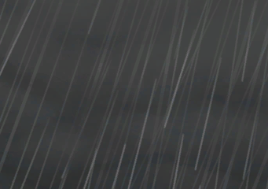

# 飓风(天启)  
> 密集雨点遮蔽视野，滔天巨浪拍过来了！  
  
<table class="table table-bordered" data-toggle="table"  data-show-header="false"><thead style="display:none"><tr ><th  style="width:50%;text-align:left;vertical-align:top;"  data-sortable="true"  >title</th><th  style="width:50%;text-align:left;vertical-align:top;"  ></th></tr></thead><tr ><td  style="width:50%;text-align:left;vertical-align:top;"  ></td><td  style="width:50%;text-align:left;vertical-align:top;"  >

<a href="tq_Event_Character_Lola_StartEpisode_Drowning_StepOne.md" style="color:black">飓风</a>

</td></tr></tbody></table>  
  
## 获取来源  

特质影响

[旅途](tq_DiasterBeason_LolaStart.md)

  
  
## 动作  

<table><tr><td rowspan="2" style="width:200px;text-align:center;font-size:1.3em;font-weight:bold">

啊！

15分

</td><td></td></tr><tr><td><b>自身：</b>→消失</td></tr><tr><td colspan="2"><b>状态变化：</b>[

[淤青](Bruising.md)](Bruising.md)<b>+192</b>, [

[清醒度](Wakefulness.md)](Wakefulness.md)<b>+96</b>, [

[情绪](Morale.md)](Morale.md)<b>-50</b>, [

[压力](Stress.md)](Stress.md)<b>+360</b>, [Gs_Character_Lola_OpeningEpisode_Exhaustion](tq_Gs_Character_Lola_OpeningEpisode_Exhaustion.md)<b>+1</b></td></tr><tr><td colspan="2">[

[深海(环境)](tq_Env_DeepSea.md)](tq_Env_DeepSea.md)(<b>+1</b>), [

[Storm](tq_Wather_StromRain.md)](tq_Wather_StromRain.md)(<b>+1</b>)</td></tr></table>
  
  
  

