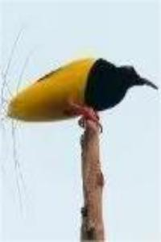

# 奇事  
> 一只貌相奇异的鸟在你头上盯着你  
  
<table class="table table-bordered" data-toggle="table"  data-show-header="false"><thead style="display:none"><tr ><th  style="width:50%;text-align:left;vertical-align:top;"  data-sortable="true"  >title</th><th  style="width:50%;text-align:left;vertical-align:top;"  ></th></tr></thead><tr ><td  style="width:50%;text-align:left;vertical-align:top;"  ></td><td  style="width:50%;text-align:left;vertical-align:top;"  >

<a href="tq_Event_GeeseSouth_MissileBird.md" style="color:black">奇事</a>

</td></tr></tbody></table>  
  
## 获取来源  

转化

[大雁南飞](tq_Wather_GeeseSouth.md)

  
  
## 动作  

<table><tr><td rowspan="2" style="width:200px;text-align:center;font-size:1.3em;font-weight:bold">

Ignore it

</td><td></td></tr><tr><td><b>自身：</b>→消失</td></tr><tr><td colspan="2">[

[导弹冲击！(事件)](tq_Event_GeeseSouth_MissileBird_Attack.md)](tq_Event_GeeseSouth_MissileBird_Attack.md)(<b>+1</b>)</td></tr></table>
  

<table><tr><td rowspan="2" style="width:200px;text-align:center;font-size:1.3em;font-weight:bold">

朝着它大喊大叫

</td><td></td></tr><tr><td><b>自身：</b>→消失</td></tr><tr><td colspan="2">[

[导弹冲击！(事件)](tq_Event_GeeseSouth_MissileBird_Attack.md)](tq_Event_GeeseSouth_MissileBird_Attack.md)(<b>+1</b>)</td></tr></table>
  

<table><tr><td rowspan="2" style="width:200px;text-align:center;font-size:1.3em;font-weight:bold">

Throw Rock at it

</td><td></td></tr><tr><td><b>自身：</b>→消失</td></tr><tr><td colspan="2"><b>状态变化：</b>[

[投石(技能)](Skill_RockThrowing.md)](Skill_RockThrowing.md)<b>+0.5</b></td></tr><tr><td colspan="2">[

[导弹冲击！(事件)](tq_Event_GeeseSouth_MissileBird_Attack.md)](tq_Event_GeeseSouth_MissileBird_Attack.md)(<b>+1</b>)</td></tr></table>
  

<table><tr><td rowspan="2" style="width:200px;text-align:center;font-size:1.3em;font-weight:bold">

对着它开始狂舞！

30分

</td><td></td></tr><tr><td><b>自身：</b>→消失</td></tr><tr><td colspan="2">

<table style="margin-bottom:3px;"><tr><td rowspan=2 style="text-align:center" width="80px">
基础权重

3
</td><td style="font-size:0.6em;line-height:0.6em;font-weight:bold">Success</td></tr><tr><td>[

[导弹冲击！(事件)](tq_Event_GeeseSouth_MissileBird_Attack.md)](tq_Event_GeeseSouth_MissileBird_Attack.md)(<b>+1</b>)</td></tr></table>

<table style="margin-bottom:3px;"><tr><td rowspan=2 style="text-align:center" width="80px">
基础权重

1
</td><td style="font-size:0.6em;line-height:0.6em;font-weight:bold">Dirt</td></tr><tr><td>[

[什么！(事件)](tq_Event_GeeseSouth_MissileBird_JumpOut.md)](tq_Event_GeeseSouth_MissileBird_JumpOut.md)(<b>+1</b>)</td></tr></table>

</td></tr></table>
  
  
  

