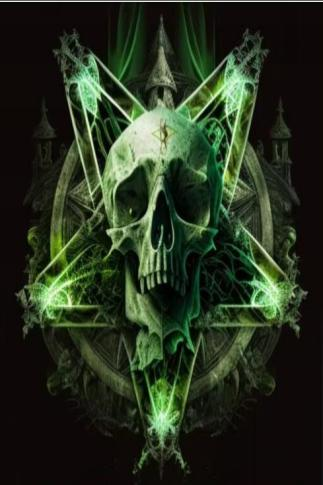

# 怎么回事！  
> 项链突然迸发出强烈的光芒，世界在不停的旋转！  
  
<table class="table table-bordered" data-toggle="table"  data-show-header="false"><thead style="display:none"><tr ><th  style="width:50%;text-align:left;vertical-align:top;"  >title</th><th  style="width:50%;text-align:left;vertical-align:top;"  ></th></tr></thead><tr ><td  style="width:50%;text-align:left;vertical-align:top;"  >** 不可删除 **</td><td  style="width:50%;text-align:left;vertical-align:top;"  >

<a href="tq_Event_GhostShip_BoneNeck_Tp.md" style="color:black">怎么回事！</a>

</td></tr></tbody></table>  
  
## 获取来源  

转化

[死亡](tq_Nc_GhostShip_BoneNeck.md)

  
  
## 动作  

<table><tr><td rowspan="2" style="width:200px;text-align:center;font-size:1.3em;font-weight:bold">

啊！！

</td><td></td></tr><tr><td><b>自身：</b>→消失</td></tr><tr><td colspan="2">[

[幽灵船(环境)](tq_Env_GhostShip.md)](tq_Env_GhostShip.md)(<b>+1</b>), [

[骷髅船(幽灵船)](tq_Exp_GhostShip.json.md)](tq_Exp_GhostShip.json.md)(<b>+1</b>), [

[前往祭坛](tq_Path_GhostShip_Retern.json.md)](tq_Path_GhostShip_Retern.json.md)(<b>+1</b>)</td></tr></table>
  
  
  

