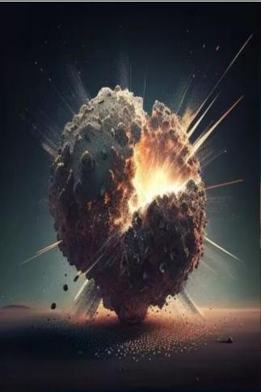

# 什么！  
> 陨石爆炸了！  
  
<table class="table table-bordered" data-toggle="table"  data-show-header="false"><thead style="display:none"><tr ><th  style="width:50%;text-align:left;vertical-align:top;"  data-sortable="true"  >title</th><th  style="width:50%;text-align:left;vertical-align:top;"  ></th></tr></thead><tr ><td  style="width:50%;text-align:left;vertical-align:top;"  ></td><td  style="width:50%;text-align:left;vertical-align:top;"  >

<a href="tq_Event_Imprint_StarDrop_TypeOne_Boom.md" style="color:black">什么！</a>

</td></tr></tbody></table>  
  
## 获取来源  

** 使用**[求生斧](AxeSurvival.md) , [石斧](StoneAxe.md) , [废金属斧](AxeScrap.md) , [燧石斧](AxeFlint.md) , [铜斧](AxeCopper.md) , [“斧”](tag_Axe.md)开采一下？

[陨石](tq_Nc_Meteor_Imprint_StarDrop_TypeOne.md)

转化

[陨石](tq_Nc_Meteor_Imprint_StarDrop_TypeOne.md)

  
  
## 动作  

<table><tr><td rowspan="2" style="width:200px;text-align:center;font-size:1.3em;font-weight:bold">

啊！

</td><td></td></tr><tr><td><b>自身：</b>→消失</td></tr><tr><td colspan="2"><b>状态变化：</b>[

[局部烧伤](tq_Gs_DisasterBeason_Burns.md)](tq_Gs_DisasterBeason_Burns.md)<b>+500</b>, [

[压力](Stress.md)](Stress.md)<b>+80</b> 加成<b>+120</b></td></tr></table>
  
  
  

