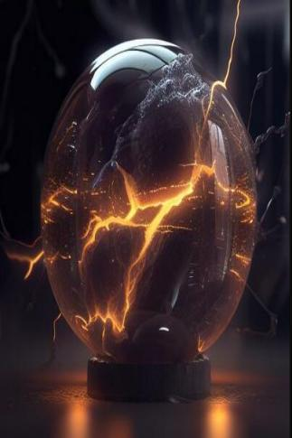

# 雷云滚滚  
> 闪光过后，世界变为白色。没有声音，一切都变得如此安静。直到一束光线直射眉心。  
  
<table class="table table-bordered" data-toggle="table"  data-show-header="false"><thead style="display:none"><tr ><th  style="width:50%;text-align:left;vertical-align:top;"  data-sortable="true"  >title</th><th  style="width:50%;text-align:left;vertical-align:top;"  ></th></tr></thead><tr ><td  style="width:50%;text-align:left;vertical-align:top;"  ></td><td  style="width:50%;text-align:left;vertical-align:top;"  >

<a href="tq_Event_ThunderStorm_StormAttackHuman.md" style="color:black">雷云滚滚</a>

</td></tr></tbody></table>  
  
## 获取来源  

轰隆隆！

[雷暴](tq_Wather_Thunderstorm.md)

  
  
## 动作  

<table><tr><td rowspan="2" style="width:200px;text-align:center;font-size:1.3em;font-weight:bold">

闪电直劈身体！

</td><td></td></tr><tr><td><b>自身：</b>→消失</td></tr><tr><td colspan="2"><b>状态变化：</b>[

[情绪](Morale.md)](Morale.md)<b>-50</b>, [

[清醒度](Wakefulness.md)](Wakefulness.md)<b>+50</b>, [

[世界观](Structure.md)](Structure.md)<b>-500</b>, [

[烧伤](Burns.md)](Burns.md)<b>+150</b></td></tr><tr><td colspan="2">[

[雷暴劈伤](tq_W_ThunderStorm_StormAttackHuman.md)](tq_W_ThunderStorm_StormAttackHuman.md)(<b>+1</b>)</td></tr></table>
  

<table><tr><td rowspan="2" style="width:200px;text-align:center;font-size:1.3em;font-weight:bold">

引导

</td><td></td></tr><tr><td><b>自身：</b>→消失</td></tr><tr><td colspan="2"><b>需求：</b>[

[瓶中闪电](tq_Nc_ThunderStorm_Lightning_In_Bottle.md)](tq_Nc_ThunderStorm_Lightning_In_Bottle.md)存在于手中</td></tr><tr><td colspan="2"><b>相关卡牌变化：</b>手牌中所有[瓶中闪电](tq_Nc_ThunderStorm_Lightning_In_Bottle.md)  <b>+1</b></td></tr></table>
  

<table><tr><td rowspan="2" style="width:200px;text-align:center;font-size:1.3em;font-weight:bold">

引导

</td><td></td></tr><tr><td><b>自身：</b>→消失</td></tr><tr><td colspan="2"><b>需求：</b>[

[雷鸣](tq_Nc_ThunderStorm_Lightning_In_Bottle_StepTwo.md)](tq_Nc_ThunderStorm_Lightning_In_Bottle_StepTwo.md)存在于手中</td></tr><tr><td colspan="2"><b>相关卡牌变化：</b>手牌中所有[雷鸣](tq_Nc_ThunderStorm_Lightning_In_Bottle_StepTwo.md)  <b>+1</b></td></tr></table>
  
  
  

