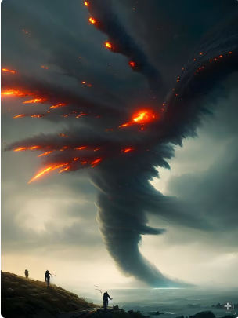

# 飓风离去  
> 飓风离开了，风缓人息。周边全是一片狼藉，但也许仍能重新开始。  
  
<table class="table table-bordered" data-toggle="table"  data-show-header="false"><thead style="display:none"><tr ><th  style="width:50%;text-align:left;vertical-align:top;"  data-sortable="true"  >title</th><th  style="width:50%;text-align:left;vertical-align:top;"  ></th></tr></thead><tr ><td  style="width:50%;text-align:left;vertical-align:top;"  ></td><td  style="width:50%;text-align:left;vertical-align:top;"  >

<a href="tq_Event_TornadoShark_Leave.md" style="color:black">飓风离去</a>

</td></tr></tbody></table>  
  
## 获取来源  

转化

[鲨龙卷](tq_Wather_TornadoShark.md)

  
  
## 动作  

<table><tr><td rowspan="2" style="width:200px;text-align:center;font-size:1.3em;font-weight:bold">

清理现场

</td><td></td></tr><tr><td><b>自身：</b>→消失</td></tr><tr><td colspan="2"><b>状态变化：</b>[

[情绪](Morale.md)](Morale.md)<b>+30</b>, [

[压力](Stress.md)](Stress.md)<b>-100</b></td></tr><tr><td colspan="2">[

[倒下的大树](LargeTreeFelled.md)](LargeTreeFelled.md)(<b>+6</b>), [

[长木棍](StickLong.md)](StickLong.md)(<b>+10</b>), [

[塑料瓶](PlasticBottle.md)](PlasticBottle.md)(<b>+2</b>), [

[鲨鱼尸体](SharkCarcass.md)](SharkCarcass.md)(<b>+1</b>), [

[失落之船](tq_Nc_TornadoShark_DropShip.md)](tq_Nc_TornadoShark_DropShip.md)(<b>+1</b>)</td></tr></table>
  
  
  

