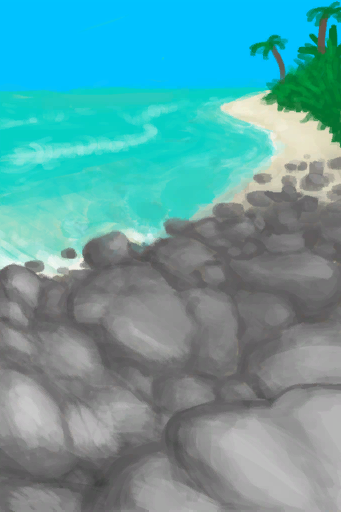

# 狂风(天启)  
> 狂风将身体吹起，世界在不停的旋转！  
  
<table class="table table-bordered" data-toggle="table"  data-show-header="false"><thead style="display:none"><tr ><th  style="width:50%;text-align:left;vertical-align:top;"  >title</th><th  style="width:50%;text-align:left;vertical-align:top;"  ></th></tr></thead><tr ><td  style="width:50%;text-align:left;vertical-align:top;"  >** 不可删除 **</td><td  style="width:50%;text-align:left;vertical-align:top;"  >

<a href="tq_Event_TornadoShark_TornadoTp.md" style="color:black">狂风</a>

</td></tr></tbody></table>  
  
## 获取来源  

转化

[鲨龙卷](tq_Wather_TornadoShark.md)

  
  
## 动作  

<table><tr><td rowspan="2" style="width:200px;text-align:center;font-size:1.3em;font-weight:bold">

啊！！

</td><td></td></tr><tr><td><b>自身：</b>→消失</td></tr><tr><td colspan="2">

<table style="margin-bottom:3px;"><tr><td rowspan=2 style="text-align:center" width="80px">
基础权重

1
</td><td style="font-size:0.6em;line-height:0.6em;font-weight:bold">Shore Path</td></tr><tr><td>[

[丛林深处(环境)](Env_DeepJungle.md)](Env_DeepJungle.md)(<b>+1</b>), [

[前往丛林高地(丛林深处)](Path_DeepJungleToJungleHighlands.md)](Path_DeepJungleToJungleHighlands.md)(<b>+1</b>)</td></tr></table>

<table style="margin-bottom:3px;"><tr><td rowspan=2 style="text-align:center" width="80px">
基础权重

1
</td><td style="font-size:0.6em;line-height:0.6em;font-weight:bold">Wetlands Path</td></tr><tr><td>[

[神秘谷(环境)](Env_SecretValley.md)](Env_SecretValley.md)(<b>+1</b>), [

[前往丛林深处(神秘谷)](Path_ValleyToDeepJungle.md)](Path_ValleyToDeepJungle.md)(<b>+1</b>)</td></tr></table>

<table style="margin-bottom:3px;"><tr><td rowspan=2 style="text-align:center" width="80px">
基础权重

1
</td><td style="font-size:0.6em;line-height:0.6em;font-weight:bold">Success</td></tr><tr><td>[

[丛林高地(环境)](Env_JungleHighlands.md)](Env_JungleHighlands.md)(<b>+1</b>)</td></tr></table>

<table style="margin-bottom:3px;"><tr><td rowspan=2 style="text-align:center" width="80px">
基础权重

1
</td><td style="font-size:0.6em;line-height:0.6em;font-weight:bold">Path</td></tr><tr><td>[

[东部草原(环境)](Env_GrasslandsE.md)](Env_GrasslandsE.md)(<b>+1</b>), [

[前往荒芜沙滩(东部草原)](Path_GrasslandsEToDesolateBeach.md)](Path_GrasslandsEToDesolateBeach.md)(<b>+1</b>)</td></tr></table>

<table style="margin-bottom:3px;"><tr><td rowspan=2 style="text-align:center" width="80px">
基础权重

1
</td><td style="font-size:0.6em;line-height:0.6em;font-weight:bold">Path</td></tr><tr><td>[

[东部高地(环境)](Env_HighlandsEastern.md)](Env_HighlandsEastern.md)(<b>+1</b>), [

[前往东部草原(东部高地)](Path_HighlandsEToGrasslandsE.md)](Path_HighlandsEToGrasslandsE.md)(<b>+1</b>)</td></tr></table>

<table style="margin-bottom:3px;"><tr><td rowspan=2 style="text-align:center" width="80px">
基础权重

1
</td><td style="font-size:0.6em;line-height:0.6em;font-weight:bold">Path</td></tr><tr><td>[

[西部高地(环境)](Env_HighlandsWestern.md)](Env_HighlandsWestern.md)(<b>+1</b>), [

[前往东部高地(西部高地)](Path_HighlandsWToHighlandsE.md)](Path_HighlandsWToHighlandsE.md)(<b>+1</b>)</td></tr></table>

<table style="margin-bottom:3px;"><tr><td rowspan=2 style="text-align:center" width="80px">
基础权重

1
</td><td style="font-size:0.6em;line-height:0.6em;font-weight:bold">Path</td></tr><tr><td>[

[海湾(环境)](Env_Bay.md)](Env_Bay.md)(<b>+1</b>), [

[前往丛林小径(海湾)](Path_BayToJungle.md)](Path_BayToJungle.md)(<b>+1</b>)</td></tr></table>

<table style="margin-bottom:3px;"><tr><td rowspan=2 style="text-align:center" width="80px">
基础权重

1
</td><td style="font-size:0.6em;line-height:0.6em;font-weight:bold">Path</td></tr><tr><td>[

[沙滩(环境)](Env_Beach.md)](Env_Beach.md)(<b>+1</b>), [

[前往海湾](Path_BeachToBay.md)](Path_BeachToBay.md)(<b>+1</b>)</td></tr></table>

<table style="margin-bottom:3px;"><tr><td rowspan=2 style="text-align:center" width="80px">
基础权重

1
</td><td style="font-size:0.6em;line-height:0.6em;font-weight:bold">Success</td></tr><tr><td>[

[鸟岩岛(环境)](Env_BirdRock.md)](Env_BirdRock.md)(<b>+1</b>), [

[隐秘港湾](Path_BirdRockToCove.md)](Path_BirdRockToCove.md)(<b>+1</b>)</td></tr></table>

<table style="margin-bottom:3px;"><tr><td rowspan=2 style="text-align:center" width="80px">
基础权重

1
</td><td style="font-size:0.6em;line-height:0.6em;font-weight:bold">Path</td></tr><tr><td>[

[岩滩(环境)](Env_Rocks.md)](Env_Rocks.md)(<b>+1</b>), [

[前往沙滩(岩滩)](Path_RocksToBeach.md)](Path_RocksToBeach.md)(<b>+1</b>)</td></tr></table>

<table style="margin-bottom:3px;"><tr><td rowspan=2 style="text-align:center" width="80px">
基础权重

1
</td><td style="font-size:0.6em;line-height:0.6em;font-weight:bold">Success</td></tr><tr><td>[

[隐秘港湾(环境)](Env_Cove.md)](Env_Cove.md)(<b>+1</b>), [

[鸟岩岛(隐秘港湾)](Path_CoveToBirdRock.md)](Path_CoveToBirdRock.md)(<b>+1</b>)[

[猎手接近](HuntersProximity.md)](HuntersProximity.md)<b>-24</b></td></tr></table>

<table style="margin-bottom:3px;"><tr><td rowspan=2 style="text-align:center" width="80px">
基础权重

1
</td><td style="font-size:0.6em;line-height:0.6em;font-weight:bold">Path</td></tr><tr><td>[

[荒芜沙滩(环境)](Env_DesolateBeach.md)](Env_DesolateBeach.md)(<b>+1</b>), [

[前往红树林(荒芜沙滩)](Path_DesolateBeachToMangroves.md)](Path_DesolateBeachToMangroves.md)(<b>+1</b>)</td></tr></table>

<table style="margin-bottom:3px;"><tr><td rowspan=2 style="text-align:center" width="80px">
基础权重

1
</td><td style="font-size:0.6em;line-height:0.6em;font-weight:bold">Path</td></tr><tr><td>[

[红树林(环境)](Env_Mangroves.md)](Env_Mangroves.md)(<b>+1</b>), [

[前往海湾](Path_MangrovesToBay.md)](Path_MangrovesToBay.md)(<b>+1</b>)</td></tr></table>

<table style="margin-bottom:3px;"><tr><td rowspan=2 style="text-align:center" width="80px">
基础权重

1
</td><td style="font-size:0.6em;line-height:0.6em;font-weight:bold">Path</td></tr><tr><td>[

[火山(环境)](Env_Volcano.md)](Env_Volcano.md)(<b>+1</b>), [

[前往东部高地(火山)](Path_VolcanoToHighlandsE.md)](Path_VolcanoToHighlandsE.md)(<b>+1</b>)</td></tr></table>

<table style="margin-bottom:3px;"><tr><td rowspan=2 style="text-align:center" width="80px">
基础权重

1
</td><td style="font-size:0.6em;line-height:0.6em;font-weight:bold">Path</td></tr><tr><td>[

[火山(环境)](Env_AcidLake.md)](Env_AcidLake.md)(<b>+1</b>), [

[前往火山](Path_AcidLakeToVolcano.md)](Path_AcidLakeToVolcano.md)(<b>+1</b>)</td></tr></table>

<table style="margin-bottom:3px;"><tr><td rowspan=2 style="text-align:center" width="80px">
基础权重

1
</td><td style="font-size:0.6em;line-height:0.6em;font-weight:bold">Path</td></tr><tr><td>[

[西部草原(环境)](Env_GrasslandsW.md)](Env_GrasslandsW.md)(<b>+1</b>), [

[前往东部草原(西部草原)](Path_GrasslandsWToGrasslandsE.md)](Path_GrasslandsWToGrasslandsE.md)(<b>+1</b>)</td></tr></table>

<table style="margin-bottom:3px;"><tr><td rowspan=2 style="text-align:center" width="80px">
基础权重

1
</td><td style="font-size:0.6em;line-height:0.6em;font-weight:bold">Wetlands Path</td></tr><tr><td>[

[湿地(环境)](Env_Wetlands.md)](Env_Wetlands.md)(<b>+1</b>), [

[前往丛林深处(湿地)](Path_WetlandsToDeepJungle.md)](Path_WetlandsToDeepJungle.md)(<b>+1</b>)</td></tr></table>

<table style="margin-bottom:3px;"><tr><td rowspan=2 style="text-align:center" width="80px">
基础权重

1
</td><td style="font-size:0.6em;line-height:0.6em;font-weight:bold">Path</td></tr><tr><td>[

[西部高地(环境)](Env_HighlandsWestern.md)](Env_HighlandsWestern.md)(<b>+1</b>), [

[前往东部高地(西部高地)](Path_HighlandsWToHighlandsE.md)](Path_HighlandsWToHighlandsE.md)(<b>+1</b>)</td></tr></table>

</td></tr></table>
  

<table><tr><td rowspan="2" style="width:200px;text-align:center;font-size:1.3em;font-weight:bold">

抵抗

</td><td></td></tr><tr><td><b>自身：</b>→消失</td></tr><tr><td colspan="2"><b>需求：</b>[

[引力](tq_Nc_Meteor_Imprint_WeightBall.md)](tq_Nc_Meteor_Imprint_WeightBall.md)存在于手中</td></tr><tr><td colspan="2"><b>相关卡牌变化：</b>所有[引力](tq_Nc_Meteor_Imprint_WeightBall.md)可用次数  <b>-288</b></td></tr></table>
  
  
  

