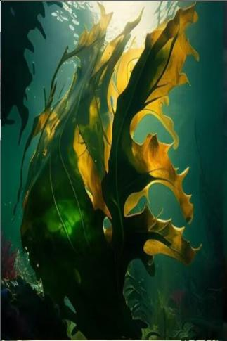

# 海带  
> 丝丝海带延伸至脚踝，发觉时感觉一股猛力向下拖拽！  
  
<table class="table table-bordered" data-toggle="table"  data-show-header="false"><thead style="display:none"><tr ><th  style="width:50%;text-align:left;vertical-align:top;"  >title</th><th  style="width:50%;text-align:left;vertical-align:top;"  ></th></tr></thead><tr ><td  style="width:50%;text-align:left;vertical-align:top;"  >**重量：**10000</td><td  style="width:50%;text-align:left;vertical-align:top;"  >

<a href="tq_Event_UnderSea_Kelp_Winding.md" style="color:black">海带</a>

</td></tr></tbody></table>  
  
## 获取来源  

采摘海带

[海带(浅海)](tq_Nc_UnderSea_Kelp.md)

采摘海带

[海带](tq_Nc_UnderSea_Kelp_Two.md)

  
  
## 动作  

<table><tr><td rowspan="2" style="width:200px;text-align:center;font-size:1.3em;font-weight:bold">

挣脱

1小时

</td><td></td></tr><tr><td><b>自身：</b>→消失</td></tr><tr><td colspan="2"><b>需求：</b>

: <b>96～960(10%～100%)</b></td></tr></table>
  
  
  

