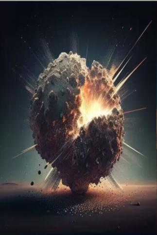
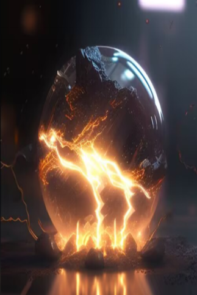

# 局部烧伤  
> Caused by over-exposure to the sun or by coming in contact with fire.  
  

<b>基础值: </b> 0 
  

<b>变化范围: </b> 0 ~ 1500 
  

<b>基础变化率: </b> -1 / 每15分钟 
  
## 阶段  

<table><tr style="height:2em;"><td style="background-color:#F0F0F0;text-align:center;width:180px;font-size:1.4em;font-weight:bold;vertical-align:middle;">
1 ～ 150

0% ～ 10%
</td><td colspan=2 style="font-size:1.1em;vertical-align:middle;background-color:#F9F9F9;">
<b>

Minor Burn</b>

</td></tr><tr><td colspan=2><b>影响：</b>[

[皮肤完整度](SkinIntegrity.md)](SkinIntegrity.md)<b>-1</b>, [

[疼痛](Pain.md)](Pain.md)<b>+50</b>, [

[受伤](Wounds.md)](Wounds.md)<b>+50</b>, [

[水分](Hydration.md)](Hydration.md)加成<b>-0.125</b></td></tr><tr><td colspan=2></td></tr><tr style="height:2em;"><td style="background-color:#F0F0F0;text-align:center;width:180px;font-size:1.4em;font-weight:bold;vertical-align:middle;">
151 ～ 299

10% ～ 19%
</td><td colspan=2 style="font-size:1.1em;vertical-align:middle;background-color:#F9F9F9;">
<b>

First Degree Burn</b>

&nbsp;&nbsp;Burns...
</td></tr><tr><td colspan=2><b>影响：</b>[

[皮肤完整度](SkinIntegrity.md)](SkinIntegrity.md)<b>-2</b>, [

[疼痛](Pain.md)](Pain.md)<b>+100</b>, [

[受伤](Wounds.md)](Wounds.md)<b>+150</b>, [

[水分](Hydration.md)](Hydration.md)加成<b>-0.25</b></td></tr><tr><td colspan=2></td></tr><tr style="height:2em;"><td style="background-color:#F0F0F0;text-align:center;width:180px;font-size:1.4em;font-weight:bold;vertical-align:middle;">
300 ～ 599

20% ～ 39%
</td><td colspan=2 style="font-size:1.1em;vertical-align:middle;background-color:#F9F9F9;">
<b>

Second Degree Burn</b>

&nbsp;&nbsp;It burns
</td></tr><tr><td colspan=2><b>影响：</b>[

[皮肤完整度](SkinIntegrity.md)](SkinIntegrity.md)<b>-3</b>, [

[疼痛](Pain.md)](Pain.md)<b>+200</b>, [

[体重](Weight.md)](Weight.md)加成<b>-1</b>, [

[受伤](Wounds.md)](Wounds.md)<b>+300</b>, [

[水分](Hydration.md)](Hydration.md)加成<b>-0.375</b></td></tr><tr><td colspan=2></td></tr><tr style="height:2em;"><td style="background-color:#F0F0F0;text-align:center;width:180px;font-size:1.4em;font-weight:bold;vertical-align:middle;">
600 ～ 999

40% ～ 66%
</td><td colspan=2 style="font-size:1.1em;vertical-align:middle;background-color:#F9F9F9;">
<b>

Second Degree Burn</b>

&nbsp;&nbsp;Hurts so much!
</td></tr><tr><td colspan=2><b>影响：</b>[

[皮肤完整度](SkinIntegrity.md)](SkinIntegrity.md)<b>-4</b>, [

[疼痛](Pain.md)](Pain.md)<b>+350</b>, [

[体重](Weight.md)](Weight.md)加成<b>-1</b>, [

[受伤](Wounds.md)](Wounds.md)<b>+500</b>, [

[水分](Hydration.md)](Hydration.md)加成<b>-0.5</b></td></tr><tr><td colspan=2></td></tr><tr style="height:2em;"><td style="background-color:#F0F0F0;text-align:center;width:180px;font-size:1.4em;font-weight:bold;vertical-align:middle;">
1000 ～ 1500

66% ～ 100%
</td><td colspan=2 style="font-size:1.1em;vertical-align:middle;background-color:#F9F9F9;">
<b>

Third Degree Burn</b>

&nbsp;&nbsp;Arghhh!
</td></tr><tr><td colspan=2><b>影响：</b>[

[皮肤完整度](SkinIntegrity.md)](SkinIntegrity.md)<b>-5</b>, [

[疼痛](Pain.md)](Pain.md)<b>+500</b>, [

[体重](Weight.md)](Weight.md)加成<b>-2</b>, [

[受伤](Wounds.md)](Wounds.md)<b>+1000</b>, [

[水分](Hydration.md)](Hydration.md)加成<b>-1</b></td></tr><tr><td colspan=2></td></tr></table>
  
## 相关卡牌  
[血狼化](tq_Gs_BloodMoon_BloodWolfTransformation.md)  |  [水仙素](tq_Gs_PollenSeason_DaffodilsFlower_Fruit.md)  |  [海洋润肤](tq_Gs_UnderSea_Kelp_Plasters.md)  
## 加成值影响因素  
<table class="table table-bordered" data-toggle="table"  ><thead style=""><tr ><th  style="text-align:left;vertical-align:top;"  >来源</th><th  style="text-align:left;vertical-align:top;"  >操作</th><th  style="text-align:left;vertical-align:top;"  >值</th></tr></thead><tr ><td  style="text-align:left;vertical-align:top;"  >[自然之灵](tq_Nc_FlowerSea_CureWoundBall.md)</td><td  style="text-align:left;vertical-align:top;"  >被动效果</td><td  style="text-align:left;vertical-align:top;"  >加成-0.5</td></tr></tbody></table>  
  
## 可被以下操作改变  
<table class="table table-bordered" data-toggle="table"  ><thead style=""><tr ><th  style="text-align:left;vertical-align:top;"  >来源</th><th  style="text-align:left;vertical-align:top;"  >操作</th><th  style="text-align:left;vertical-align:top;"  data-sortable="true"  >值</th></tr></thead><tr ><td  style="text-align:left;vertical-align:top;"  >[

[什么！(事件)](tq_Event_Imprint_StarDrop_TypeOne_Boom.md)](tq_Event_Imprint_StarDrop_TypeOne_Boom.md)</td><td  style="text-align:left;vertical-align:top;"  >啊！</td><td  style="text-align:left;vertical-align:top;"  >500</td></tr><tr ><td  style="text-align:left;vertical-align:top;"  >[

[轰隆隆！(事件)](tq_Event_Thunder_NearHuman.md)](tq_Event_Thunder_NearHuman.md)</td><td  style="text-align:left;vertical-align:top;"  >闪电劈在眼前！</td><td  style="text-align:left;vertical-align:top;"  >50</td></tr><tr ><td  style="text-align:left;vertical-align:top;"  >[

[什么！(事件)](tq_Event_ThunderStorm_ThunderBall_Boom.md)](tq_Event_ThunderStorm_ThunderBall_Boom.md)</td><td  style="text-align:left;vertical-align:top;"  >啊！</td><td  style="text-align:left;vertical-align:top;"  >300</td></tr><tr ><td  style="text-align:left;vertical-align:top;"  >[

[什么！(事件)](tq_Event_Thunder_LightInBottle_StepTwo_Boom.md)](tq_Event_Thunder_LightInBottle_StepTwo_Boom.md)</td><td  style="text-align:left;vertical-align:top;"  >啊！</td><td  style="text-align:left;vertical-align:top;"  >300</td></tr><tr ><td  style="text-align:left;vertical-align:top;"  >[

[蒸汽冲击(事件)](tq_Event_VolcanicEruptions_Rolling_Smoke.md)](tq_Event_VolcanicEruptions_Rolling_Smoke.md)</td><td  style="text-align:left;vertical-align:top;"  >我不能呼吸了！</td><td  style="text-align:left;vertical-align:top;"  >200 ~ 250</td></tr><tr ><td  style="text-align:left;vertical-align:top;"  >[

[雷云滚滚(事件)](tq_Event_ThunderStorm_StormAttackHuman.md)](tq_Event_ThunderStorm_StormAttackHuman.md)</td><td  style="text-align:left;vertical-align:top;"  >闪电直劈身体！</td><td  style="text-align:left;vertical-align:top;"  >150</td></tr></tbody></table>  
  

