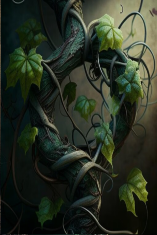
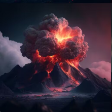

# 肺部损伤  
> Caused by being unprotected in areas with high air toxicity. Causes pain and reduces stamina.  
  

<b>基础值: </b> 0 
  

<b>变化范围: </b> 0 ~ 1000 
  

<b>基础变化率: </b> -1 / 每15分钟 
  
## 阶段  

<table><tr style="height:2em;"><td style="background-color:#F0F0F0;text-align:center;width:180px;font-size:1.4em;font-weight:bold;vertical-align:middle;">
250 ～ 500

25% ～ 50%
</td><td colspan=2 style="font-size:1.1em;vertical-align:middle;background-color:#F9F9F9;">
<b>

Breathing Problems</b>

</td></tr><tr><td colspan=2><b>影响：</b>[

[疼痛](Pain.md)](Pain.md)<b>+50</b>, [

[耐力](Stamina.md)](Stamina.md)加成<b>-0.5</b></td></tr><tr><td colspan=2></td></tr><tr style="height:2em;"><td style="background-color:#F0F0F0;text-align:center;width:180px;font-size:1.4em;font-weight:bold;vertical-align:middle;">
501 ～ 750

50% ～ 75%
</td><td colspan=2 style="font-size:1.1em;vertical-align:middle;background-color:#F9F9F9;">
<b>

Breathing Hurts</b>

</td></tr><tr><td colspan=2><b>影响：</b>[

[疼痛](Pain.md)](Pain.md)<b>+175</b>, [

[耐力](Stamina.md)](Stamina.md)加成<b>-1</b></td></tr><tr><td colspan=2></td></tr><tr style="height:2em;"><td style="background-color:#F0F0F0;text-align:center;width:180px;font-size:1.4em;font-weight:bold;vertical-align:middle;">
751 ～ 999

75% ～ 99%
</td><td colspan=2 style="font-size:1.1em;vertical-align:middle;background-color:#F9F9F9;">
<b>

Breathing Hurts too much</b>

</td></tr><tr><td colspan=2><b>影响：</b>[

[疼痛](Pain.md)](Pain.md)<b>+350</b>, [

[耐力](Stamina.md)](Stamina.md)加成<b>-1.5</b></td></tr><tr><td colspan=2></td></tr><tr style="height:2em;"><td style="background-color:#F0F0F0;text-align:center;width:180px;font-size:1.4em;font-weight:bold;vertical-align:middle;">
1000

100%
</td><td colspan=2 style="font-size:1.1em;vertical-align:middle;background-color:#F9F9F9;">
<b>

Dead of Asphyxiation</b>

</td></tr><tr><td colspan=2><b>影响：</b>[

[疼痛](Pain.md)](Pain.md)<b>+500</b></td></tr><tr><td colspan=2></td></tr></table>
  
## 相关卡牌  
[血狼化](tq_Gs_BloodMoon_BloodWolfTransformation.md)  |  [水仙素](tq_Gs_PollenSeason_DaffodilsFlower_Fruit.md)  |  [红晶素](tq_Gs_PollenSeason_Tyrannus_Fruit.md)  
## 加成值影响因素  
<table class="table table-bordered" data-toggle="table"  ><thead style=""><tr ><th  style="text-align:left;vertical-align:top;"  >来源</th><th  style="text-align:left;vertical-align:top;"  >操作</th><th  style="text-align:left;vertical-align:top;"  >值</th></tr></thead><tr ><td  style="text-align:left;vertical-align:top;"  >[燃烧树](tq_Nc_ThunderStorm_BurnTree.md)</td><td  style="text-align:left;vertical-align:top;"  >被动效果</td><td  style="text-align:left;vertical-align:top;"  >加成+2</td></tr><tr ><td  style="text-align:left;vertical-align:top;"  >[灰烬树](tq_Nc_VolcanicEruption_BurnTree.md)</td><td  style="text-align:left;vertical-align:top;"  >被动效果</td><td  style="text-align:left;vertical-align:top;"  >加成+2</td></tr><tr ><td  style="text-align:left;vertical-align:top;"  >[自然之灵](tq_Nc_FlowerSea_CureWoundBall.md)</td><td  style="text-align:left;vertical-align:top;"  >被动效果</td><td  style="text-align:left;vertical-align:top;"  >加成-0.5</td></tr></tbody></table>  
  
## 可被以下操作改变  
<table class="table table-bordered" data-toggle="table"  ><thead style=""><tr ><th  style="text-align:left;vertical-align:top;"  >来源</th><th  style="text-align:left;vertical-align:top;"  >操作</th><th  style="text-align:left;vertical-align:top;"  data-sortable="true"  >值</th></tr></thead><tr ><td  style="text-align:left;vertical-align:top;"  >[

[剧烈燃烧(事件)](tq_Event_PollenSeason_TwistedVine_BurnDeath.md)](tq_Event_PollenSeason_TwistedVine_BurnDeath.md)</td><td  style="text-align:left;vertical-align:top;"  >咳咳咳...</td><td  style="text-align:left;vertical-align:top;"  >250</td></tr><tr ><td  style="text-align:left;vertical-align:top;"  >[

[蒸汽冲击(事件)](tq_Event_VolcanicEruptions_Rolling_Smoke.md)](tq_Event_VolcanicEruptions_Rolling_Smoke.md)</td><td  style="text-align:left;vertical-align:top;"  >我不能呼吸了！</td><td  style="text-align:left;vertical-align:top;"  >50</td></tr></tbody></table>  
  

