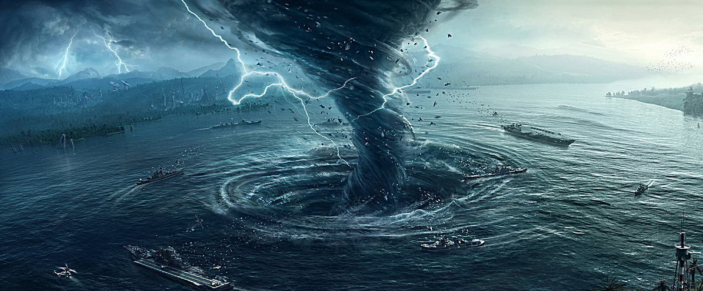

# DiasterBeasonsPresence  
  

<b>基础值: </b> 0 
  

<b>变化范围: </b> 0 ~ 1 
  

<b>基础变化率: </b> +0 / 每15分钟 
  
  
## 可被以下操作改变  
<table class="table table-bordered" data-toggle="table"  ><thead style=""><tr ><th  style="text-align:left;vertical-align:top;"  >来源</th><th  style="text-align:left;vertical-align:top;"  >操作</th><th  style="text-align:left;vertical-align:top;"  data-sortable="true"  >值</th></tr></thead><tr ><td  style="text-align:left;vertical-align:top;"  >[

[血月](tq_Wather_BloodMoon.md)](tq_Wather_BloodMoon.md)</td><td  style="text-align:left;vertical-align:top;"  >被动效果</td><td  style="text-align:left;vertical-align:top;"  >1</td></tr><tr ><td  style="text-align:left;vertical-align:top;"  >[

[大雁南飞](tq_Wather_GeeseSouth.md)](tq_Wather_GeeseSouth.md)</td><td  style="text-align:left;vertical-align:top;"  >被动效果</td><td  style="text-align:left;vertical-align:top;"  >1</td></tr><tr ><td  style="text-align:left;vertical-align:top;"  >[

[暴风雪](tq_Wather_Hail.md)](tq_Wather_Hail.md)</td><td  style="text-align:left;vertical-align:top;"  >被动效果</td><td  style="text-align:left;vertical-align:top;"  >1</td></tr><tr ><td  style="text-align:left;vertical-align:top;"  >[

[流星雨](tq_Wather_Meteor_Shower.md)](tq_Wather_Meteor_Shower.md)</td><td  style="text-align:left;vertical-align:top;"  >被动效果</td><td  style="text-align:left;vertical-align:top;"  >1</td></tr><tr ><td  style="text-align:left;vertical-align:top;"  >[

[花粉季](tq_Wather_PollenSeason.md)](tq_Wather_PollenSeason.md)</td><td  style="text-align:left;vertical-align:top;"  >被动效果</td><td  style="text-align:left;vertical-align:top;"  >1</td></tr><tr ><td  style="text-align:left;vertical-align:top;"  >[

[彩虹](tq_Wather_Rainbow.md)](tq_Wather_Rainbow.md)</td><td  style="text-align:left;vertical-align:top;"  >被动效果</td><td  style="text-align:left;vertical-align:top;"  >1</td></tr><tr ><td  style="text-align:left;vertical-align:top;"  >[

[雷暴](tq_Wather_Thunderstorm.md)](tq_Wather_Thunderstorm.md)</td><td  style="text-align:left;vertical-align:top;"  >被动效果</td><td  style="text-align:left;vertical-align:top;"  >1</td></tr><tr ><td  style="text-align:left;vertical-align:top;"  >[

[鲨龙卷](tq_Wather_TornadoShark.md)](tq_Wather_TornadoShark.md)</td><td  style="text-align:left;vertical-align:top;"  >被动效果</td><td  style="text-align:left;vertical-align:top;"  >1</td></tr><tr ><td  style="text-align:left;vertical-align:top;"  >[

[火山爆发](tq_Wather_VolcanicEruptions.md)](tq_Wather_VolcanicEruptions.md)</td><td  style="text-align:left;vertical-align:top;"  >被动效果</td><td  style="text-align:left;vertical-align:top;"  >1</td></tr></tbody></table>  
  
  
## 被以下操作需求  
<table class="table table-bordered" data-toggle="table"  ><thead style=""><tr ><th  style="text-align:left;vertical-align:top;"  >来源</th><th  style="text-align:left;vertical-align:top;"  >操作</th><th  style="text-align:left;vertical-align:top;"  data-sortable="true"  >值</th></tr></thead><tr ><td  style="text-align:left;vertical-align:top;"  >[天启](tq_Nc_DiasterBeacons.md)</td><td  style="text-align:left;vertical-align:top;"  >命运</td><td  style="text-align:left;vertical-align:top;"  >0.95 ~ 1.2</td></tr><tr ><td  style="text-align:left;vertical-align:top;"  >[天启](tq_Nc_DiasterBeacons.md)</td><td  style="text-align:left;vertical-align:top;"  >命运</td><td  style="text-align:left;vertical-align:top;"  >-1 ~ 0.8</td></tr></tbody></table>  
  

