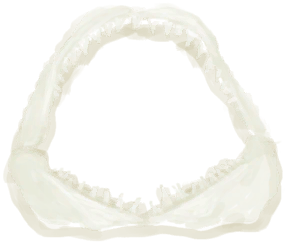

# 狼爪(天启)  
> 曾经的手，粗壮的爪子..至少干活很方便...  
  
<table class="table table-bordered" data-toggle="table"  data-show-header="false"><thead style="display:none"><tr ><th  style="width:50%;text-align:left;vertical-align:top;"  >title</th><th  style="width:50%;text-align:left;vertical-align:top;"  ></th></tr></thead><tr ><td  style="width:50%;text-align:left;vertical-align:top;"  >** 区域唯一 **  ** 不可删除 **  ** 装备时等效于拿在手上 **  **装备时减重：**0  **标签：**	[“西”](tag_West.md)  **装备：**  **可用次数：**2688  ** 效果: ** [

[手掌损伤](HandDamage.md)](HandDamage.md)<b>-200</b> 加成<b>-1</b> [

[手茧](CallousesHands.md)](CallousesHands.md)<b>+500</b></td><td  style="width:50%;text-align:left;vertical-align:top;"  >

<a href="tq_Nc_BloodMoon_BloodWolf_Claw.md" style="color:black">狼爪</a>

</td></tr></tbody></table>  
  
## 获取来源  

我感觉身体产生了一些变化...

[未知病毒](tq_W_BloodWolfViur_StepTwo.md)

  
  
## 可拖入  

<table style="margin-bottom:0px;"><tr><td style="width:40%;text-align:left; background-color:#FEFEFE"><b>拖入：</b>[

[巨蜥尸体](MonitorCarcass.md)](MonitorCarcass.md)</td><td style="width:40%;font-size:1em;font-weight:bold;background-color:#FEFEFE">剥皮刮肉  </td></tr><tr style="background-color:#FFFFFF"><td style=""><b>使用物：</b>→消失</td><td style=""><b>自身：</b>

  <b>+0(0%)</b></td></tr><tr><td colspan="2">[

[巨蜥肉](MonitorMeat.md)](MonitorMeat.md)(<b>+10</b>), [

[刮净的蜥蜴皮](SkinFleshedReptile.md)](SkinFleshedReptile.md)(<b>+2</b>), [

[食丸](GastricPellet.md)](GastricPellet.md)(<b>+2</b>), [

[骨头](Bones.md)](Bones.md)(<b>+3</b>), [

[腐烂物](RottenRemains.md)](RottenRemains.md)(<b>+3</b>)</td></tr></table>
  

<table style="margin-bottom:0px;"><tr><td style="width:40%;text-align:left; background-color:#FEFEFE"><b>拖入：</b>[

[山羊尸体(公)](GoatCarcassMale.md)](GoatCarcassMale.md) | [

[山羊尸体(母)](GoatCarcassFemale.md)](GoatCarcassFemale.md)</td><td style="width:40%;font-size:1em;font-weight:bold;background-color:#FEFEFE">剥皮刮肉  </td></tr><tr style="background-color:#FFFFFF"><td style=""><b>使用物：</b>→消失</td><td style=""><b>自身：</b>

  <b>+3(25%)</b></td></tr><tr><td colspan="2">[

[羊肉](GoatMeat.md)](GoatMeat.md)(<b>+6</b>), [

[脂肪](Fat.md)](Fat.md)(<b>+2～+3</b>), [

[骨头](Bones.md)](Bones.md)(<b>+3</b>), [

[刮净的皮](SkinFleshed.md)](SkinFleshed.md)(<b>+3</b>)</td></tr></table>
  

<table style="margin-bottom:0px;"><tr><td style="width:40%;text-align:left; background-color:#FEFEFE"><b>拖入：</b>[

[猕猴尸体](MacaqueCarcass.md)](MacaqueCarcass.md)</td><td style="width:40%;font-size:1em;font-weight:bold;background-color:#FEFEFE">剥皮刮肉  </td></tr><tr style="background-color:#FFFFFF"><td style=""><b>使用物：</b>→消失</td><td style=""><b>自身：</b>

  <b>+3(25%)</b></td></tr><tr><td colspan="2">[

[猕猴肉](MacaqueMeat.md)](MacaqueMeat.md)(<b>+2</b>), [

[骨头](Bones.md)](Bones.md)(<b>+1</b>), [

[刮净的皮](SkinFleshed.md)](SkinFleshed.md)(<b>+1</b>)</td></tr></table>
  

<table style="margin-bottom:0px;"><tr><td style="width:40%;text-align:left; background-color:#FEFEFE"><b>拖入：</b>[

[野猪尸体](BoarCarcass.md)](BoarCarcass.md)</td><td style="width:40%;font-size:1em;font-weight:bold;background-color:#FEFEFE">剥皮刮肉  </td></tr><tr style="background-color:#FFFFFF"><td style=""><b>使用物：</b>→消失</td><td style=""><b>自身：</b>

  <b>+3(25%)</b></td></tr><tr><td colspan="2">[

[野猪肉](BoarMeat.md)](BoarMeat.md)(<b>+10</b>), [

[骨头](Bones.md)](Bones.md)(<b>+4</b>), [

[刮净的皮](SkinFleshed.md)](SkinFleshed.md)(<b>+3</b>), [

[脂肪](Fat.md)](Fat.md)(<b>+4</b>), [

[野猪牙](Tusk.md)](Tusk.md)(<b>+2</b>)</td></tr></table>
  

<table style="margin-bottom:0px;"><tr><td style="width:40%;text-align:left; background-color:#FEFEFE"><b>拖入：</b>[

[鲨鱼尸体](SharkCarcass.md)](SharkCarcass.md)</td><td style="width:40%;font-size:1em;font-weight:bold;background-color:#FEFEFE">剥皮刮肉  </td></tr><tr style="background-color:#FFFFFF"><td style=""><b>使用物：</b>→消失</td><td style=""><b>自身：</b>

  <b>+3(25%)</b></td></tr><tr><td colspan="2">[

[鲨鱼肉](SharkMeat.md)](SharkMeat.md)(<b>+10</b>), [

[鱼杂](FishScraps.md)](FishScraps.md)(<b>+10</b>), [

[鲨鱼下颚](SharkJaws.md)](SharkJaws.md)(<b>+1</b>)</td></tr></table>
  

<table style="margin-bottom:0px;"><tr><td style="width:40%;text-align:left; background-color:#FEFEFE"><b>拖入：</b>[

[猕猴尸体](MacaqueCarcass.md)](MacaqueCarcass.md)</td><td style="width:40%;font-size:1em;font-weight:bold;background-color:#FEFEFE">剥皮刮肉  </td></tr><tr style="background-color:#FFFFFF"><td style=""><b>使用物：</b>→消失</td><td style=""><b>自身：</b>

  <b>+3(25%)</b></td></tr><tr><td colspan="2">[

[猕猴肉](MacaqueMeat.md)](MacaqueMeat.md)(<b>+2</b>), [

[骨头](Bones.md)](Bones.md)(<b>+1</b>), [

[刮净的皮](SkinFleshed.md)](SkinFleshed.md)(<b>+5</b>)</td></tr></table>
  

<table style="margin-bottom:0px;"><tr><td style="width:40%;text-align:left; background-color:#FEFEFE"><b>拖入：</b>[

[海鸥尸体](SeagullDead.md)](SeagullDead.md)</td><td style="width:40%;font-size:1em;font-weight:bold;background-color:#FEFEFE">剥皮刮肉  </td></tr><tr style="background-color:#FFFFFF"><td style=""><b>使用物：</b>→消失</td><td style=""><b>自身：</b>

  <b>+3(25%)</b></td></tr><tr><td colspan="2">[

[鸟肉](BirdMeat.md)](BirdMeat.md)(<b>+1</b>), [

[羽毛](Feathers.md)](Feathers.md)(<b>+2</b>), [

[鸟骨](BonesBird.md)](BonesBird.md)(<b>+1</b>)</td></tr></table>
  

<table style="margin-bottom:0px;"><tr><td style="width:40%;text-align:left; background-color:#FEFEFE"><b>拖入：</b>[

[海怪尸体](SeahoundCarcass.md)](SeahoundCarcass.md)</td><td style="width:40%;font-size:1em;font-weight:bold;background-color:#FEFEFE">剥皮刮肉  </td></tr><tr style="background-color:#FFFFFF"><td style=""><b>使用物：</b>→消失</td><td style=""><b>自身：</b>

  <b>+3(25%)</b></td></tr><tr><td colspan="2">[

[海怪肉](Seahoundmeat.md)](Seahoundmeat.md)(<b>+10</b>), [

[鱼杂](FishScraps.md)](FishScraps.md)(<b>+10</b>), [

[脂肪](Fat.md)](Fat.md)(<b>+2</b>)</td></tr></table>
  

<table style="margin-bottom:0px;"><tr><td style="width:40%;text-align:left; background-color:#FEFEFE"><b>拖入：</b>[

[灰山鹑尸体](PartridgeDead.md)](PartridgeDead.md)</td><td style="width:40%;font-size:1em;font-weight:bold;background-color:#FEFEFE">剥皮刮肉  </td></tr><tr style="background-color:#FFFFFF"><td style=""><b>使用物：</b>→消失</td><td style=""><b>自身：</b>

  <b>+3(25%)</b></td></tr><tr><td colspan="2">[

[鸟肉](BirdMeat.md)](BirdMeat.md)(<b>+1</b>), [

[羽毛](Feathers.md)](Feathers.md)(<b>+2</b>), [

[鸟骨](BonesBird.md)](BonesBird.md)(<b>+1</b>)</td></tr></table>
  

<table style="margin-bottom:0px;"><tr><td style="width:40%;text-align:left; background-color:#FEFEFE"><b>拖入：</b>[

[海鸥尸体](SeagullDead.md)](SeagullDead.md)</td><td style="width:40%;font-size:1em;font-weight:bold;background-color:#FEFEFE">剥皮刮肉  </td></tr><tr style="background-color:#FFFFFF"><td style=""><b>使用物：</b>→消失</td><td style=""><b>自身：</b>

  <b>+3(25%)</b></td></tr><tr><td colspan="2">[

[鸟肉](BirdMeat.md)](BirdMeat.md)(<b>+1</b>), [

[羽毛](Feathers.md)](Feathers.md)(<b>+2</b>), [

[鸟骨](BonesBird.md)](BonesBird.md)(<b>+1</b>)</td></tr></table>
  

<table style="margin-bottom:0px;"><tr><td style="width:40%;text-align:left; background-color:#FEFEFE"><b>拖入：</b>[

[眼镜蛇尸体](CobraDead.md)](CobraDead.md) | [

[海蛇尸体](SeaKraitDead.md)](SeaKraitDead.md)</td><td style="width:40%;font-size:1em;font-weight:bold;background-color:#FEFEFE">剥皮刮肉  </td></tr><tr style="background-color:#FFFFFF"><td style=""><b>使用物：</b>→消失</td><td style=""><b>自身：</b>

  <b>+3(25%)</b></td></tr><tr><td colspan="2">[

[剥皮的蛇](SnakeSkinned.md)](SnakeSkinned.md)(<b>+1</b>)</td></tr></table>
  
  
## 属性   

<table style="margin-bottom:0px;"><tr><td style="width:30%;text-align:left; background-color:#FEFEFE;font-size:1.3em;font-weight:bold;">使用次数</td><td style="font-size:1em;background-color:#FEFEFE">初始：2688 , 最大：2688 -</td></tr><tr style="background-color:#FFFFFF"><td colspan=2>** 到达0时： ** 自身: →消失 [

[布片](ClothSmall.md)](ClothSmall.md)(<b>+1</b>)</td></tr></table>
  

<table style="margin-bottom:0px;"><tr><td style="width:30%;text-align:left; background-color:#FEFEFE;font-size:1.3em;font-weight:bold;">

</td><td style="font-size:1em;background-color:#FEFEFE">初始：0 , 最大：12 每15分钟-1 , 最多需要：3小时</td></tr><tr style="background-color:#FFFFFF"><td colspan=2></td></tr></table>
  

