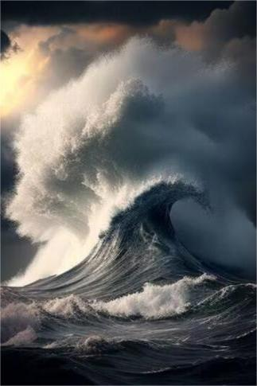

# 海面  
> 强烈的窒息感...  
  
<table class="table table-bordered" data-toggle="table"  data-show-header="false"><thead style="display:none"><tr ><th  style="width:50%;text-align:left;vertical-align:top;"  >title</th><th  style="width:50%;text-align:left;vertical-align:top;"  ></th></tr></thead><tr ><td  style="width:50%;text-align:left;vertical-align:top;"  >**环境：**[深海(环境)](tq_Env_DeepSea.md)  **重量：**10</td><td  style="width:50%;text-align:left;vertical-align:top;"  >

<a href="tq_Nc_DeepSeaToOverTheDeepSea.md" style="color:black">海面</a>

</td></tr></tbody></table>  
  
## 动作  

<table><tr><td rowspan="2" style="width:200px;text-align:center;font-size:1.3em;font-weight:bold">

向上游动

15分

</td><td></td></tr><tr><td></td></tr><tr><td colspan="2"><b>状态变化：</b>[Gs_Character_Lola_OpeningEpisode_Exhaustion](tq_Gs_Character_Lola_OpeningEpisode_RovingCounter.md)<b>+1</b></td></tr><tr><td colspan="2">

<table style="margin-bottom:3px;"><tr><td rowspan=2 style="text-align:center" width="80px">
基础权重

1
</td><td style="font-size:0.6em;line-height:0.6em;font-weight:bold">YoYo</td></tr><tr><td></td></tr><tr><td colspan=2><li>[Gs_Character_Lola_OpeningEpisode_Exhaustion](tq_Gs_Character_Lola_OpeningEpisode_RovingCounter.md)为<b>3</b>时权重<b>-10</b></li></td></tr></table>

<table style="margin-bottom:3px;"><tr><td rowspan=2 style="text-align:center" width="80px">
基础权重

0
</td><td style="font-size:0.6em;line-height:0.6em;font-weight:bold">Dirt</td></tr><tr><td>[

[乱流(事件)](tq_Event_Character_Lola_StartEpisode_Drowning_StepThree.md)](tq_Event_Character_Lola_StartEpisode_Drowning_StepThree.md)(<b>+1</b>)</td></tr><tr><td colspan=2><li>[Gs_Character_Lola_OpeningEpisode_Exhaustion](tq_Gs_Character_Lola_OpeningEpisode_RovingCounter.md)为<b>3</b>时权重<b>+10</b></li></td></tr></table>
<button class="btn btn-secondary btn-sm" style="" data-toggle="modal" onclick="setCollectionDataBase64('eyJ0aXRsZSI6IuamgueOh+aooeaLnzog5ZCR5LiK5ri45YqoICjmtbfpnaIpIiwiY29sbGVjdGlvbnMiOlt7ImRyb3AiOiLml6AiLCJiYXNlIjoiMSIsImNvbmRpdGlvbiI6W3sia2V5IjoidHFfR3NfQ2hhcmFjdGVyX0xvbGFfT3BlbmluZ0VwaXNvZGVfUm92aW5nQ291bnRlciIsInRpdGxlIjoiR3NfQ2hhcmFjdGVyX0xvbGFfT3BlbmluZ0VwaXNvZGVfRXhoYXVzdGlvbiIsInR5cGUiOiJyYW5nZSIsIm1heCI6WzAsM10sInJhbmdlIjpbMywzXSwid2VpZ2h0IjpbbnVsbCxudWxsXSwiZGVmYXVsdFZhbHVlIjowLCJ3aGVuT3V0T2ZSYW5nZSI6MH1dfSx7ImRyb3AiOiI8ZGl2IHN0eWxlPVwid2lkdGg6MjVweDtkaXNwbGF5OmlubGluZS1ibG9jazt0ZXh0LWFsaWduOmNlbnRlclwiPjxpbWcgZGVjb2Rpbmc9XCJhc3luY1wiIHNyYz1cIlNwcml0ZS90cS9FdmVudF9DaGFyYWN0ZXJfTG9sYV9TdGFydEVwaXNvZGVfRHJvd25pbmdfU3RlcFRocmVlLmpwZ1wiIGhyZWY9XCJhLm1kXCIgc3R5bGU9XCJtYXgtd2lkdGg6MjVweDttYXgtaGVpZ2h0OjI1cHg7XCI+PC9kaXY+5Lmx5rWBKOS6i+S7tikiLCJiYXNlIjowLCJjb25kaXRpb24iOlt7ImtleSI6InRxX0dzX0NoYXJhY3Rlcl9Mb2xhX09wZW5pbmdFcGlzb2RlX1JvdmluZ0NvdW50ZXIiLCJ0aXRsZSI6IkdzX0NoYXJhY3Rlcl9Mb2xhX09wZW5pbmdFcGlzb2RlX0V4aGF1c3Rpb24iLCJ0eXBlIjoicmFuZ2UiLCJtYXgiOlswLDNdLCJyYW5nZSI6WzMsM10sIndlaWdodCI6W251bGwsbnVsbF0sImRlZmF1bHRWYWx1ZSI6MCwid2hlbk91dE9mUmFuZ2UiOjB9XX1dfQ==')" data-target="#modelCollectionSimulator">概率模拟</button>
</td></tr></table>
  
  
  

