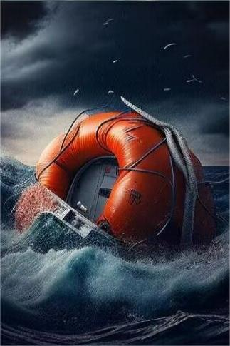
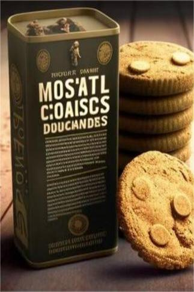
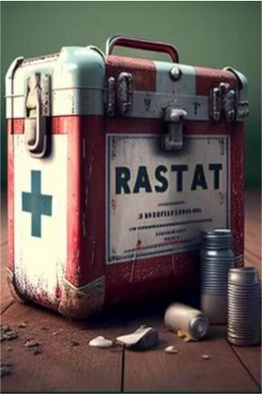

# 漂流物资  
> 各类物资飘散于洋流之中，逐级下沉..  
  
<table class="table table-bordered" data-toggle="table"  data-show-header="false"><thead style="display:none"><tr ><th  style="width:50%;text-align:left;vertical-align:top;"  >title</th><th  style="width:50%;text-align:left;vertical-align:top;"  ></th></tr></thead><tr ><td  style="width:50%;text-align:left;vertical-align:top;"  >**环境：**[深海(环境)](tq_Env_DeepSea.md)  **重量：**10</td><td  style="width:50%;text-align:left;vertical-align:top;"  >

<a href="tq_Nc_DeepSea_ScatteredMaterials.md" style="color:black">漂流物资</a>

</td></tr></tbody></table>  
  
## 动作  

<table><tr><td rowspan="2" style="width:200px;text-align:center;font-size:1.3em;font-weight:bold">

抢救物资

15分

</td><td></td></tr><tr><td></td></tr><tr><td colspan="2">

<table style="margin-bottom:3px;"><tr><td rowspan=2 style="text-align:center" width="80px">
基础权重

1
</td><td style="font-size:0.6em;line-height:0.6em;font-weight:bold">1</td></tr><tr><td>[

[绷带组合](tq_Nc_DiasterBeason_Character_Lola_StartMaterials_BandagesSet.md)](tq_Nc_DiasterBeason_Character_Lola_StartMaterials_BandagesSet.md)(<b>+1</b>)</td></tr></table>

<table style="margin-bottom:3px;"><tr><td rowspan=2 style="text-align:center" width="80px">
基础权重

1
</td><td style="font-size:0.6em;line-height:0.6em;font-weight:bold">2</td></tr><tr><td>[

[梅林牛肉](tq_Nc_DiasterBeason_Character_Lola_StartMaterials_CannedGoods_TypeOne.md)](tq_Nc_DiasterBeason_Character_Lola_StartMaterials_CannedGoods_TypeOne.md)(<b>+1</b>)</td></tr></table>

<table style="margin-bottom:3px;"><tr><td rowspan=2 style="text-align:center" width="80px">
基础权重

1
</td><td style="font-size:0.6em;line-height:0.6em;font-weight:bold">3</td></tr><tr><td>[

[塔克鱼肉](tq_Nc_DiasterBeason_Character_Lola_StartMaterials_CannedGoods_TypeTwo.md)](tq_Nc_DiasterBeason_Character_Lola_StartMaterials_CannedGoods_TypeTwo.md)(<b>+1</b>)</td></tr></table>

<table style="margin-bottom:3px;"><tr><td rowspan=2 style="text-align:center" width="80px">
基础权重

1
</td><td style="font-size:0.6em;line-height:0.6em;font-weight:bold">4</td></tr><tr><td>[

[莱恩蛋白](tq_Nc_DiasterBeason_Character_Lola_StartMaterials_CannedGoods_TypeThree.md)](tq_Nc_DiasterBeason_Character_Lola_StartMaterials_CannedGoods_TypeThree.md)(<b>+1</b>)</td></tr></table>

<table style="margin-bottom:3px;"><tr><td rowspan=2 style="text-align:center" width="80px">
基础权重

1
</td><td style="font-size:0.6em;line-height:0.6em;font-weight:bold">5</td></tr><tr><td>[

[库伦汤品](tq_Nc_DiasterBeason_Character_Lola_StartMaterials_CannedGoods_TypeFour.md)](tq_Nc_DiasterBeason_Character_Lola_StartMaterials_CannedGoods_TypeFour.md)(<b>+1</b>)</td></tr></table>

<table style="margin-bottom:3px;"><tr><td rowspan=2 style="text-align:center" width="80px">
基础权重

1
</td><td style="font-size:0.6em;line-height:0.6em;font-weight:bold">6</td></tr><tr><td>[

[格林曲奇](tq_Nc_DiasterBeason_Character_Lola_StartMaterials_CookieBox.md)](tq_Nc_DiasterBeason_Character_Lola_StartMaterials_CookieBox.md)(<b>+1</b>)</td></tr></table>

<table style="margin-bottom:3px;"><tr><td rowspan=2 style="text-align:center" width="80px">
基础权重

1
</td><td style="font-size:0.6em;line-height:0.6em;font-weight:bold">7</td></tr><tr><td>[

[应急水袋](tq_Nc_DiasterBeason_Character_Lola_StartMaterials_EmergencyWaterBags.md)](tq_Nc_DiasterBeason_Character_Lola_StartMaterials_EmergencyWaterBags.md)(<b>+1</b>)</td></tr></table>

<table style="margin-bottom:3px;"><tr><td rowspan=2 style="text-align:center" width="80px">
基础权重

1
</td><td style="font-size:0.6em;line-height:0.6em;font-weight:bold">8</td></tr><tr><td>[

[手电筒(关)](tq_Nc_DiasterBeason_Character_Lola_StartMaterials_Flashlight_Off.md)](tq_Nc_DiasterBeason_Character_Lola_StartMaterials_Flashlight_Off.md)(<b>+1</b>)</td></tr></table>

<table style="margin-bottom:3px;"><tr><td rowspan=2 style="text-align:center" width="80px">
基础权重

1
</td><td style="font-size:0.6em;line-height:0.6em;font-weight:bold">9</td></tr><tr><td>[

[打火机(关)](tq_Nc_DiasterBeason_Character_Lola_StartMaterials_LighterOff.md)](tq_Nc_DiasterBeason_Character_Lola_StartMaterials_LighterOff.md)(<b>+1</b>)</td></tr></table>

<table style="margin-bottom:3px;"><tr><td rowspan=2 style="text-align:center" width="80px">
基础权重

1
</td><td style="font-size:0.6em;line-height:0.6em;font-weight:bold">10</td></tr><tr><td>[

[凯蒂](tq_Nc_DiasterBeason_Character_Lola_StartMaterials_MedicalKit.md)](tq_Nc_DiasterBeason_Character_Lola_StartMaterials_MedicalKit.md)(<b>+1</b>)</td></tr></table>

<table style="margin-bottom:3px;"><tr><td rowspan=2 style="text-align:center" width="80px">
基础权重

1
</td><td style="font-size:0.6em;line-height:0.6em;font-weight:bold">11</td></tr><tr><td>[

[远行米包](tq_Nc_DiasterBeason_Character_Lola_StartMaterials_RiceBag.md)](tq_Nc_DiasterBeason_Character_Lola_StartMaterials_RiceBag.md)(<b>+1</b>)</td></tr></table>

<table style="margin-bottom:3px;"><tr><td rowspan=2 style="text-align:center" width="80px">
基础权重

1
</td><td style="font-size:0.6em;line-height:0.6em;font-weight:bold">12</td></tr><tr><td>[

[安全刀](SafetyKnife.md)](SafetyKnife.md)(<b>+1</b>)</td></tr></table>

</td></tr></table>
  
  
  

