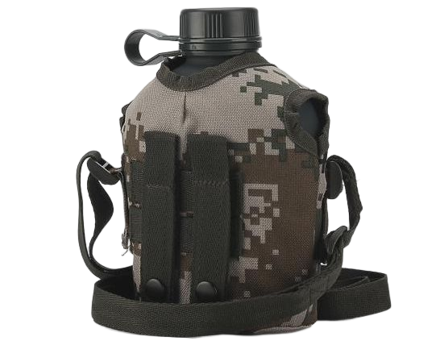

# 旅行水壶  
> 罗拉的水壶，可以补充不少水分。  
  
<table class="table table-bordered" data-toggle="table"  data-show-header="false"><thead style="display:none"><tr ><th  style="width:50%;text-align:left;vertical-align:top;"  >title</th><th  style="width:50%;text-align:left;vertical-align:top;"  ></th></tr></thead><tr ><td  style="width:50%;text-align:left;vertical-align:top;"  >**重量：**250  **装备时减重：**-1500  **标签：**	[“储水容器”](tag_WaterContainer.md), [“军用的”](tag_Military.md), [“容器（密封）”](tag_ContainerSealed.md)  **装备：**  **储水量：**1500</td><td  style="width:50%;text-align:left;vertical-align:top;"  >

<a href="tq_Nc_DiasterBeacons_Lola_Bottle.md" style="color:black">旅行水壶</a>

</td></tr></tbody></table>  
  
## 动作  

<table><tr><td rowspan="2" style="width:200px;text-align:center;font-size:1.3em;font-weight:bold">

收集雨水

</td><td></td></tr><tr><td></td></tr><tr><td colspan="2"><b>需求：</b>[

[降水值](RainValue.md)](RainValue.md): <b>1-5</b></td></tr><tr><td colspan="2">[水](LQ_Water.md)(<b>+50</b>)</td></tr></table>
  
  
  

