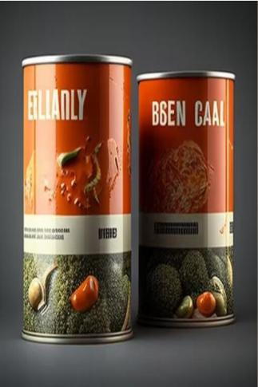

# 库伦汤品  
> 库伦汤品，高汁浓汤，舌尖愉悦。  
  
<table class="table table-bordered" data-toggle="table"  data-show-header="false"><thead style="display:none"><tr ><th  style="width:50%;text-align:left;vertical-align:top;"  >title</th><th  style="width:50%;text-align:left;vertical-align:top;"  ></th></tr></thead><tr ><td  style="width:50%;text-align:left;vertical-align:top;"  >**标签：**	[“人类食物”](tag_HumanFood.md)</td><td  style="width:50%;text-align:left;vertical-align:top;"  >

<a href="tq_Nc_DiasterBeason_Character_Lola_StartMaterials_CannedGoods_TypeFour.md" style="color:black">库伦汤品</a>

</td></tr></tbody></table>  
  
## 获取来源  

抢救物资

[漂流物资(深海)](tq_Nc_DeepSea_ScatteredMaterials.md)

  
  
## 动作  

<table><tr><td rowspan="2" style="width:200px;text-align:center;font-size:1.3em;font-weight:bold">

食用

3分

</td><td>[“进食动作(组)”](EatingAction.md)</td></tr><tr><td><b>自身：</b>→消失</td></tr><tr><td colspan="2"><b>状态变化：</b>[

[饱食](Satiation.md)](Satiation.md)<b>+25</b>, [

[胃](Stomach.md)](Stomach.md)<b>+12.5</b>, [

[水分](Hydration.md)](Hydration.md)<b>+75</b>, [

[情绪](Morale.md)](Morale.md)<b>+100</b>, [

[肠道](Intestines.md)](Intestines.md)<b>+12.5</b></td></tr><tr><td colspan="2">[

[空罐头](tq_Nc_DiasterBeason_Character_Lola_StartMaterials_CannedGoods_Empty.md)](tq_Nc_DiasterBeason_Character_Lola_StartMaterials_CannedGoods_Empty.md)(<b>+1</b>)</td></tr></table>
  
  
  
## 属性   

<table style="margin-bottom:0px;"><tr><td style="width:30%;text-align:left; background-color:#FEFEFE;font-size:1.3em;font-weight:bold;">耐久</td><td style="font-size:1em;background-color:#FEFEFE">初始：0 -</td></tr><tr style="background-color:#FFFFFF"><td colspan=2>** 到达0时： **</td></tr></table>
  

