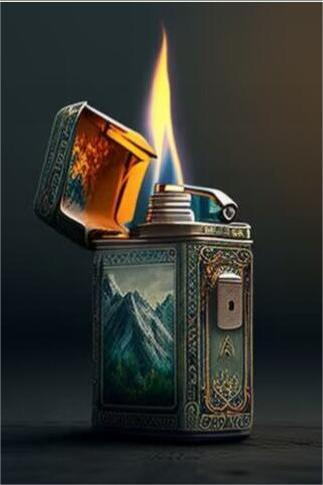

# 打火机  
> 需要一次打开的契机..  
  
<table class="table table-bordered" data-toggle="table"  data-show-header="false"><thead style="display:none"><tr ><th  style="width:50%;text-align:left;vertical-align:top;"  >title</th><th  style="width:50%;text-align:left;vertical-align:top;"  ></th></tr></thead><tr ><td  style="width:50%;text-align:left;vertical-align:top;"  >** 不可删除 **  **槽位：**1  **过滤器：**[“可烹饪的”](tag_Cookable.md) , [“储水容器”](tag_WaterContainer.md)</td><td  style="width:50%;text-align:left;vertical-align:top;"  >

<a href="tq_Nc_DiasterBeason_Character_Lola_StartMaterials_LighterOff.md" style="color:black">打火机</a>

</td></tr></tbody></table>  
  
## 获取来源  

抢救物资

[漂流物资(深海)](tq_Nc_DeepSea_ScatteredMaterials.md)

熄灭

[打火机（开）(开)](tq_Nc_DiasterBeason_Character_Lola_StartMaterials_LighterOn.md)

转化

[打火机（开）(开)](tq_Nc_DiasterBeason_Character_Lola_StartMaterials_LighterOn.md)

  
  
## 动作  

<table><tr><td rowspan="2" style="width:200px;text-align:center;font-size:1.3em;font-weight:bold">

打火

3分

</td><td></td></tr><tr><td><b>自身：</b>→ [

[打火机（开）(开)](tq_Nc_DiasterBeason_Character_Lola_StartMaterials_LighterOn.md)](tq_Nc_DiasterBeason_Character_Lola_StartMaterials_LighterOn.md)</td></tr><tr><td colspan="2"><b>需求：</b>燃料: <b>29～288(10.07%～100%)</b></td></tr></table>
  
  
  
## 属性   

<table style="margin-bottom:0px;"><tr><td style="width:30%;text-align:left; background-color:#FEFEFE;font-size:1.3em;font-weight:bold;">燃料</td><td style="font-size:1em;background-color:#FEFEFE">初始：288 , 最大：288 -</td></tr><tr style="background-color:#FFFFFF"><td colspan=2></td></tr></table>
  

