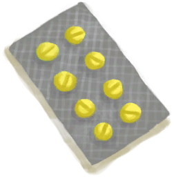

# 凯蒂  
> 箱上的痕迹印证了一个个旅途的故事，故事仍在继续。  
  
<table class="table table-bordered" data-toggle="table"  data-show-header="false"><thead style="display:none"><tr ><th  style="width:50%;text-align:left;vertical-align:top;"  >title</th><th  style="width:50%;text-align:left;vertical-align:top;"  ></th></tr></thead><tr ><td  style="width:50%;text-align:left;vertical-align:top;"  >**重量：**100  **槽位：**5  **初始卡牌：**

[

[止痛药](Painkillers.md)](Painkillers.md)

[

[抗生素](Antibiotics.md)](Antibiotics.md)

[

[泻立停](AntiDiarrhoeaPills.md)](AntiDiarrhoeaPills.md)

[

[净水片](WaterPurificationTablets.md)](WaterPurificationTablets.md)

[

[绷带组合](tq_Nc_DiasterBeason_Character_Lola_StartMaterials_BandagesSet.md)](tq_Nc_DiasterBeason_Character_Lola_StartMaterials_BandagesSet.md)

  
  
  **容量：**150  **减重：**-150</td><td  style="width:50%;text-align:left;vertical-align:top;"  >

<a href="tq_Nc_DiasterBeason_Character_Lola_StartMaterials_MedicalKit.md" style="color:black">凯蒂</a>

</td></tr></tbody></table>  
  
## 获取来源  

抢救物资

[漂流物资(深海)](tq_Nc_DeepSea_ScatteredMaterials.md)

  
  

